# Prepare Centrify Identity Platform / The Portal

## Introduction

As in the former part of the training, Alex Foster (you), has set up the CIP to have some basic configuration and a deployed cloud connector, a few small configuration steps need to be taken care off.

This first lab will cover:

1. Enable “Allow Access from a Public Network”
2. Integrate Portal with Audit
3. MFA Setup

!!!Note
    Estimated time to complete this lab: **15 minutes**

!!!Attention

    Systems used in this lab:

    - dc-server.greensafe.lab
    - apps-server.greensafe.lab
    - https://<tenant\>.my.centrify.net

### Enable "allow access from a public network"

By default, the CIP does not allow systems to be reached via the internet. This part of the training is where Alex (you) will enable that possibility.

1. Login to **apps-server.greensafe.lab** with the following credentials:

    - Username: afoster
    - Password: *Provided by Trainer*
    
2. Launch Google Chrome and browse to your unique Identity Platform URL https://<tenant\>.my.centrify.net

2. Login to your unique Identity Platform with the following credentials:

    - Username: admin@lab.<tenant\>
    - Password: *Provided by Trainer*

3. On the *Welcome Message*, click **Cancel**

1. From the portal, use the main menu on the left to navigate to **Settings > Resources > Security > Security Settings**

    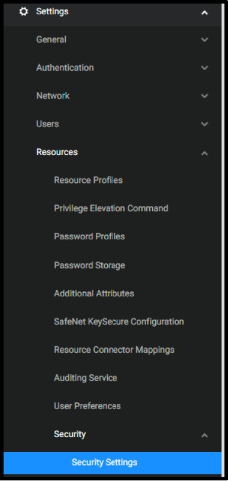

2. Scroll down in the page to **Global System Security** section.

    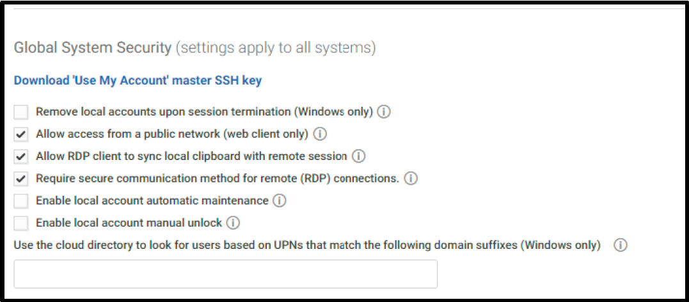

3. Check that the box next to **Allow access from a public network (web client only)** is checked. If not, check the box and click **Save**

    !!!tip
        This setting can also be set on a system basis. Due to 

### Integrate Portal with Audit Installation

The Portal can use the audit installation was created before during Server Suite lab to record gateway-based sessions.

1. From the portal, use the main menu on the left to navigate to **Settings > Resources > Auditing Service**

    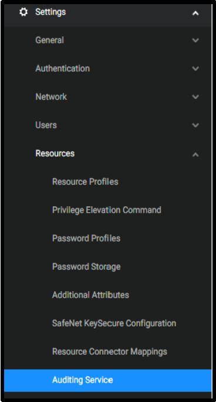

2. Check the box next to **Enable Auditing**. Keep the defaults

    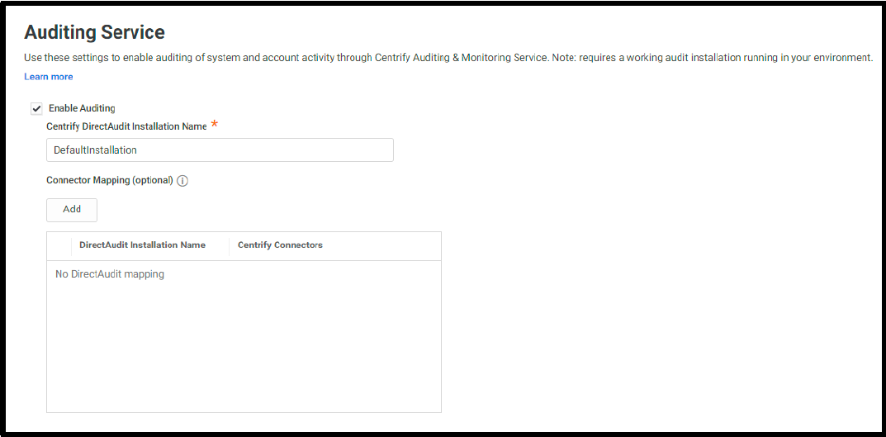

3. **Save**

### MFA Setup

In this lab, we are going to learn how to create MFA profiles in CIP. The portal can use multiple MFA methods. For the email OTP, the connector can be used to connect the CIP to the email server within the local network if the builtin mail services can not to be used. Other MFA methods, such as security questions and TOTP, do not need to leverage connector. It is recommended to setup multiple MFA Options that users can select from, to avoid login issues in case connector services are faulty for any reason.

#### Create MFA Profiles

1. In CIP, use the main menu on the left to navigate to **Settings > Authentication > Authentication Profiles**

    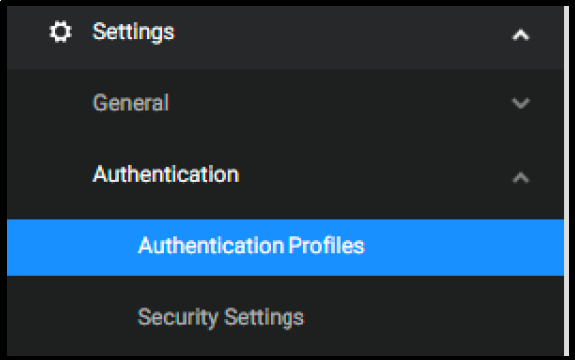

2. Click **Add Profile** Button.

3. Type **Contactors MFA** Profile in the name field

4. Under **Challenge 1** Column, Check the box next to **Password**

5. Under **Challenge 2 (Optional)** Column, Check the boxes next to:

    - OATH OTP Client
    - Security Questions

6. Under **Challenge Pass-Through Duration** dropdown list, change from **30 minutes** to **No Pass Through**. Below is an image shows how the profile should look like:

    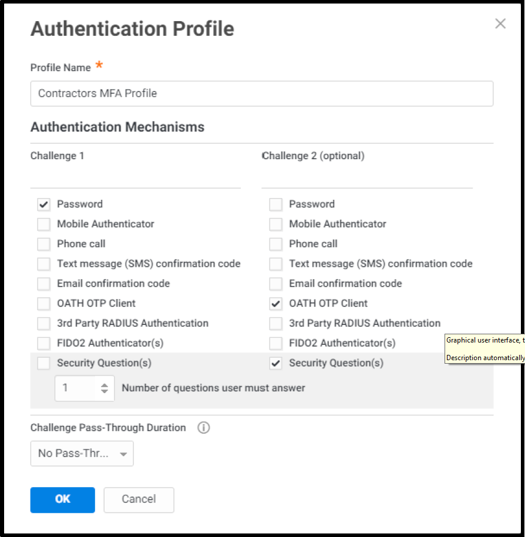

7. Click **Ok** to save

#### Configure MFA Setting for contractor user

1. Launch google chrome in incognito mode and navigate to your unique CIP URL **https://<tenant\>.my.centrify.net**

2. Login to CIP using the following:

    Username: **zcontractor@labguide-####**
    Password: **provided by trainer**

    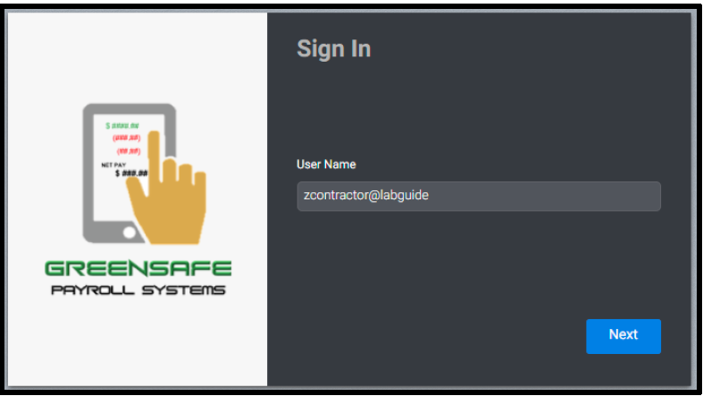

3. Click on the username dropdown list in the upper right corner, select **Profile**

    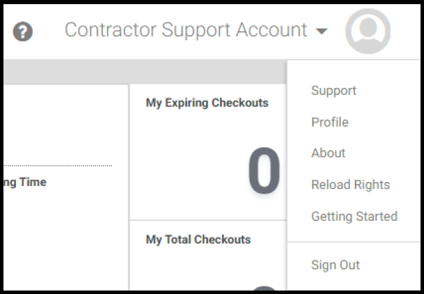

4. Click on **Security questions** button

    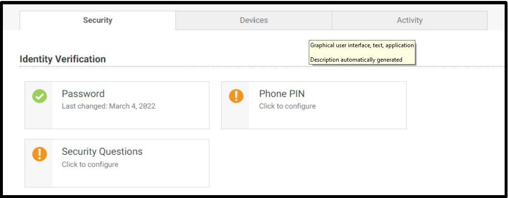

5. Type a security question and answer of your own choice

    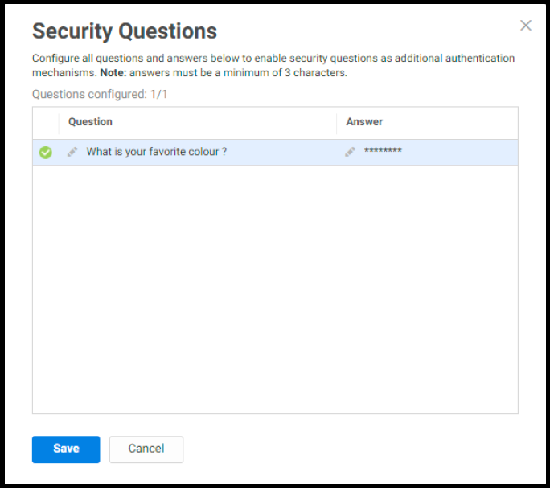

6. **Save** and **sign out** from contractor user portal session.

7. Test the login again using *zcontractor* user, you should now be asked to enter the security question answer.

    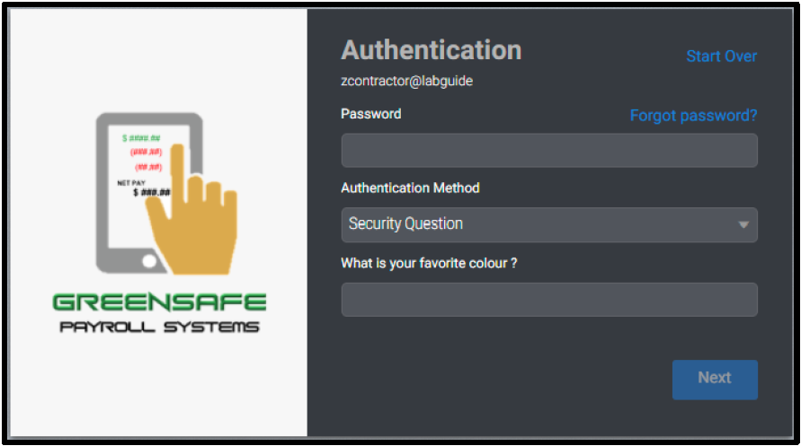

    !!!Note
        Keep the incognito chrome session running, we will use it later, and switch to the other opened chrome session.

#### Create Policy

You will create a new policy specific for contractors, the policy will include mandating MFA profiles at Portal login for contractor's team members at all conditions.

01. Switch to original Google Chrome Session, you should have active **admin** login to the portal.

02. From the portal and, use the main menu on the left to navigate to **Access > Policies**

    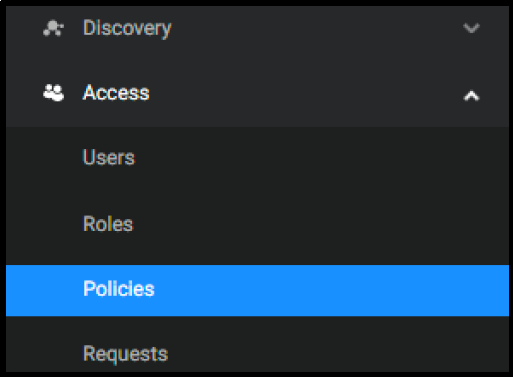

03. Click on **Add Policy Set** button

04. Type **Contractors Policy** in the policy name field

05. Select **Specified Roles**

06. Click **Add** button

    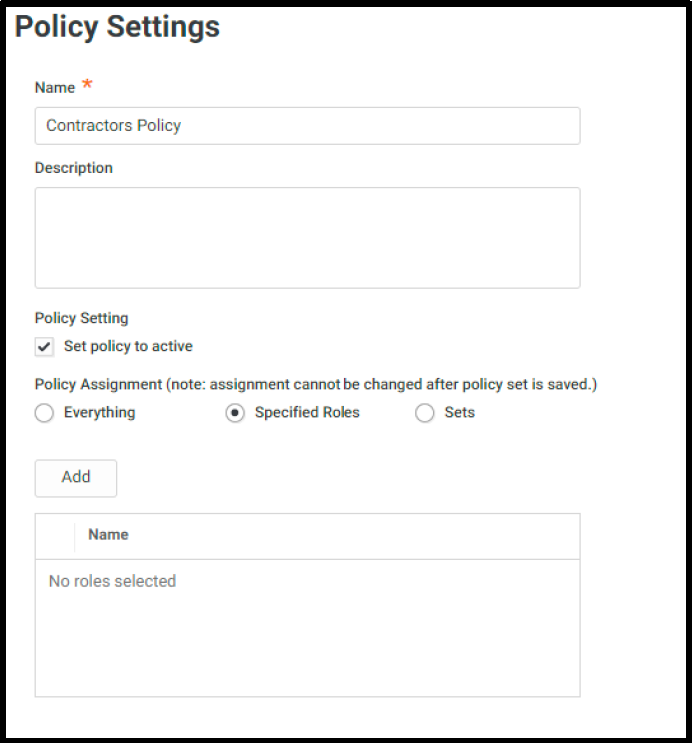

07. In **Select Role** box, check the boxes next to:

    - Contractor Manager Role
    - Contractor Role

    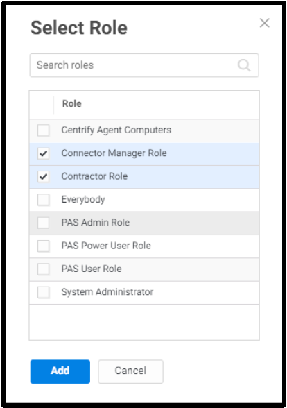

08. Click **Add**

09. While in the policy page, expand **Authentication**

10. Click on **Centrify Services**

    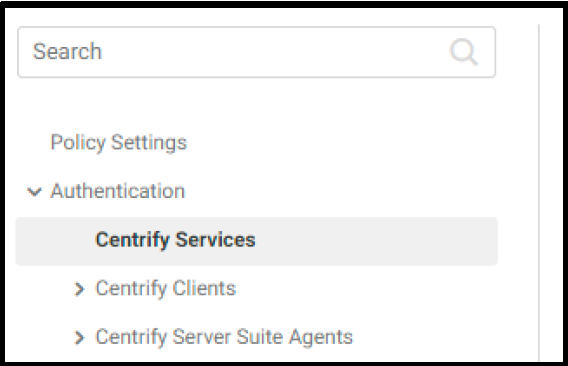

11. From the dropdown list next to **Enable authentication policy controls**, select **Yes**.

    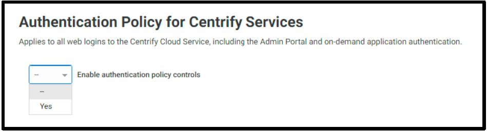

12. From the dropdown list under **Default Profile (used if no conditions matched)**, select **Contractors MFA Profile**

    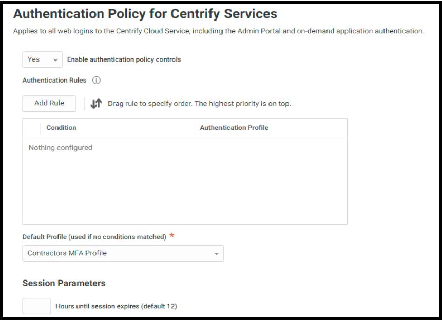

13. Scroll a bit down and make sure you have checked **Allow users without a valid authentication factor to log in**

    !!!warning
        When this option is not checked, users might not be able to login as the policy states that the users MUST use MFA to be able to login. This checkbox allows users that do not have set the MFA options (OAUTH, and Security Questions in the training's scenario) to login. After they logged in they are forced to set OAUTH and security questions before they can open the admin page.

13. In the same policy page, expand User **Security** > Click **OATH OTP**

    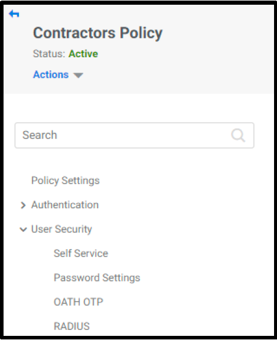

14. From the dropdown list next to **Allow OATH OTP integration**, Select **Yes**

    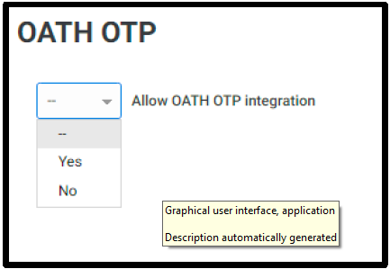

15. In the same policy page, navigate to **User Security > Authentication Settings**

    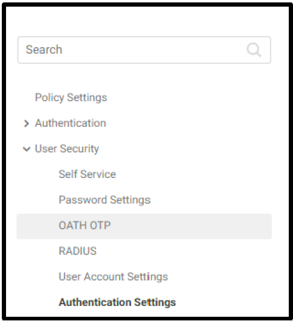

16. From the dropdown list next to **Enable users to configure an OATH OTP client**, select **Yes**

17. Type **Mobile Authenticator App** in the *OATH OTP Display Name* field

    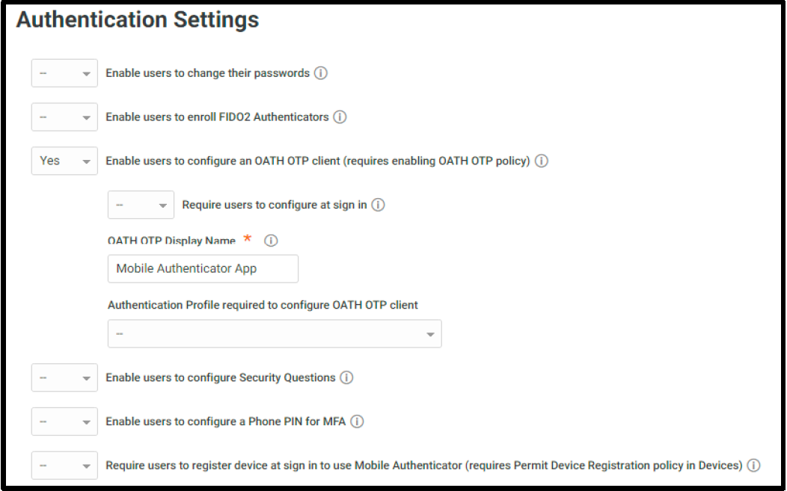

18. Click **Save**

19. Switch to **Chrome incognito** window. Login with **zcontractor@labguide** user, or refresh the page if it's still logged in.

20. Click on the username dropdown list in the upper right corner, select **profile**

    

21. Click on **Mobile Authenticator App** button

    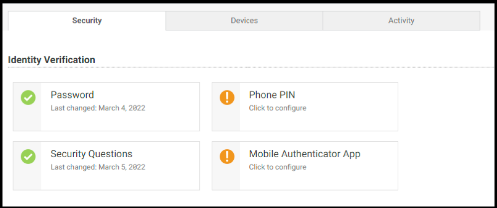

22. Open (Google Authenticator or Microsoft Authenticator) application in your mobile device, add new account.

23. Scan the QR Code provided in CIP portal.

    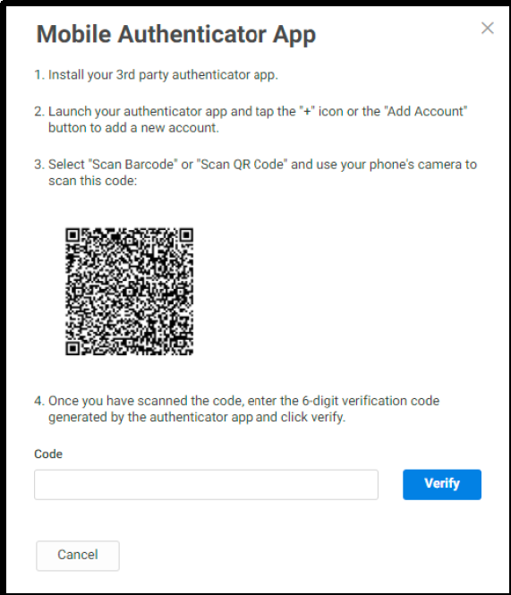

24. Type in the code provided in mobile application into **Code** field and click **Verify**.

25. **Sign-out** and login again to test authenticating using password & mobile authenticator code.

    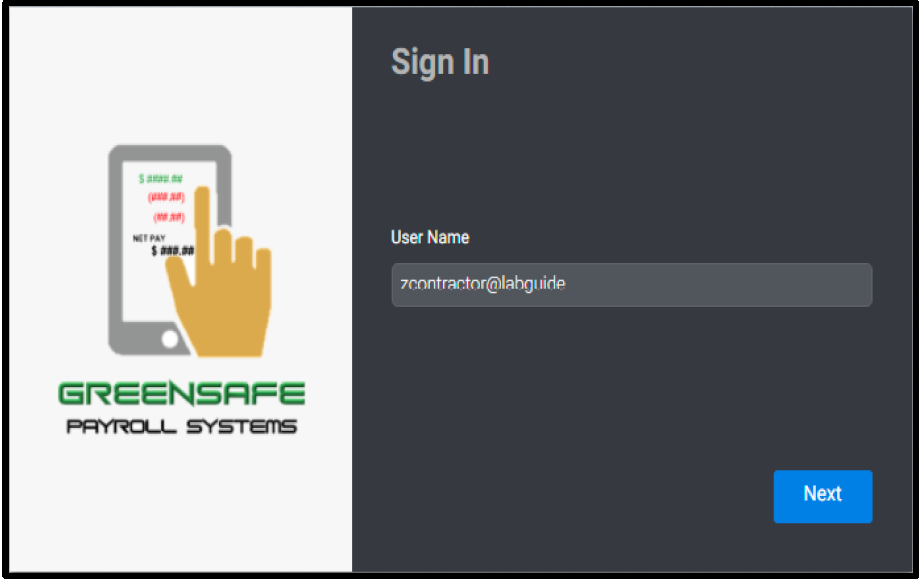

    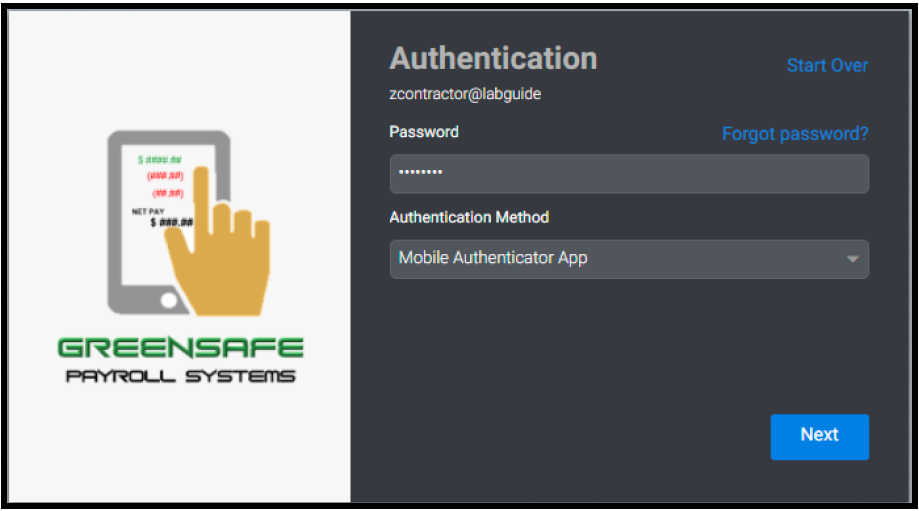

    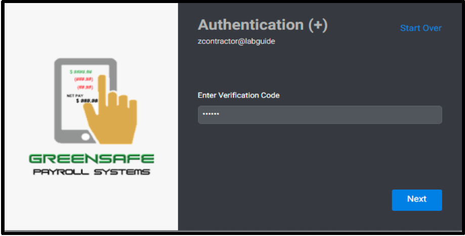