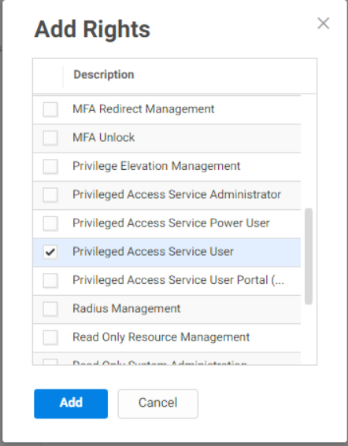
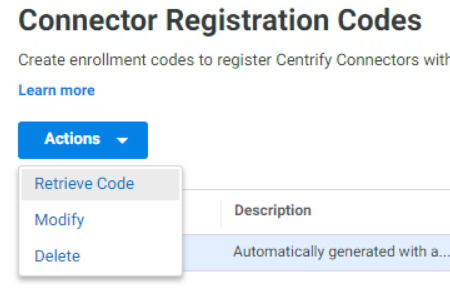

# Prepare Centrify Identity Platform / The Portal

## Introduction

This first lab will cover:

1. Customizing the Centrify Identity Platform (CIP)
2. Create Directory Service Users in CIP
3. Create Privileged Roles
4. Install and Configure the Centrify Connector
5. Enable “Allow Access from a Public Network”
6. Integrate Portal with Audit
7. MFA Setup

!!!Note
    Estimated time to complete this lab: **60 minutes**

!!!Attention

    Systems used in this lab:

    - dc-server.greensafe.lab
    - apps-server.greensafe.lab
    - https://<tenant\>.my.centrify.net

### Customizing the CIP

In this exercise, Alex (you) will login to the Centrify Identity Platform and perform initial configuration to "brand" the platform with Greensafe Logos and colors.

01. Login to *apps-server.greensafe.lab* with the following credentials:

    - **Username:** afoster
    - **Password:** *Provided by Trainer*

02. Launch Google Chrome and browse to your unique Identity Platform URL **https://<tenant\>.my.centrify.net**

03. Login to your unique Identity Platform with the following credentials:

    - **Username:** admin
    - **Password:** *Provided by Trainer*

04. On the Welcome Message, click **Cancel**

05. Use the Main Menu on the left, navigate to *Settings > General*

06. Under *Account Customization*, change the *Portal Ribbon Accent Color* to **#F1F1F1**

07. Click the **Upload** button to change the *Portal Image*, select C:\\Share\\Greensafe Portal.png

08. Under *Login Customization*, click the **Upload** button to change the Login Image, select C:\\Share\\Greensafe Login.png

    

09. Under *Message Customization*, click the **Upload** button to change the E-Mail Image, select C:\\Share\\Greensafe Portal.png

10. Click **Save**

### Create Directory Service Users in CIP

Part of the initial configuration includes creating Centrify Directory Service User Accounts that will be used for specific privileged access to Greensafe servers without requiring specific domain identities. In this exercise, Alex (you) will create an account that will manage Centrify Connectors and a second account that will be used by 3rd party contractors who support specific Greensafe servers.

01. While still in the CIP, use the main menu on the left to navigate to *Access > General > Suffix*

    

02. Click the **Add** button

03. Type **labguide-***tenant-nr* after the *username@* field

    

04. Click **Save**

05. Navigate to **Access > Users**

06. Click **Add User**

    

07. Enter the required information to create a new Centrify Directory Service User for Centrify Connector Management.

    - **Username:** ConnectorMgr (set the suffix to *labguide-####*)
    - **E-Mail Address:** ConnectorMgr@greensafe.lab
    - **Display Name:** Delinea  Connector Manager
    - **Password:** *Provided by Trainer*
    - **Check** the box to *Password never expires*

08. Click **Create User**

09. Click **Add User** button to create a second user

10. Enter the required information to create a new Centrify Directory Service User for 3rd Party Contractor Support

    - **Username:** zContractor (set the suffix to *labguide-####*)
    - **E-Mail Address:** contractors@greensafe.lab
    - **Display Name:** Contractor Support Account
    - **Password:** *Provided by Trainer*
    - **Check** the box to *Password never expires*

11. Click **Create User**

### Create Privileged Roles

Privileged roles are created to group privilege to the infrastructure. Roles can be assigned to users, groups, systems and other roles. In this exercise, Alex (you) will create specific Privileged Access Roles that will be used during the implementation and day to day management of the solution.

01. From the Centrify Identity Platform, use the main menu on the left to navigate to **Access > Roles**

02. Click **Add Role**

03. Use as name **Connector Manager Role**

04. Click **Administrative Rights** left to the *Name*

05. Click **Add**

06. This role requires the privilege to Register and Manage Centrify Connectors, select **Register and Administer Connectors**

    

07. Click **Add**

08. Click **Members** left to the *Administrative Rights*

09. Click **Add**

10. Search for *ConnectorMgr@labguide-####* and click **Add**

    

    !!!warning
        The search is case sensitive!

11. Click **Save**

12. Click **Add Role** to add a second role.

    

13. Use as name **Contractor Role**

14. Click **Administrative Rights**

15. Click **Add**

16. This role requires privilege assigned by an administrator and should be limited to servers that are specifically assigned to the role. Greensafe  has contractors that manage Greensafe database servers. Select **Privilege Access Service Users**

    

17. Click **Add**

18. Click **Members** left to the *Administrative Rights*

19. Click **Add**

20. Search for *zContractor@labguide-####* and click **Add**

21. Click **Save**

### Install and Configure Centrify Connector

Centrify Connectors are deployed in the environment to facilitate specific access between the Centrify Identity Platform and Greensafe Infrastructure Resources. In this exercise, Alex (you) will install the Centrify Connector software and configure it to communicate with the Centrify Identity Platform and Greensafe Active Directory environment.

01. From the Centrify Identity Platform, use the main menu on the left to navigate to *Settings > Network > Centrify Connector*

    

02. Click **Add Centrify Connector**

03. Click the **64-bit** link to download the Centrify Connector installation package

04. Navigate, using the *Windows Explorer*, to the location where the download has been saved (default *Downloads*)

05. Extract the downloaded zip file and open the created directory

06. Launch the application **Centrify-Connector-Installer**

07. At the *Do you want to run this file?*, message click **Run**

08. At the Welcome Message, click **Next**

09. Accept the EULA *(Check the "I have read and accept..." message)* and click **Next**

10. Keep the default features selected and click **Next**

11. Click **Install** (Some open applications will be closed automatically)

12. When completed, click **Finish** (The Connector Configuration Wizard will start automatically)

13. At the Welcome Message, click **Next**

14. *Maintain strong encryption options \*and click \*\*Next\**

15. Greensafe is not using a proxy server and no changes are needed. Click **Next**

16. Change the Tenant URL with your unique platform URL. **https://<tenant\>.my.centrify.net** (You can copy and paste the URL directly from the address bar of the browser.)

    

17. Check the **Use Registration Code**

18. Switch back to the Chrome session and click **Close** on the *Add Centrify Connector* screen

19. Open the portal and navigate to **Settings > Network > Registration Codes**

    

20. Click **Add** and set the name to **Account Creation** and leave all settings default

21. Click **Save**

22. Check the checkbox in front of **Account Creation** and select **Actions > Retrieve Code**

    

    

23. Click **Copy** to copy the code to the clipboard

24. Back in the **Centrify Connector Configuration**, paste the *Registration Code*

    

    !!!Note
        Your codes will be different!!! Don't use the codes as mentioned in the screenshots)

25. Click **Next**

26. Check the box associated to the *greensafe.lab* domain and click **Next**

27. In the *Permissions are required to domain deleted objects* click **Yes** to assign the permissions

28. The checks should be successfully run and click **Next**

    

29. After the connector has been configured successfully and registered with the CIP, Click **Finish**

30. The *Centrify Connector Control Panel* will be displayed indicating the current status and connection with the Centrify Identity Platform. You can **close** the Control Panel and return to the CIP

31. Navigate to **Settings > Network > Centrify Connector**. The Centrify Connector (*apps-server.greensafe.lab*) should be displayed as an available connector

    

### Enable "allow access from a public network"

For the Web Client (Web RDP & SSH), access from public network must be explicitly allowed.

1. From the portal, use the main menu on the left to navigate to **Settings > Resources > Security > Security Settings**

    

2. Scroll down in the page to **Global System Security** section.

    

3. Check that the box next to **Allow access from a public network (web client only)** is checked. If not, check the box and click **Save**

### Integrate Portal with Audit Installation

The Portal can use the audit installation was created before during Server Suite lab to record gateway-based sessions.

1. From the portal, use the main menu on the left to navigate to **Settings > Resources > Auditing Service**

    

2. Check the box next to **Enable Auditing**. Keep the defaults

    

3. **Save**

### MFA Setup

In this lab, we are going to learn how to create MFA profiles in CIP. The portal can use multiple MFA methods, some of these methods such as the email OTP uses the connector to connect to the email server within the local network. Other methods such as security questions and TOTP does not need to leverage connector services. It is recommended to setup multiple MFA Options that users can select from, to avoid login issues in case connector services are faulty for any reason.

#### Create MFA Profiles

1. In CIP, use the main menu on the left to navigate to **Settings > Authentication > Authentication Profiles**

    

2. Click **Add Profile** Button.

3. Type **Contactors MFA** Profile in the name field

4. Under **Challenge 1** Column, Check the box next to **Password**

5. Under **Challenge 2 (Optional)** Column, Check the boxes next to:

    - OATH OTP Client
    - Security Questions

6. Under **Challenge Pass-Through Duration** dropdown list, change from **30 minutes** to **No Pass Through**. Below is an image shows how the profile should look like:

    

7. Click **Ok** to save

#### Configure MFA Setting for contractor user

1. Launch google chrome in incognito mode and navigate to your unique CIP URL **https://<tenant\>.my.centrify.net**

2. Login to CIP using the following:

    Username: **zcontractor@labguide-####**
    Password: **provided by trainer**

    

3. Click on the username dropdown list in the upper right corner, select **Profile**

    

4. Click on **Security questions** button

    

5. Type a security question and answer of your own choice

    

6. **Save** and **sign out** from contractor user portal session.

7. Test the login again using *zcontractor* user, you should now be asked to enter the security question answer.

    

    !!!Note
        Keep the incognito chrome session running, we will use it later, and switch to the other opened chrome session.

#### Create Policy

You will create a new policy specific for contractors, the policy will include mandating MFA profiles at Portal login for contractor's team members at all conditions.

01. Switch to original Google Chrome Session, you should have active **admin** login to the portal.

02. From the portal and, use the main menu on the left to navigate to **Access > Policies**

    

03. Click on **Add Policy Set** button

04. Type **Contractors Policy** in the policy name field

05. Select **Specified Roles**

06. Click **Add** button

    

07. In **Select Role** box, check the boxes next to:

    - Contractor Manager Role
    - Contractor Role

    

08. Click **Add**

09. While in the policy page, expand **Authentication**

10. Click on **Centrify Services**

    

11. From the dropdown list next to **Enable authentication policy controls**, select **Yes**.

    

12. From the dropdown list under **Default Profile (used if no conditions matched)**, select **Contractors MFA Profile**

    

13. In the same policy page, expand User **Security** > Click **OATH OTP**

    

14. From the dropdown list next to **Allow OATH OTP integration**, Select **Yes**

    

15. In the same policy page, navigate to **User Security > Authentication Settings**

    

16. From the dropdown list next to **Enable users to configure an OATH OTP client**, select **Yes**

17. Type **Mobile Authenticator App** in the *OATH OTP Display Name* field

    

18. Click **Save**

19. Switch to **Chrome incognito** window. Login with **zcontractor@labguide** user, or refresh the page if it's still logged in.

20. Click on the username dropdown list in the upper right corner, select **profile**

    

21. Click on **Mobile Authenticator App** button

    

22. Open (Google Authenticator or Microsoft Authenticator ) application in your mobile device, add new account.

23. Scan the QR Code provided in CIP portal.

    

24. Type in the code provided in mobile application into **Code** field and click **Verify**.

25. **Sign-out** and login again to test authenticating using password & mobile authenticator code.

    

    

    