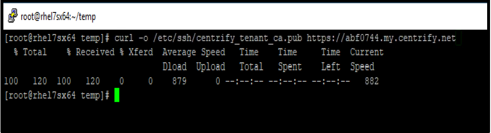
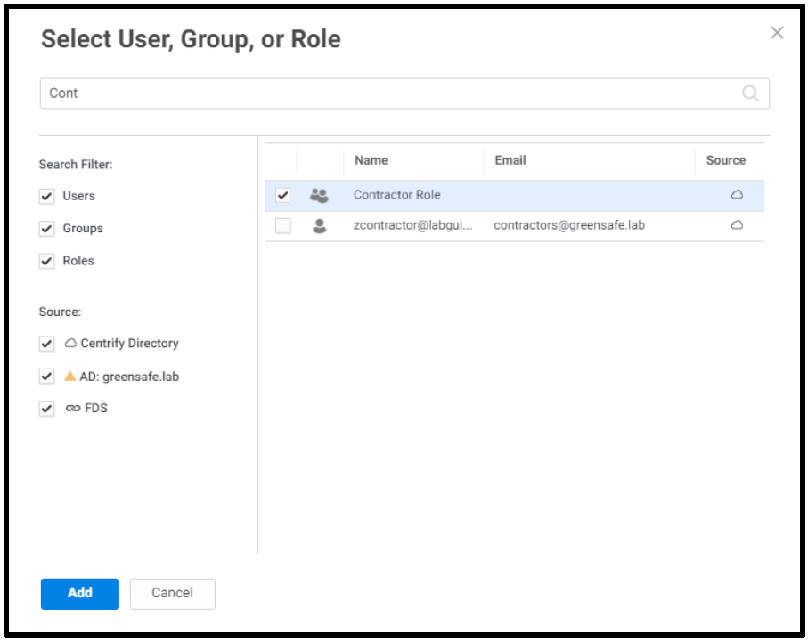
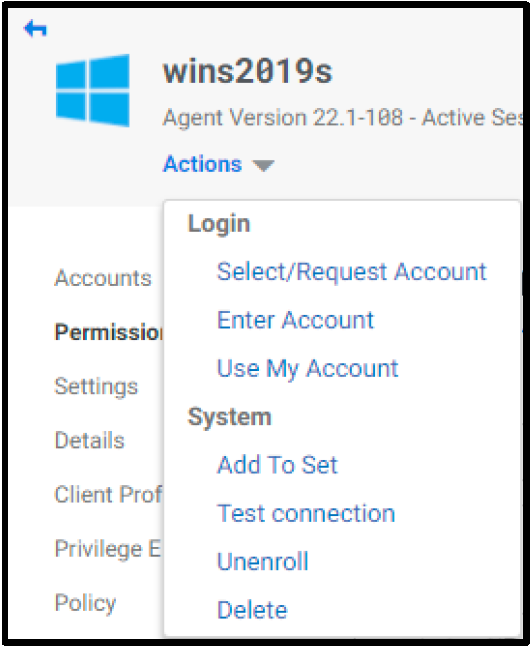
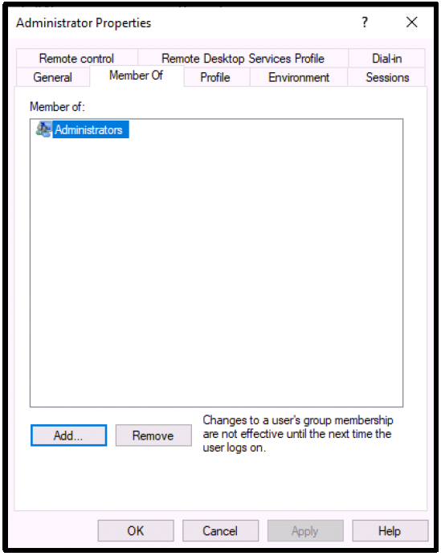

# Install Cloud Client

## Introduction

This second lab will cover:

1. Prepare for Client Installation
2. Install Cloud Client on Windows Server
3. Enroll Cloud Client with CIP
4. Install Cloud Client on Linux Server
5. Enroll Cloud Client with CIP
6. Create Login from CIP

!!!Note
    Estimated time to complete this lab: **60 minutes**


!!!Attention

    Systems used in this lab:
    
    - apps-server.greensafe.lab
    - cloud-win-server
    - cloud-linux-server
    - https://<tenant\>.my.centrify.net


### Prepare for Client Installation

01. Login to **cloud-win-server** using the following **Local** credentials:

    - **Username:** Administrator
    - **Password:** provided by trainer

02. Launch **Google Chrome** from Desktop and navigate to your unique CIP URL, **https://<tenant\>.my.centrify.net**

03. Login to CIP using your **admin** credentials

04. From main menu, navigate to **Settings > Enrollment > Enrollment Codes**

    

05. In **Enrollment Codes** page, click **Add** button

    

06. Under **Owner**, click on **Select** button.

07. Choose **System Administrator** Role from the list.

08. Click **Select**

09. **Save**

    

10. Click **Copy**, to copy the enrolment code to clipboard. **This will be used to enroll Cloud Clients**.

    

### Install & Enroll Cloud Client on Windows Server

01. In **cloud-win-server**, navigate to **downloads** folder and launch Centrify Client installer (**cagentinstaller-***version*)

    

02. On the *Welcome Page*, click **Next**

03. On the *EULA* page, *check* the box (*I Accept the terms in the license agreement*) and click **Next**

04. In Enrollment Parameters page, type your unique CIP URL (https://<tenant\>.my.centrify.net) in the first field

05. **Paste** the enrollment code from clipboard in the second field (Enrollment Code).

06. Keep *Optional Parameters* field empty.

07. Click **Next**

    

08. Click **Install**

    

09. On the page *Files in Use*, select *Do not close applications. A reboot will be required* and click **Ok**

10. After successful installation, click **Finish**

11. Reboot the server and log back in after the reboot as **Administrator**

12. Keep Cloud-win-server session active. You will use the session in the next step.

!!!Note
    To verify a successful enrolment, **cloud-win-server** must be added automatically and available in systems list in **The Portal**. Reopen Chrome, in The Portal and navigate to **Resources > System**. You should see the windows server listed.

### Install & Enroll Cloud Client on Linux Server

1. While in **cloud-win-server**, open *Putty* available on Desktop and connect to cloud-nix-server using the following details:

   - **IP Address:** 10.0.0.37
   - **Username:** root
   - **Password:** provided by trainer

2. Navigate to (temp) directory and check it contains client package using the following command:

    ```bash
    cd temp
    ls
    ```

    

3. To start the installation, use the following command

    ```bash
    rpm -Uvh CentrifyCC-<version>.rpm
    ```

    

4. To enroll the server, type the following command:

    ```bash
    cenroll -t https://<tenant>.my.centrify.net -c <paste the same enrolment code used earlier> -F all
    ```

    

    !!!Note
        Linux Server logins using Directory accounts requires extra steps compared to windows.

5. Download the SSH Master Key file from the Portal to the Linux server, using the following command.

    ```bash
    curl -o /etc/ssh/centrify_tenant_ca.pub https://<tenant>.my.centrify.net/servermanage/getmastersshkey
    ```

    

6. Modify the SSHD configuration file for the client, type the following command:

    ```bash
    vi /etc/ssh/sshd_config
    ```

7. Locate **Challenge Response Authentication** and change it to **yes**

    ```bash
    ChallengeResponseAuthentication yes
    UsePam Yes
    ```

8. Add the following to the file:

    ```bash
    TrustedUserCAKeys /etc/ssh/centrify_tenant_ca.pub
    ```

    

9. **Write and quit** by clicking *Escape* button on keyboard > type **:wq!** > hit **Enter**

10. Restart the sshd daemon using ``systemctl restart sshd``.

!!!Note
    To verify a successful enrolment, **cloud-nix-server** must be added automatically and available in systems list in **The Portal**. Reopen Chrome, in CIP and navigate to **Resources > System**. You should see the Linux server listed.
### Agent Authentication Login

#### Windows Server

01. Switch back to the **apps-server** and in CIP Portal, navigate to **Resources > Systems**

    

02. In the system list, Click on the windows server object name (**wins2019s**)

03. Click on **Permissions**.

04. Click **Add**

    

05. Type **Contractor Role** in the search box, **check the box** next to it once it appears.

06. Click **Add**

    !!!Note
        The search is case sensitive.

    

07. In the **Permissions** list, Check **Agent Auth** for the **Contractor Role**

    

    !!!Note
        Agent Auth allows the **Contractor Role** member **users** to authenticate to the servers leveraging the client installed on it as themselves using a feature (**Use My Account**)

08. Switch to **Chrome Incognito** Window and login to CIP Portal as:

    - **Username:** zcontractor@labguide-####
    - **Password:** Provided by trainer

09. Navigate to **Resources > Systems**

10. Right Click on Windows Server object **wins2019s**.

11. Click Use **My Account**

    

12. After a successful automatic login to the system, open **Start > Computer Management**

    

    !!!Note
        If you see the message in Chrome to allow the CIP (URL) to *See text and image copied to the Clipboard*, click **Allow**

13. Click on **Local User and Groups > Users**

14. Note that the users list now contains **zcontractor** as a local user. This user was **auto created** by the client upon *Use My Account* step.

15. Double click on the user to open properties, click Member Of tab.

    !!!Note
        The **zcontractor** was added to two groups, Remote Desktop Users & Users. This means this is a standard user with no administrative rights on the windows server.

    

16. **Sign out** of the windows server session.

17. Switch back to **Normal Chrome** session with **admin** login to **CIP Portal**.

18. Navigate to **Resources > Systems**

19. Click on the Windows server object **wins2019s**

20. Click on **Local Group Mapping**

21. Click **Add** button

    

22. click **Select** button

23. Check **System Administrator**

24. click **Select**

25. Under **Local Groups** click the **Add** button

26. Type **Administrators**

27. Click **Add**

    

28. Click **Ok**

29. Click **Permissions**

    

30. Check **Agent Auth** for **System Administrator** Role.

31. Click on *Actions* and Select **Use My Account**

    

32. You will be auto logged in to the server with CIP Portal Admin Account. Note that this account membership on the server is different. This account must be member of **Local Administrators** group.

    

#### Linux Server

01. While in **The Portal** logged in as **Admin** user, navigate to **Resources > Systems**

02. Click on the Linux system object *rhel7sx64*.

03. Click *Settings*, scroll down and *check (Use My Account is configured on this system)*

    

04. Click on **Permissions > Add**

05. Search for **Contractor Role**

    

06. Check the box, click **Add**

07. Check **Agent Auth** box for **Contractor Role**

08. **Save**

09. Switch to **Chrome Incognito** session, Refresh the page or login using **zcontractor** again if session was logged out.

10. Navigate to **Resources > Systems**.

11. Right click on linux system **rhel7sx64**

12. Click on **Use My Account**

    

13. You will be auto logged in using **zcontractor** account. Home Directory auto created.

    

!!!Note
    If the connection is not made to the Linux machine, make sure the commands that you have used to setup sshd_config AND the content of the .pub file is correct! These are the know issues on the **Use My Account** with respect to Linux machines.