# Least Privilege / Privilege Elevation, MFA

## Introduction

This third lab will cover:

1. Configure privilege elevation for Windows
2. Configure privilege elevation for Linux
3. Configure MFA requirement at elevation

!!!Note
    Estimated time to complete this lab: **30 minutes**


!!!Attention

    Systems used in this lab:

    - cloud-win-server
    - cloud-linux-server
    - https://tenant.my.centrify.net

______________________________________________________________________

### Privilege Elevation for Windows

The Cloud Client installed on windows server provides privilege elevation capabilities. In the previous chapter, you have configured a CIP/Client based logins to windows server as a standard user with no administrative permissions on the server for the zcontractor user. The contractor as part of his role may need to view security events and resource and performance monitor only. In this lab, you are going to grant him the needed enough privileges in a form of privilege elevation.

#### Create Elevation Commands

1. Launch Google Chrome, login to CIP Portal as admin.

2. From the main menu on the left, navigate to **Settings > Resources > Privilege Elevation command**

    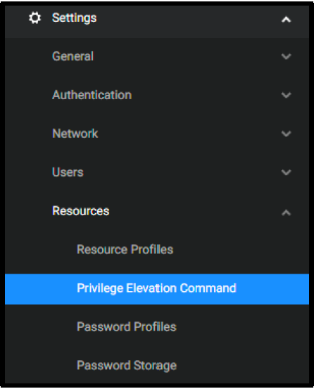

3. Click **Add**

4. Fill in the following Information:

    - **Name:** Event Viewer

    - **Description:** Elevate Event Viewer to View Security Logs

    - **Operating System:** Windows

    - **Application and argument:**

      ```powershell
      "C:\Windows\system32\mmc.exe" "C:\Windows\system32\eventvwr.msc" /s
      ```

    - **Match Path:** Standard system path

    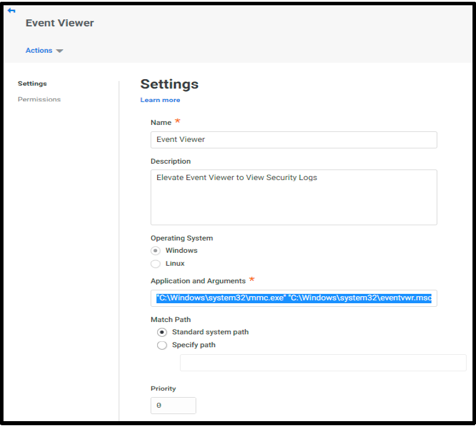

5. Click **Save**

6. Repeat **Steps 3-5** to add another **Windows** command with the following info:

    - **Name:** Resource Monitor
    - **Description:** Elevate Resource & Performance Monitor Console
    - **Command:**

    ```powershell
    "C:\Windows\system32\perfmon.exe" /res
    ```

7. Now your privilege Elevation Command List should include two windows type commands.

    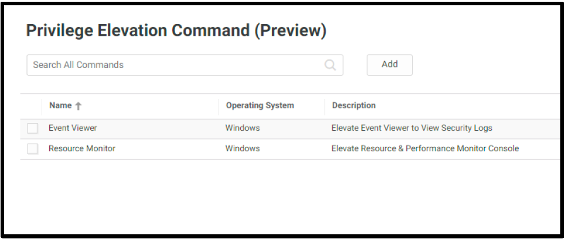

#### Assign commands to system(s)

01. From the main menu on the left, Navigate to **Resources > Systems**

    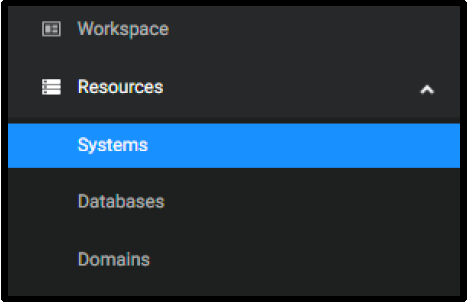

02. Click on the Windows Server **wins2019s**

03. Click on **Privilege Elevation**

04. Click **Add**

    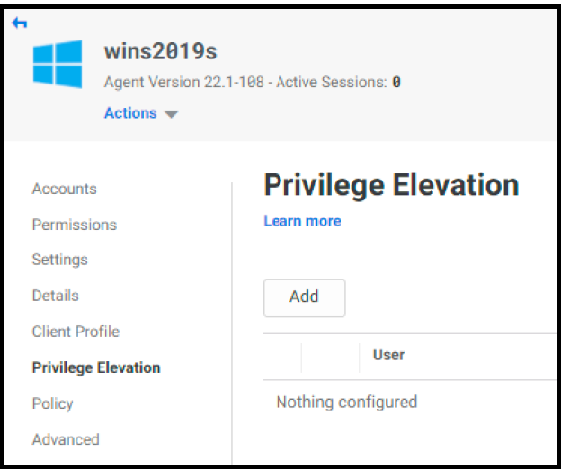

05. In Search **Command or Application** window, Select **Event Viewer**

    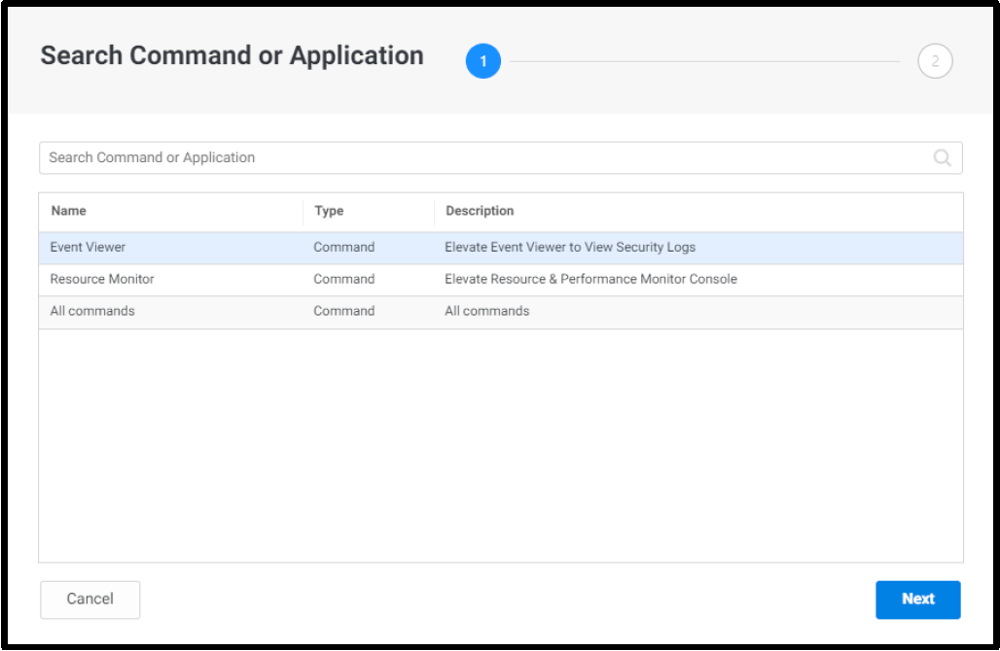

06. Click **Next**

07. In **Select User, Group, or Role** window, Search for **Contractor Role** and **select it**

08. Click **Add**

09. Repeat **Steps 3-8** to add **Resource Monitor Command** to *Contractor Role*.

10. Next to **Resource Monitor**, Check **Bypass MFA**

11. **Save**

12. The results:

    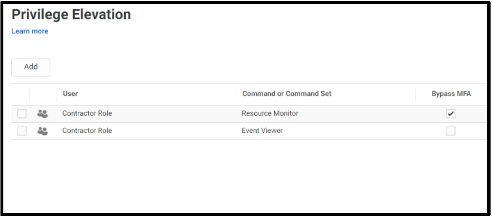

#### Apply MFA at Elevation Rule as policy

01. In the same system page, click **Policy** on the left. 

    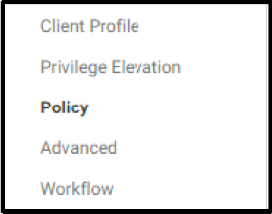

02. Scroll down to the end of the page.

03. From **Default Privilege Elevation Profile (used if no conditions matched)** dropdown list, select **Contractors MFA Profile**

04. Click **Save** 
    
    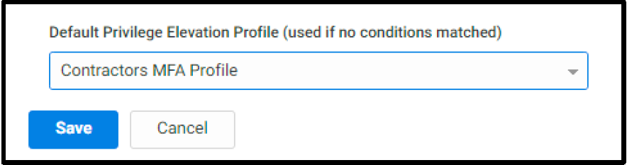

#### Test Privilege Elevation

01. Switch to/launch **Chrome incognito**, log in the **CIP Portal** as **zcontractor**.

02. Navigate to **Resources > Systems**.

03. Right Click Windows Server **wins2019s**

04. Click **Use My Account** to login to the server.

05. Open **Windows Administrative Tools** from **Start Menu**

    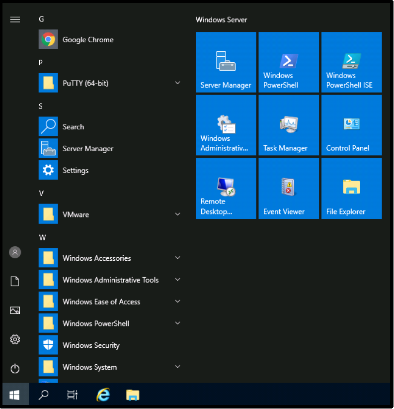

06. Double click **Event Viewer** to launch it.

07. Navigate to **Windows Logs > Security**.

08. Note that as a standard user you’re **not allowed** to view the events.

    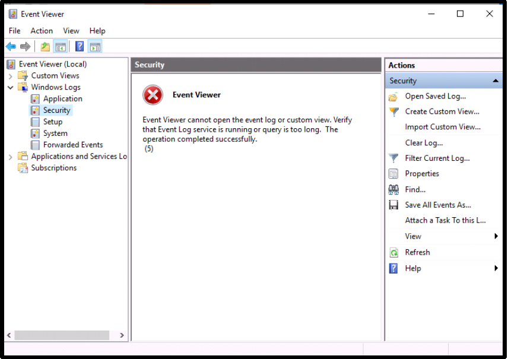

09. Close Event Viewer window

10. In **Windows Administrative Tools** page, Right Click on **Event Viewer**, Click **Run as Administrator**

    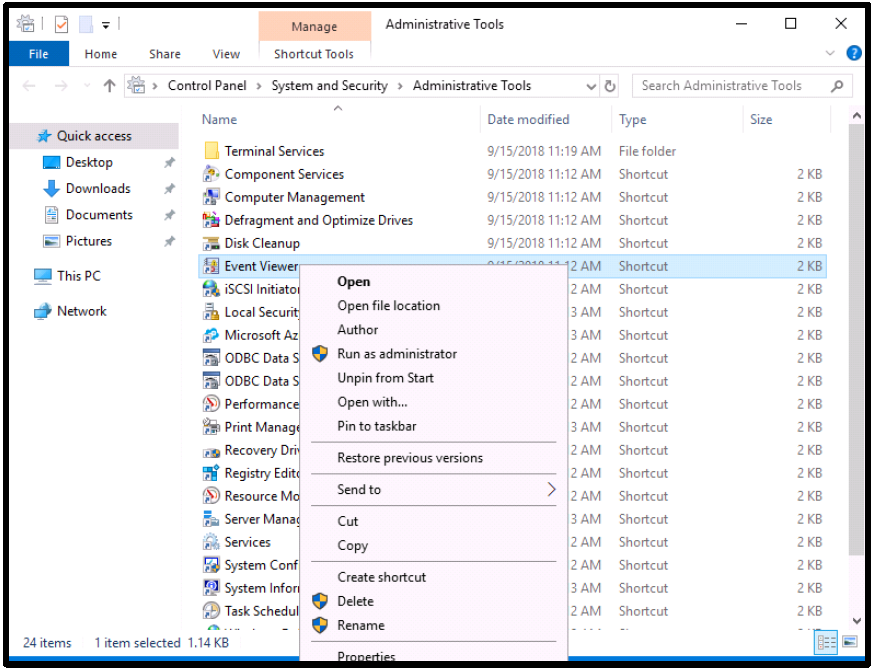

11. In UAC Prompt, Keep the default **Run with Privilege**

12. Click **Yes**

    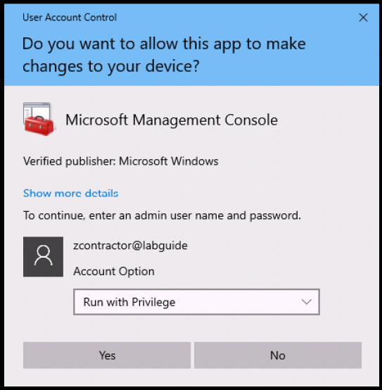

13. Based on the MFA Profile we assigned earlier, you will be prompted to reenter your **zcontractor** password and second factor (Security Question or Mobile Authenticator App).

14. Enter your credentials and click **Yes**

    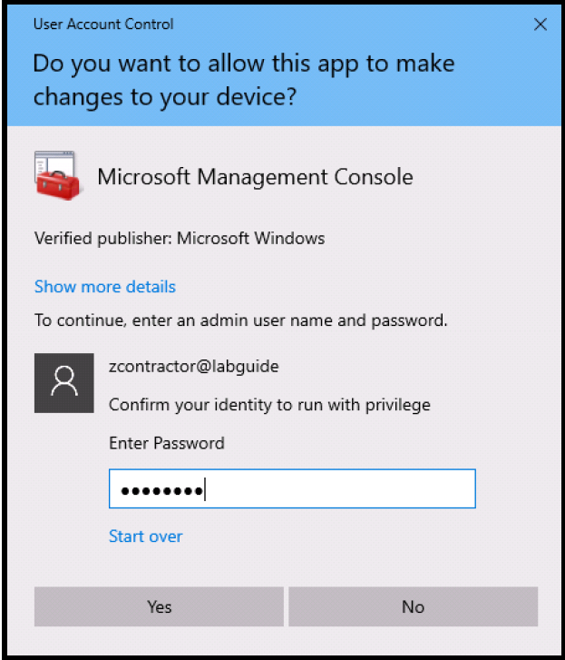

    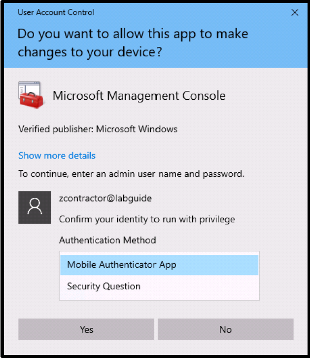

15. In the event viewer console, navigate to **Windows Logs > Security**.

16. Note that you have access to view the security events.

    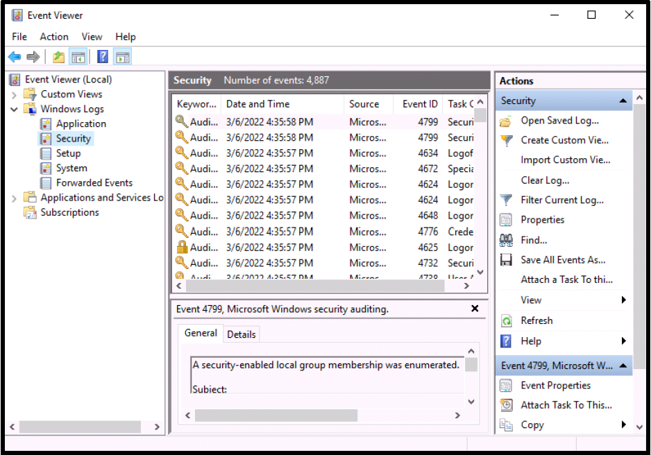

17. Repeat Steps **6-15** to test **Resource Monitor** Console Elevation

18. Note that you will gain access **without MFA** requirement, you have checked **Bypass MFA** for this command!

### Privilege Elevation for Linux

#### Create Elevation Commands

01. Launch Google Chrome, login to CIP Portal as admin.

02. From the main menu on the left, navigate to **Settings > Resources > Privilege Elevation command**

    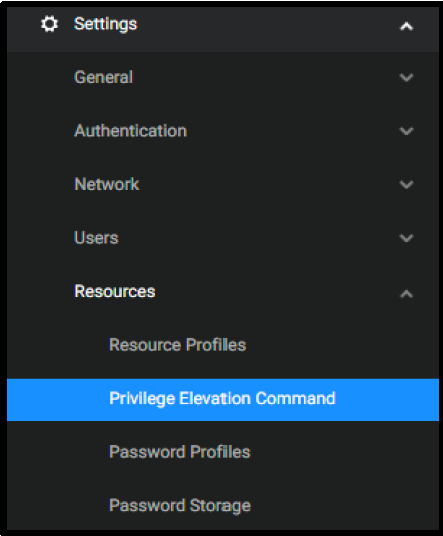

03. Click **Add**

04. Under *Operating System*, Select **Linux**

    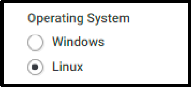

05. Fill in the following Information:

    - **Name:** SSH Config File - Edit

    - **Description:** Elevate to edit sshd server configuration file

    - **Command:**

      ```bash
      vi /etc/ssh/sshd_config
      ```

06. Under *Match Criteria*, Select **Standard User Path**

    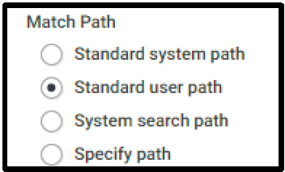

07. Click **Save**

08. Repeat Steps **3 -6** to add another command, use the following information

    - **Name:** SSH Service - Restart

    - **Description:** Elevate to allow restart sshd service

    - **Command:**

      ```bash
      systemctl restart sshd
      ```

09. Under *Match Criteria*, Select **Standard User Path**

10. Click **Save**

#### Assign commands to system(s)

01. From the main menu on the left, Navigate to **Resources > Systems**

    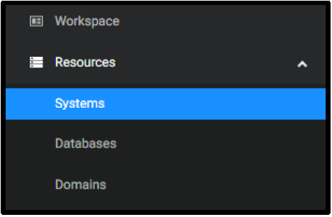

02. Click on the Linux server **rhel7sx64**

03. Click on **Privilege Elevation**

04. Click **Add**

05. In **Search Command or Application Window**, Select **SSH Service – Restart**

06. Click **Next**

    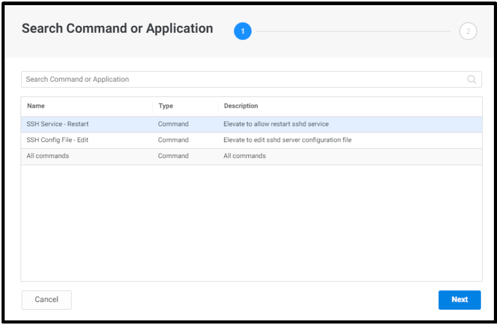

07. In **Select User, Group, or Role** window, Search for **Contractor Role** and **select** it

    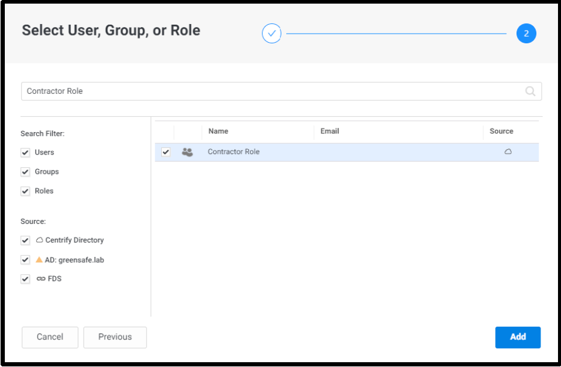

08. Click **Add**

09. Repeat **Steps 11-15** to add **SSH Config File – Edit** to **Contractor Role**.

10. Click **Save**

11. The results:

    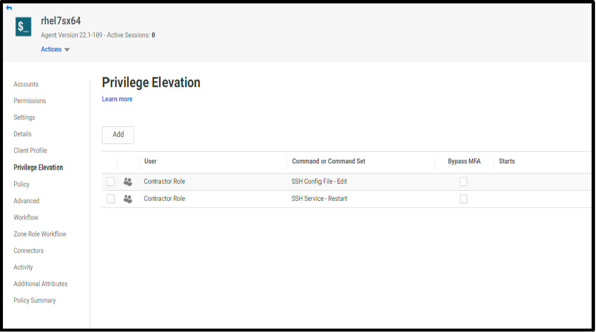

#### Apply MFA at Elevation Rule as policy

1. In the same system page, click **Policy** on the left.

    

2. Scroll down to the end of the page.

3. From **Default Privilege Elevation Profile (used if no conditions matched)** dropdown list, select **Contractors MFA Profile**

    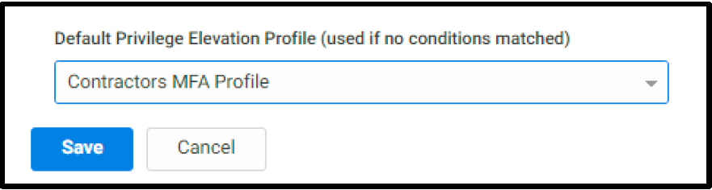

4. Click **Save**

#### Test Privilege Elevation

01. Switch to/launch **Chrome incognito**, login to the *CIP Portal* as **zcontractor**.

02. Navigate to **Resources > Systems**.

03. Right Click Linux Server **rhel7sx64**

04. Click **Use My Account** to login to the server.

05. Execute the following command:

    ```bash
    vi /etc/ssh/sshd_config
    ```

    The command will result **Permission Denied**

06. Quit by typing **ESC** and typing **:q!**

07. Execute the following command:

    ```bash
    sudo vi /etc/ssh/sshd_config
    ```

08. You will be prompted to type your **zcontractor** password and **MFA**.

    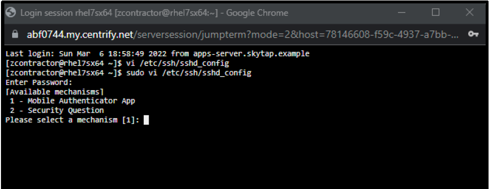

09. Now you should have access to **sshd_config** file.

10. Repeat **steps 5-9** to test *restarting the sshd service*.
