# Extras for Cloud Suite

## Introduction

This fourth lab will cover:

1. Apply MFA Everywhere
2. Unenroll and reenroll clients
3. Review Audit Sessions

!!!Note
    Estimated time to complete this lab: **20 minutes**

!!!Attention

    Systems used in this lab:

    - cloud-win-server
    - cloud-linux-server
    - https://<tenant/>.my.centrify.net


### Apply MFA Everywhere

Cloud Suite / CIP portal provides MFA requirements on the following:

1. Portal login
2. Portal Based Remote Login
3. Privilege Elevation for both Cloud Client & Server Suite agent
4. Host-based system login for both Cloud Client & Server Suite Agent

In the previous labs, you have configured MFA at Portal login & MFA at Cloud Client Privilege Elevation. In this lab you will configure the rest of MFA available options.

#### Portal Based Remote Login

01. While logged in The Portal using admin credentials, navigate to **Resources > Systems**

02. Click on the Linux system **rhel7sx64**

03. Click on **Policy**

    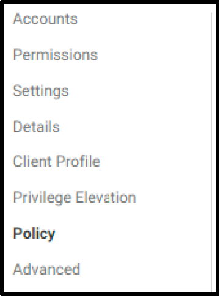

04. Under **Default System Login Profile (used if no conditions matched)**, select **Contractors MFA Profile**

    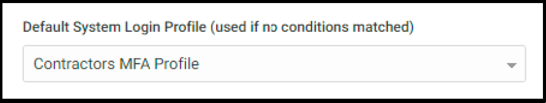

05. Click **Save**

06. Switch to **Chrome Incognito** session and login as **zcontractor@labguide** user

07. From main menu on the left, navigate to **Resources > Systems**

08. Right click the Linux system **rhel7sx64** and click **Use My Account**

    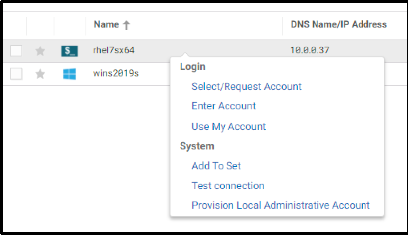

09. You will be prompted to enter your credentials again.

    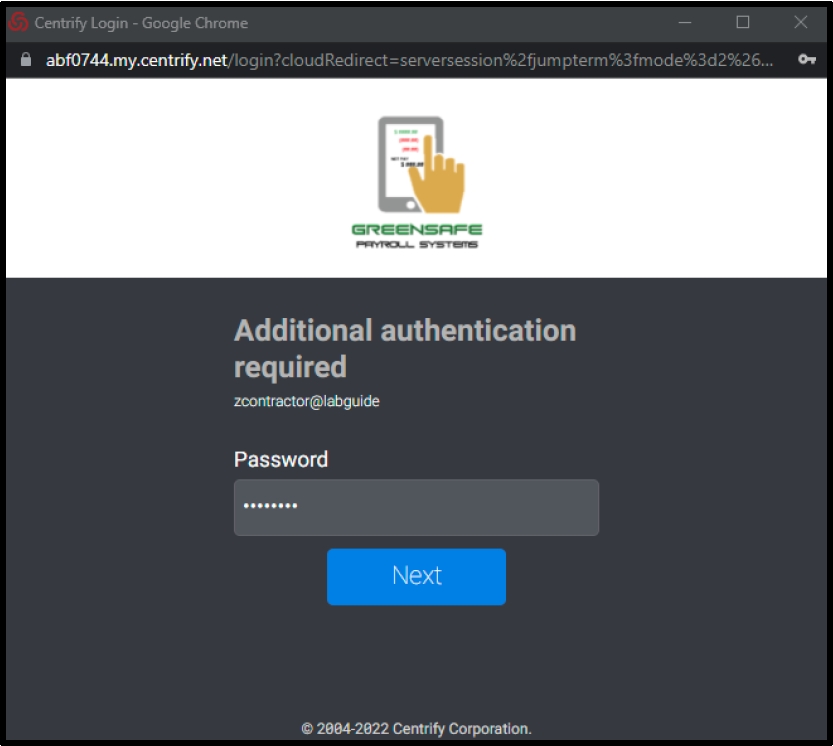

    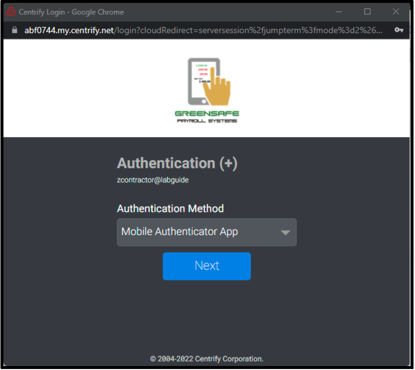

10. Provide the response and Click **Next**

11. Close the session after successful login to Linux Server.

12. Repeat **Steps 2 – 11** on the Windows server.

#### Host Based System Login – Cloud Client

01. While in portal, logged in as Admin, in the main menu on the left navigate to **Access > Policies**

    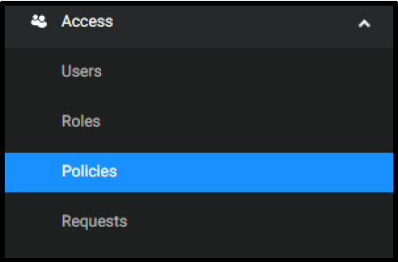

02. Click on **Contractor Policy**

03. Expand **Authentication > Centrify Clients > Login**

04. Select **Yes** from dropdown list next to **Enable authentication policy controls**

05. Select **Contractor MFA Profile** from dropdown list under **Default Profile (used if no conditions matched)**

06. Click **Save**

    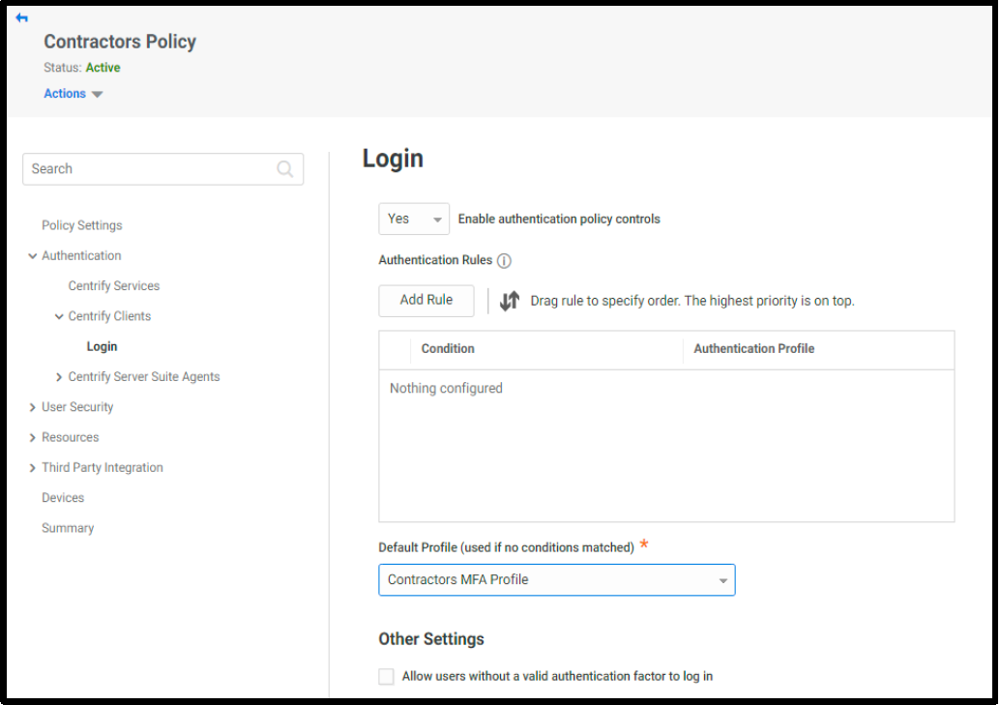

07. In **Skytap** portal , click on the **server name** to launch console access **cloud-RHEL-server**

    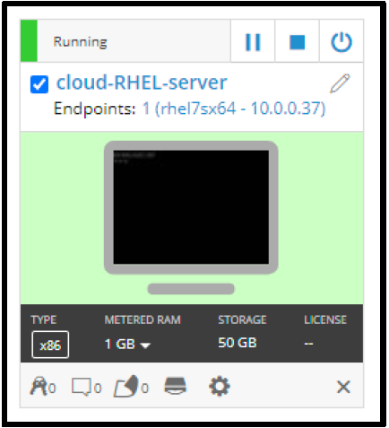

08. To login to the server, use the following credentials:

    1. **Username:** zcontractor@labguide-####
    2. **Password:** Provided by the trainer

09. You will be prompted to choose one of the available MFA options, **type the number** that corresponds the MFA mechanism you prefer to choose and hit **Enter**

    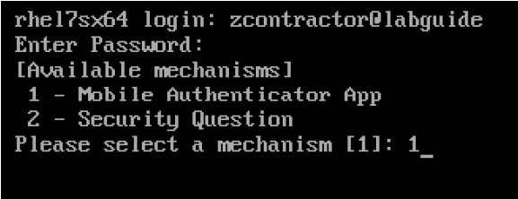

10. Repeat **Steps 7-9** to test MFA at **Windows** Server Console login **cloud-win-server**, using same *zcontractor@labguide-####*

    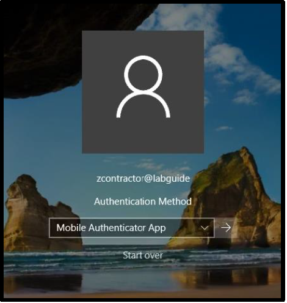

11. Sign out of the **cloud-win-server**

### Unenroll & Re-enrol Cloud Client

In a previous chapter, we have used the Wizard to enrol Windows Server with The Portal. In some cases, you may need to unenroll the client and re-enrol it. In this lab we will un-enroll and re-enrol Cloud Client using command line interface.

#### Unenroll the Windows server

1. From Skytap portal, open (cloud-win-server) console and login using the following credentials:

    1. **Username:** .Administrator
    2. **Password:** Provided by the trainer.

2. From **Start Menu**, launch **CMD** as **Administrator**.

3. Navigate to cagent folder using the following path

    ```powershell
    cd "C:\Program Files\Centrify\cagent"
    ```

    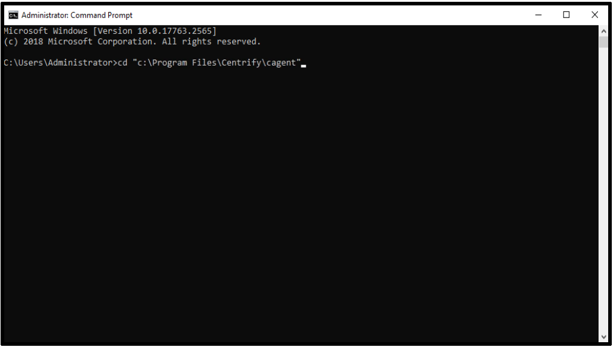

4. To unenroll, type the following command. The user provided is your tenant admin user account.

    ```powershell
    cunenroll.exe -d -u <your-tenant-admin-user>
    ```

5. The system will be successfully **unenrolled**.

    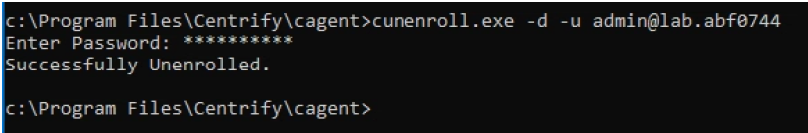

6. Open The Portal and refresh, navigate to **Resources > Systems**. The system no longer exists.

#### Re-enrol the Windows server:

7. While in CMD session on the windows server, type the following command:

    ```powershell
    cenroll.exe -F all -t <your-tenant-url> -u <your-tenant-admin-user>>
    ```

    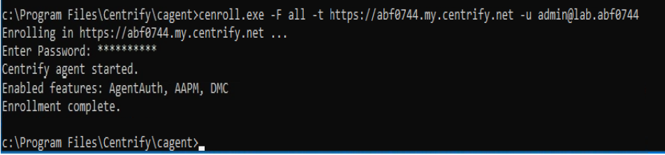

    !!!Note
        You can use the registration code to enrol the system by replacing ( **-u** ) switch with ( **-c** ) followed by the registration code retrieved from The Portal.

    ```powershell
    cenroll.exe -F all -t <your-tenant-url> -c <registration-code>
    ```

8. Refresh The Portal and navigate to **Resources > Systems** page to see the newly created windows server.

### Review Portal Based – Gateway Audits

1. Login to *apps-server* using **afoster** credentials

2. Launch **Audit Manager** by click on the icon available on the Desktop

    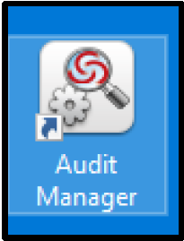

3. To View the list of systems were audited via CIP Portal, Click on **DefaultInstallation > Audited Systems (Vault-based)**

    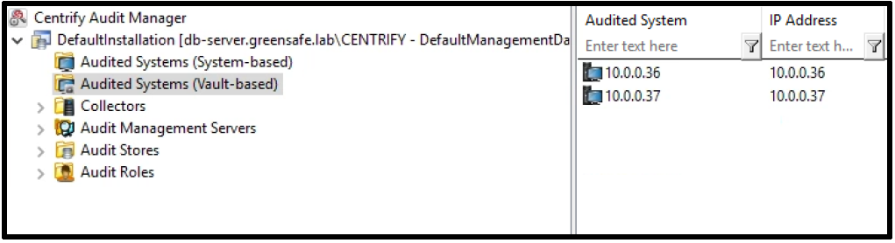

    !!!Note
        Your environment may look from IP addresses perspective a bit different)

4. **Close** Audit Manager

5. To replay Recorded sessions, Launch **Audit Analyzer** by click on the icon available on the Desktop

    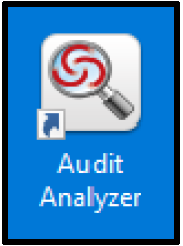

6. Expand Audited Sessions

7. Choose Today filter

    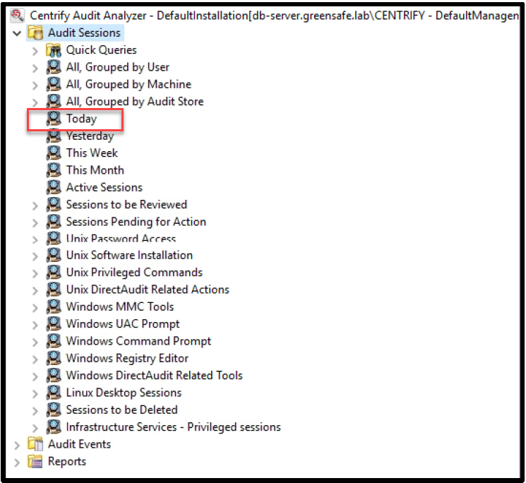

8. The list of audited sessions are showing the zcontractor that has connected using the CIP and the Cloud Connector that has been installed earlier in the lab

    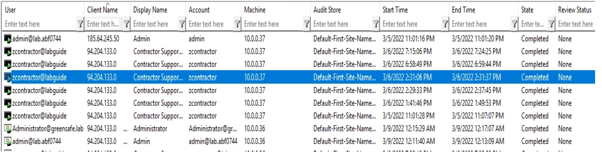