# Server Suite with CIP

## Introduction

Server Suite leverages CIP to enable MFA at System Login, MFA at privilege elevation and workflow for just in time access.
Each Server Suite user must have a profile in CIP to achieve the mentioned features.

This lab will cover:

1. Apply MFA at system Login for Server Suite agents
2. Apply MFA at Privilege Elevation for Server Suite agents
3. Configure workflow for automatic time-based role assignment for Server Suite Agent.

!!!Note
    Estimated time to complete this lab: **60 minutes**

!!!Attention
    Systems used in this lab:

    - apps-server.greensafe.lab
    - db-server.greensafe.lab
    - db-unix.greensafe.lab
    - https://tenant.my.centrify.net


### Apply MFA at system Login

#### Enable Server Suite MFA in CIP Portal

1. Login to your unique CIP Portal URL by navigating to <https:/>/tenant.my.centrify.net with your admin credentials on the **apps-server**.

2. From the main menu on the left, navigate to **Access > Policies**

    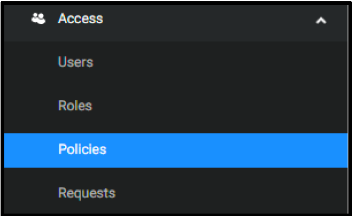

3. Click on **Contractors Policy**

4. Under **Policy Settings**, expand **Authentication > Centrify Server Suite Agents**

5. Click on **Linux, UNIX and Windows Servers**

    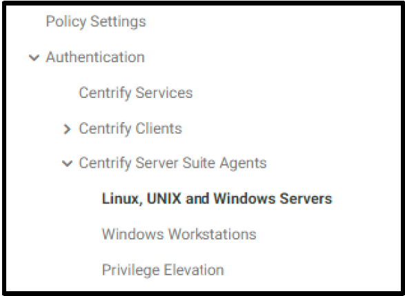

6. Select **Yes** next to **Enable authentication policy controls**

7. Under **Default Profile**, choose **Contactors MFA Profile**

8. Under **Apply Pass-Through Duration**, Keep the default **Never (Default)**

9. Click **Save**

    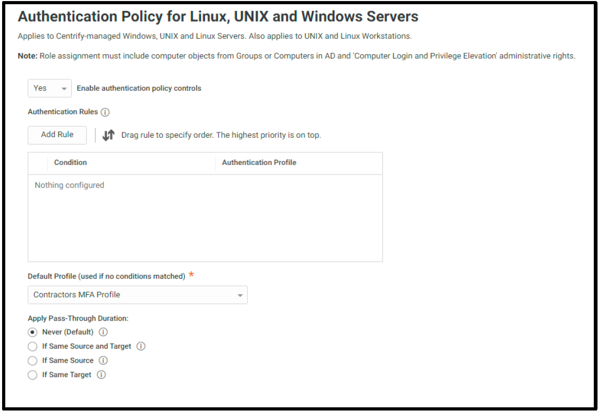

11. On the same page, Under **Policy Settings**, expand **Authentication > Centrify Server Suite Agents**

12. Click on **Privilege Elevation**

    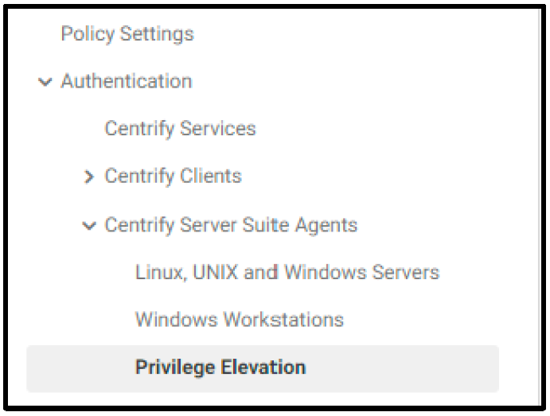

13. Select **Yes** next to **Enable authentication policy controls**

14. Under **Default Profile**, choose **Contractors MFA Profile**

15. Click **Save**

    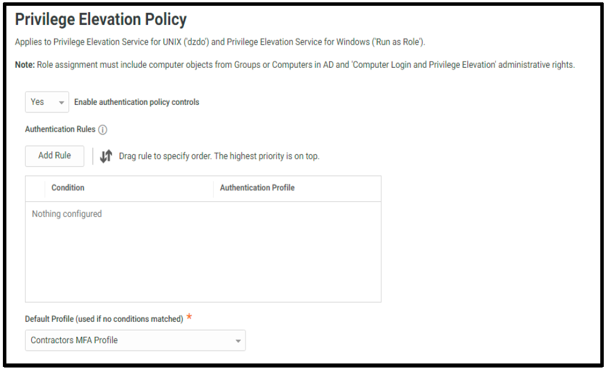

16. In the same page, navigate to **Authentication > Centrify Services**

    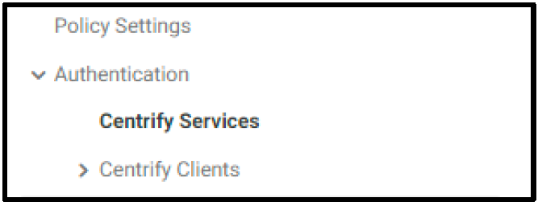

17. Scroll down to **Other Settings**

18. Ensure that **allow users without a valid authentication profile to login** is checked.

19. Click **Save**

#### Create Computer Role

01. From the Main menu on the left, navigate to **Access > Roles**

02. Click **Add Role**

03. In the name field, type **Server Suite Computers**

    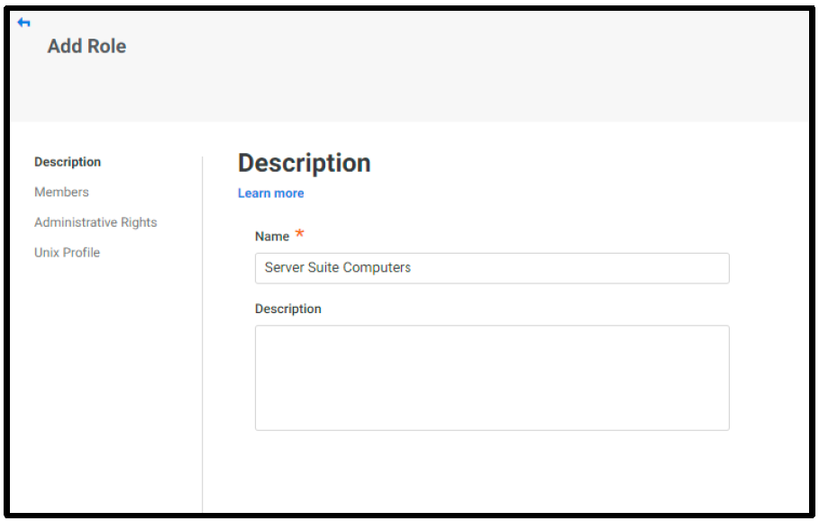

04. Click on **Members**

05. Click **Add**

06. Make sure **Computers** is checked as filter

07. Search for **db-unix**, select it

08. Click **Add**

    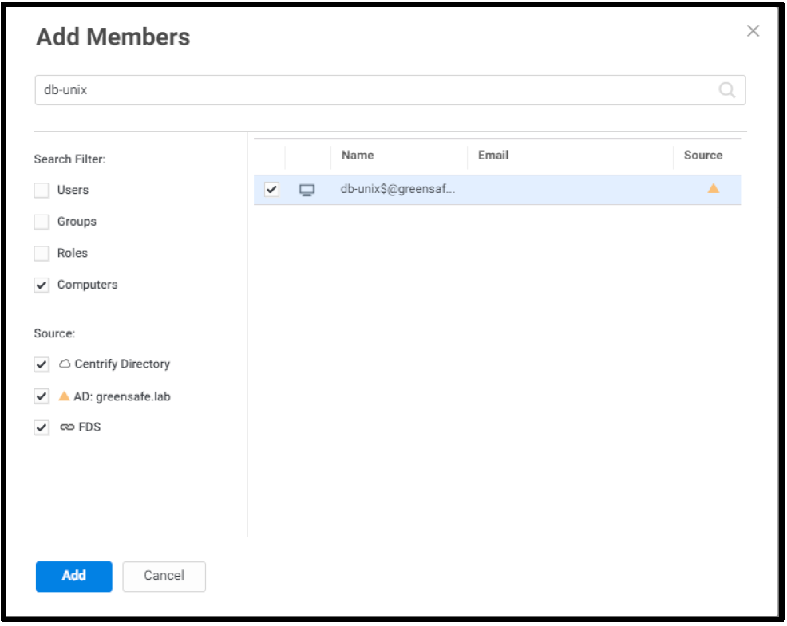

09. Repeat the same steps to add another computer as member **db-server**

10. Click on **Administrative Rights > Add**

11. Select **Computer Login and Privilege Elevation** and click **Add**

    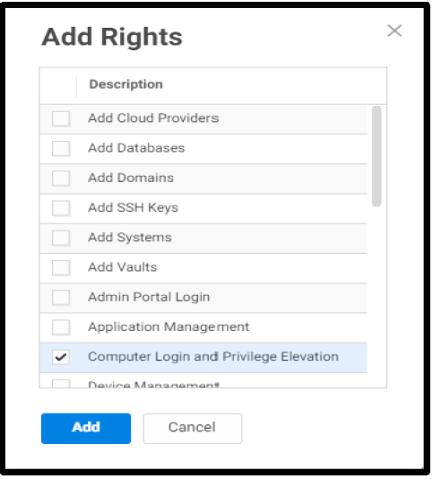

12. Click **Save** the Role

#### Assign User to role

1. From the main menu on the left, navigate to **Access > Roles**

2. Click on **Contractor Role**

3. Click on **Members**

4. Click **Add**

5. Search for user **badams@greensafe.lab**

6. **Select** the user, click **Add** and click **Save**

   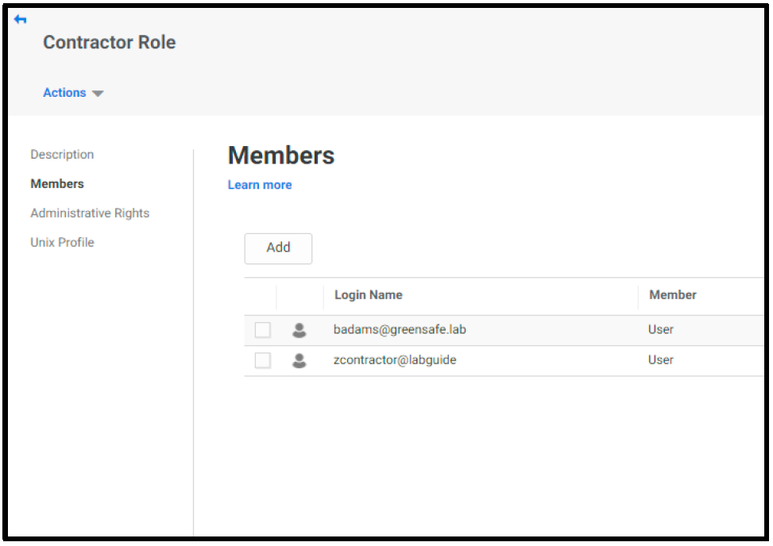

#### Create User’s MFA Profile

1. Launch **Chrome Incognito** session and navigate to the portal using *https://tenant.my.centrify.net*

2. Login to The Portal with the following credentials:

    1. **Username:** <mailto:badams@greensafe.lab>
    2. **Password:** Provided by trainer

    !!!Note
        This is your first login to the portal using badams user. Thus, you will not be prompted for MFA according to the policy you configured that allows users without valid MFA profiles to login.

3. In the top right corner, click on the **Username > Profile**

    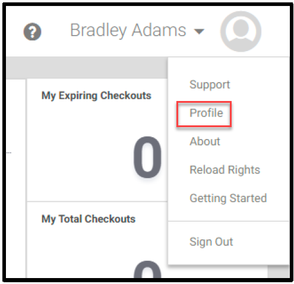

4. Click on **Security Question**, type in security question and answer it and click **Save**

5. Click on **Mobile Authenticator App** to configure it

6. Scan the **QR Code** using your mobile device Authenticator Application

7. Enter the code generated by your Authenticator Application to verify

8. Click **Save**

#### Configure Server Suite Agents

Server Suite Agents (Windows and UNIX) communicates with The Portal via available connectors. This communication requires the connector IWA root certificate to be trusted by the agents.

##### Windows Server

01. Login to **db-server.greensafe.lab** using the following credentials:

    1. **Username:** afoster
    2. **Password:** Provided by trainer

02. Launch **Google Chrome** and navigate to *https://tenant.my.centrify.net* and login using your admin account

03. From the main menu on the left, navigate to **Settings > Network > Centrify Connectors**

    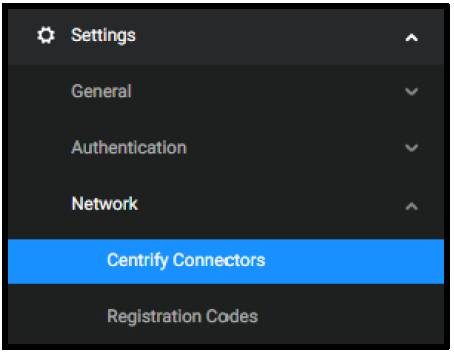

04. Click on the available connector

05. Click on **IWA Service > Download your IWA root CA certificate**

    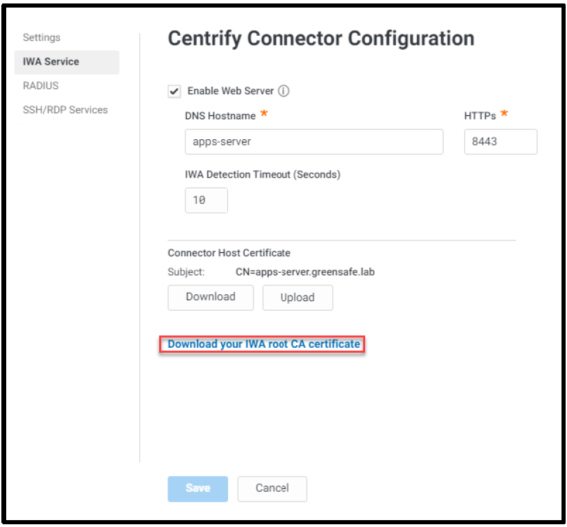

06. Double click the downloaded certificate file to open it

07. Click **Install Certificate**

    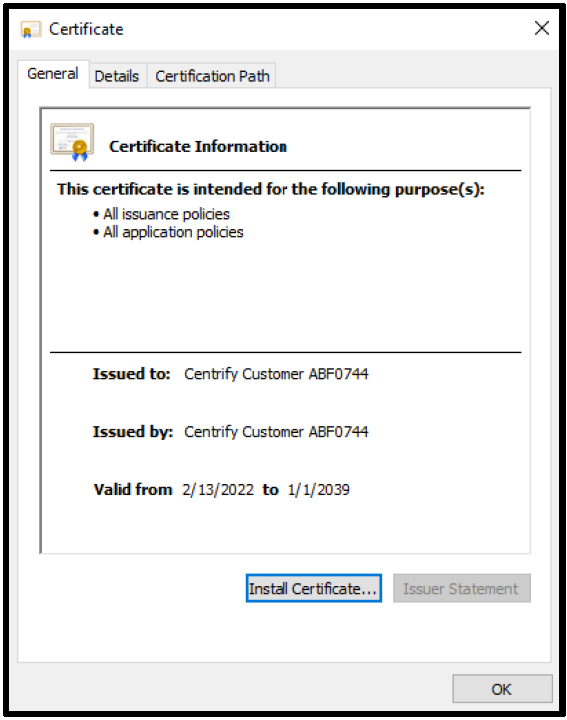

08. In **Store Location**, choose **Local Machine > Next**

    

09. In Certificate Store, choose **Place all certificates in the following store > Browse**

    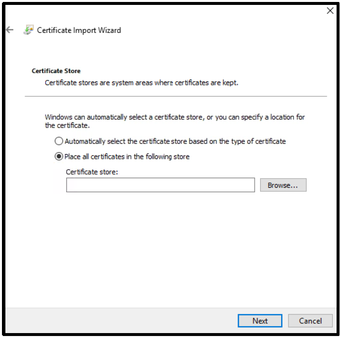

10. Click on **Trusted Root Certification Authority > Ok**

    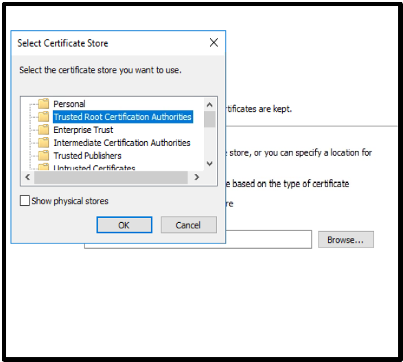

11. Click **Next > Finish**

##### Linux Server

01. On the **db-server.greensafe.lab**

02. Navigate to downloads folder, double click on **IwaTrustRoot.cer** file to open the previously downloaded Connector Certificate.

03. Click on **Details > Copy to file**

    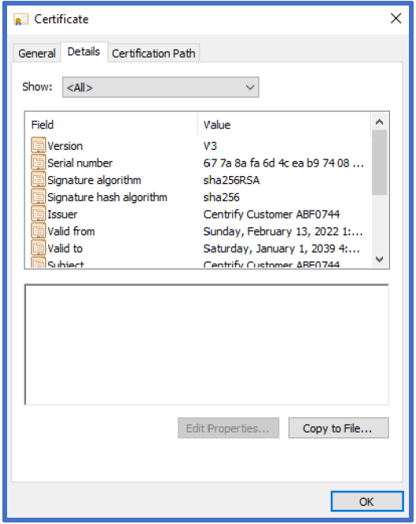

04. In the *Export Wizard*, Select **DER Encoded**.

05. Name the new certificate **Connector-cert > Save**

    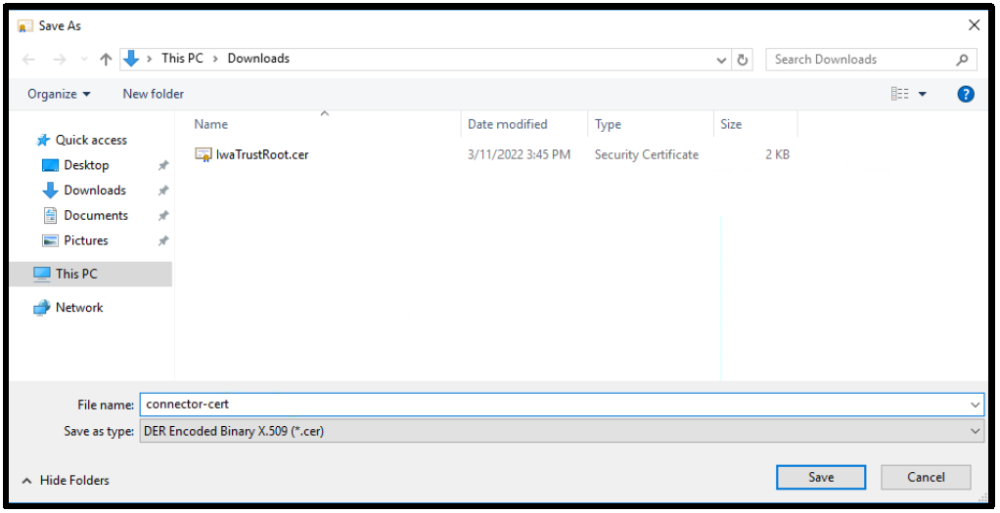

06. Launch **Server Manager > Manage > Add Roles & Features**

07. Click **Next** multiple times until **Select Feature Page > Check Group Policy Management > Continue installation**

08. From run open **Group Policy Management (gpmc.msc)**

09. Navigate to Forest: **greensafe.lab > Domains > greensafe.lab > Centrify**

10. Right Click **Centrify GPO > Edit**

    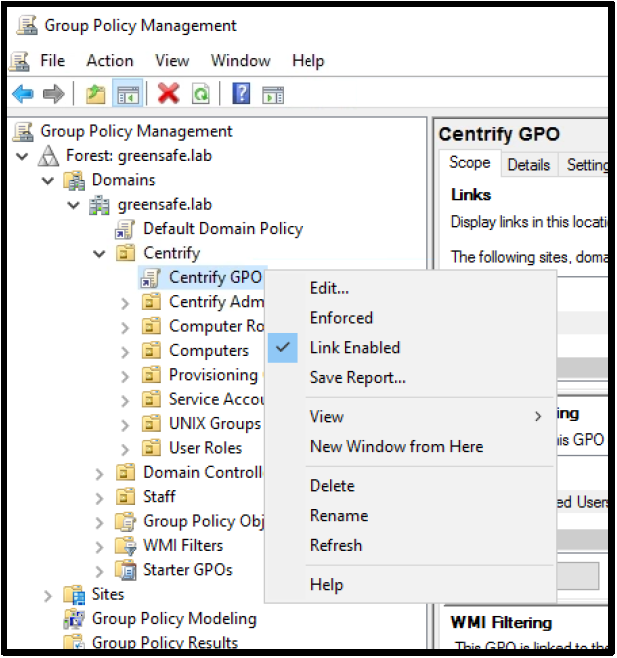

11. Navigate to **Computer Configuration > Policies > Windows Settings > Security Settings > Public Key Policies > Trusted Root Certification Authorities**

    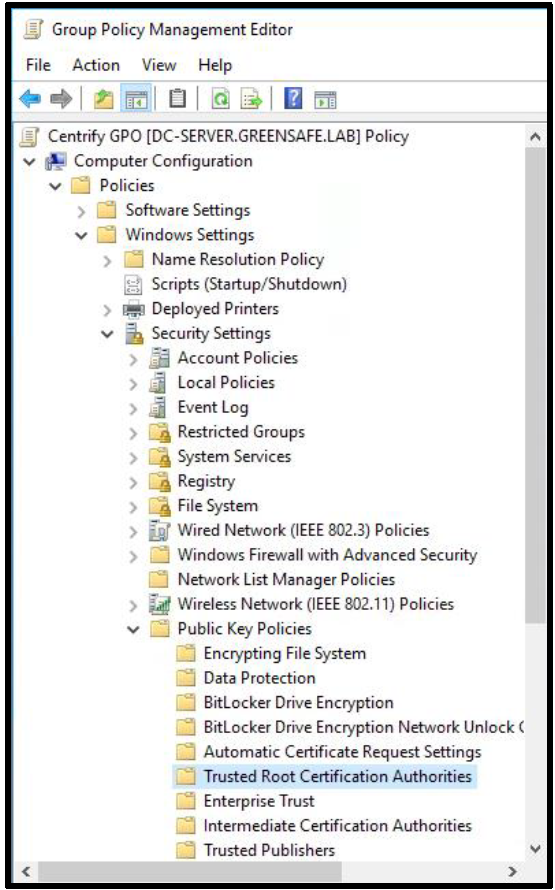

12. Import the **Connector-cert.cer** certificate

13. Login to **db-unix** server using **root** and update the group policy using this command: `adgpupdate`

#### Add Role Assignment to the user

Bradley Adams user (badams) as a member of Team_Sales Security Group in Active Directory. In previous Server Suite labs , you have assigned this user the proper Unix & Windows Login roles, without MFA. To add MFA requirements and system login.

01. Login to **apps-server** using the following credentials:

    1. **Username:** afoster
    2. **Password:** Provided by the trainer

02. Open **Access Manager**

03. Navigate to **Global Zone > Child Zone > Windows Zone > Authorization > Role Assignment**

    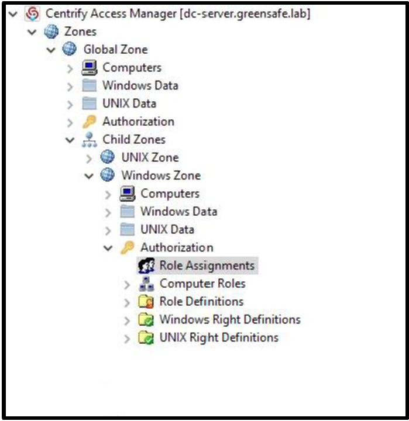

04. Right Click **Role Assignments > Assign Role**

05. Select **Require MFA for Login > Ok**

06. Click **Add AD Account > Find Team_Sales Group > Ok**

    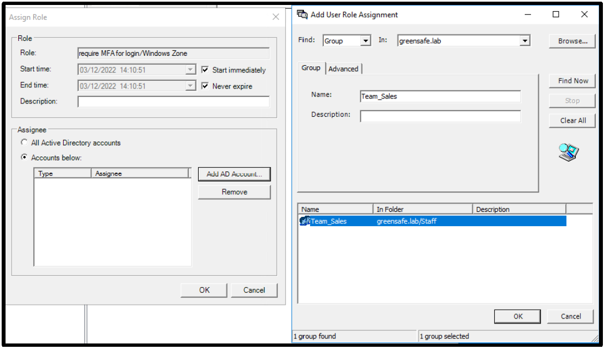

07. Navigate to **Global Zone > Child Zone > Unix Zone > Authorization > Role Assignment**

08. Right Click **Role Assignments > Assign Role**

09. Select **Require MFA for Login > Ok**

10. Add **Team_Sales Group**

11. Test Console login to **db-server & db-unix servers** using **badams**. You should be prompted for MFA. If any other account is logged in , sign them out.

    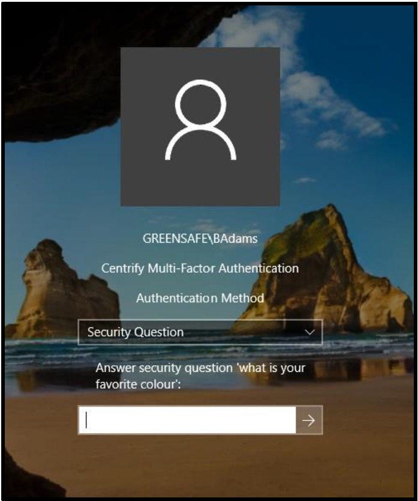

    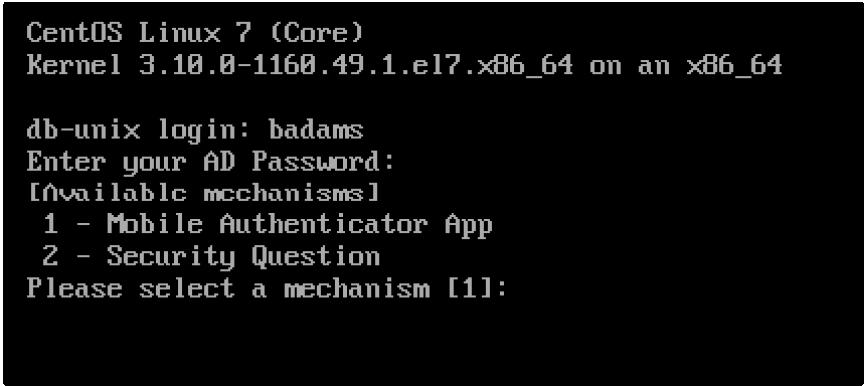

### Apply MFA at Privilege Elevation

MFA at privilege elevation is a feature enabled at the Role level in Access Manager. For this lab you are going to use an existing privilege elevation role, enable MFA requirements for it and assign it to Bradley Adams user.

#### Configure MFA for windows Application

01. From **Access Manager Console**, navigate to **Global Zone > Child Zones > Windows Zone Authorization > Windows Right Definitions > Applications**.

    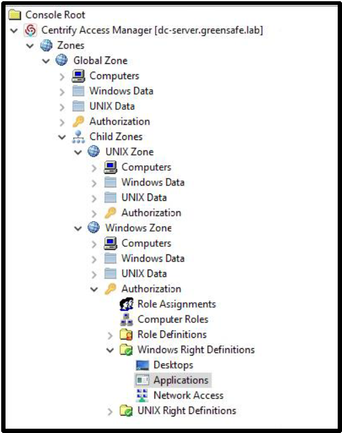

02. Right Click **Windows Firewall Management > Properties**

03. Open **Run As** tab

04. Select **Re-authenticate current user > Require multi-factor authentication**

    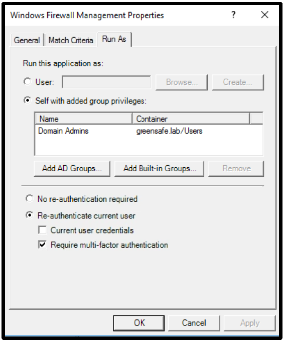

05. **Ok**

06. Under **Windows Zone**, Right Click **Role Assignments > Assign Role**

07. Select **Firewall Management > Click Ok**

08. Click **Add AD Account**

09. Search for **badams** user > Click **Find Now**

    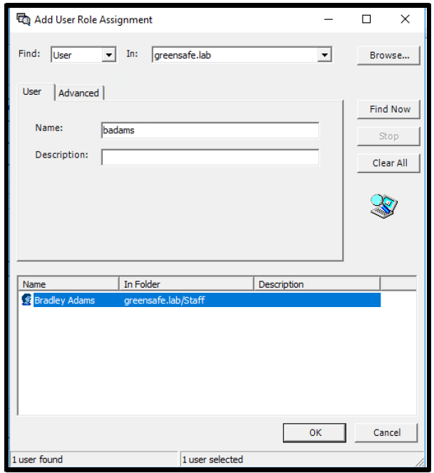

10. Select **Bradley Adams** user and click **Ok > Ok**

#### Configure MFA for UNIX Command

1. Open **Unix Zone > Authorization > UNIX Right Definitions > Commands**

    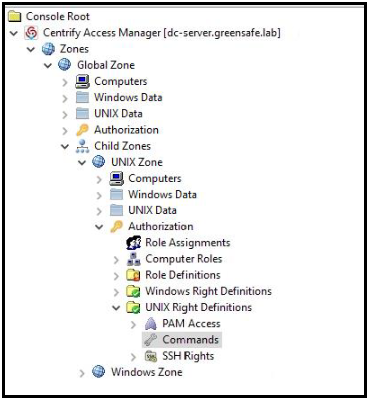

2. Right Click **Services Restart > Properties**

3. Click **Attributes** tab

4. Select **Re-authenticate current user > Require multi-factor authentication**

    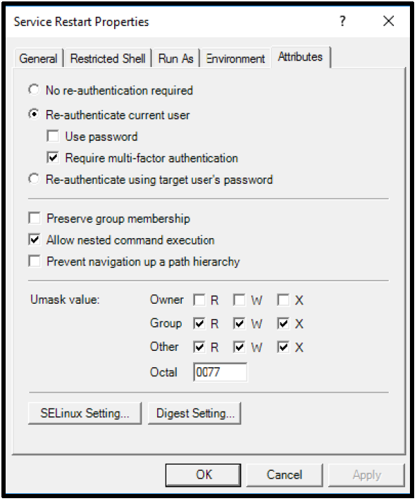

5. Click **Ok**

6. Navigate to **Unix Zone > Authorization > Role Assignment**

7. Right Click **Role Assignment** > Click **Assign Role**

8. Click **Unix Service Manager** > Click **Ok**

9. **Add AD Account > badams > Ok > Ok**

#### Test Elevation with MFA on UNIX

1. Login to **db-unix** server using **badams** credentials and MFA requirements

2. Restart the firewalld service using the following command

    ```bash
    dzdo systemctl restart firewalld
    ```

    !!!Note
        If the command throws an error you are not allowed, log into the db-unix, and run the `adflush` command. Then retry the command. If still not working you can use `dzinfo` to see the allowed commands

3. Provide the password and MFA challenge will kick in

4. Close the session

#### Test Elevation with MFA on Windows

1. Login to **db-server** server using **badams** credentials & MFA requirements

2. From **Start Menu**, Click **Windows Administrative Tools**

3. Right click **Windows Firewall** and select **More > Open File Location**

4. Click on **Run with Privilege**

5. Reauthenticate using **badams** credentials and MFA

    !!!Note
        If the command throws an error you are not allowed, log into the db-unix, and run the `dzrefresh` command. Then retry the command.

### Configure Workflow

01. Login to your unique CIP URL <https:/>/tenant.my.centrify.net as admin user.

02. Navigate to **Resources > Domains**

    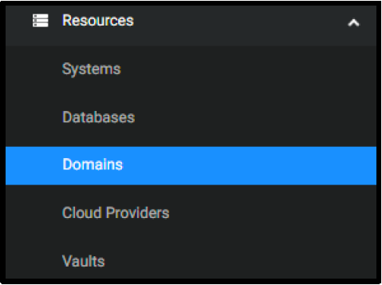

03. Click on domain name **greensafe.lab**

    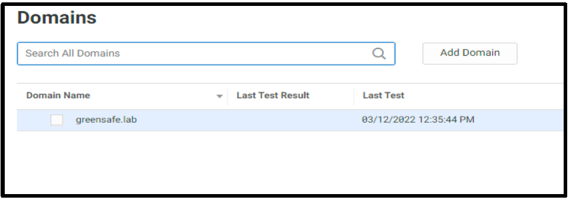

04. Click **Permission > Add**

    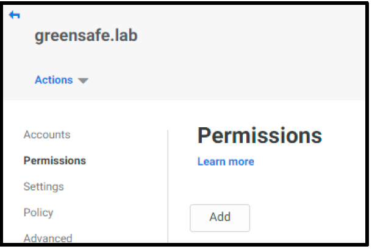

05. Search for your **CIP Admin User** > Click **Add**

    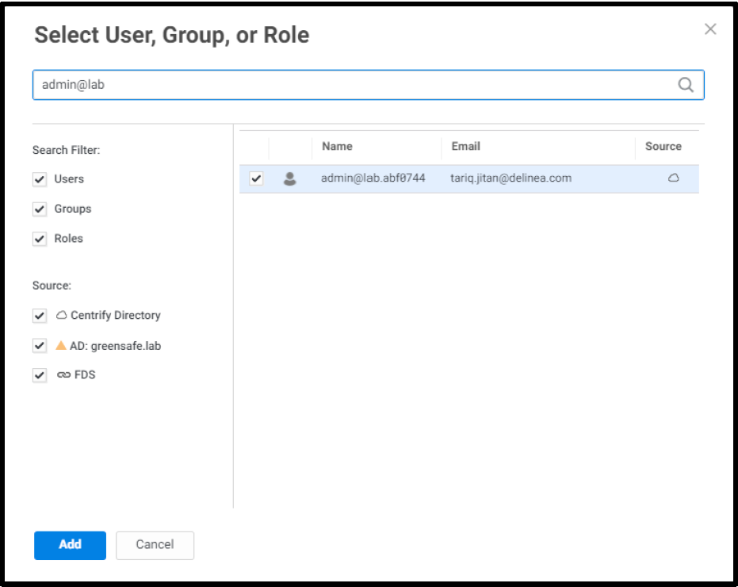

06. Next to your admin username, check **Add Account**

    

07. Click **Save**

08. In the same page, Click on **Advanced**

    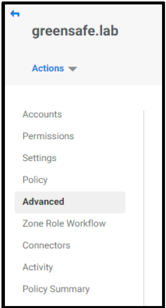

09. Under **Domain Administrative Account**, Click **Set**

    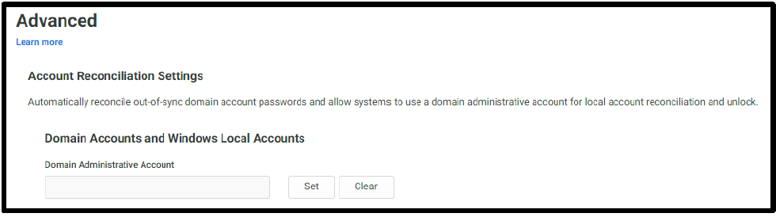

10. Choose **Active Directory Account > Select**

    

11. Search for **afoster** user, choose it > **Select**

    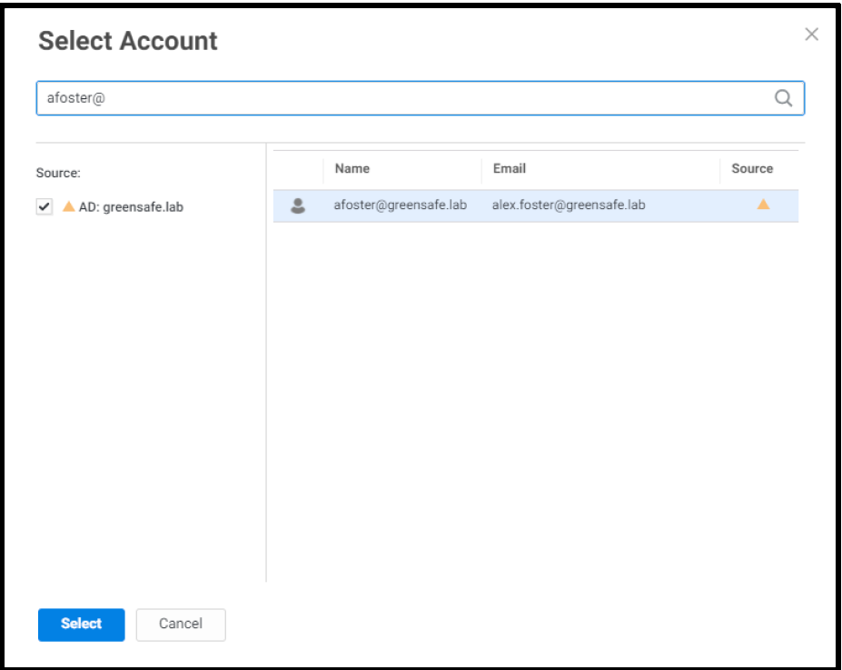

12. Provide the password, click **Select** and click **Save**

13. In the same page, Click **Zone Role Workflow**

    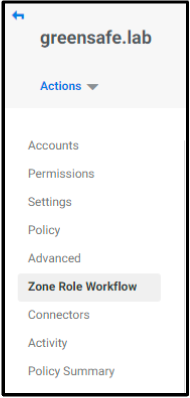

14. Check **Enable zone role requests from systems in this domain**

    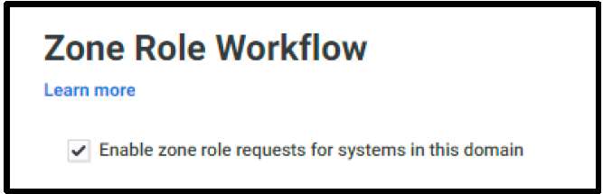

15. Under **Assignable Zone Roles**, Click **Add**

16. Search **Firewall**, Check **Firewall Management/Windows Zone**

17. Click **Add**

    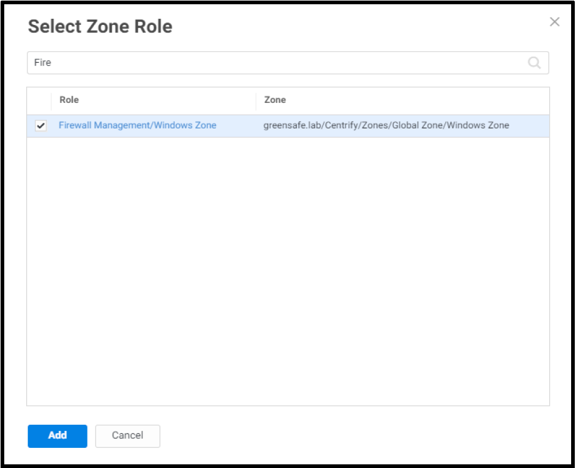

18. Under **Approver List**, Click **Add**

19. Choose **Specified user or Role** from dropdown list

    

20. Click **Add**

    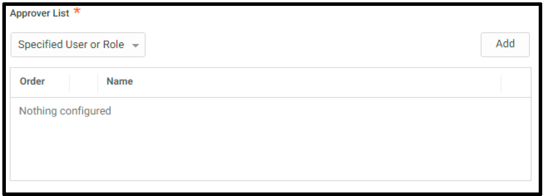

21. Search for your **CIP Admin** user and add it. This user will be approver.

    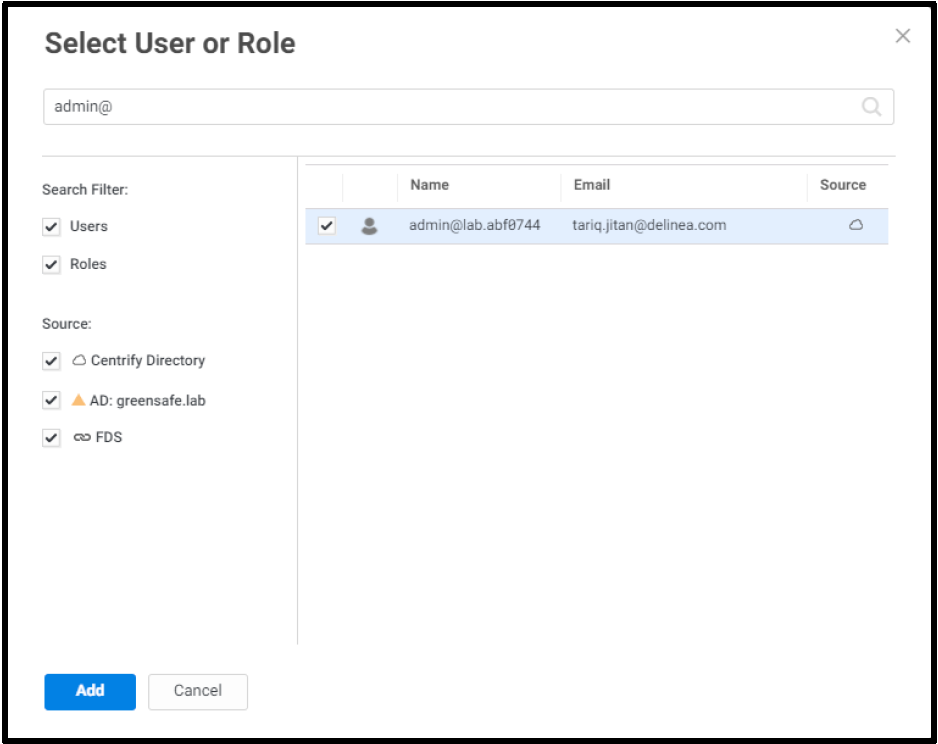

22. Click **Add** and click **Save**

23. From the main menu on the left, navigate to **Resources > Systems**

24. Click **Add System**

25. Add **db-server.greensafe.lab** as shown in the image below

    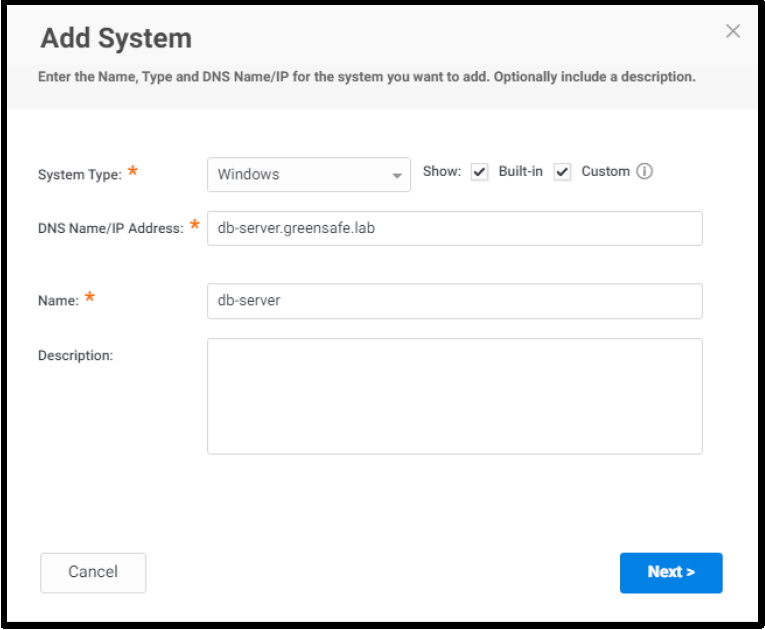

26. **Accept all defaults** and add the system using **Next** as many times till you see *Add System* and the **Finish** button. This will validate the credentials and the connection to the db-server. Click **Close** if all went ok

27. Click on db-server in the systems list

    

28. Click **Advanced**

    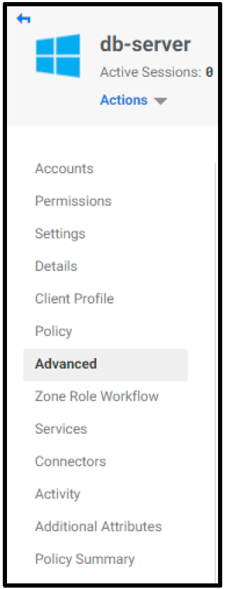

29. Under **Domain Settings**, Click **Set**

    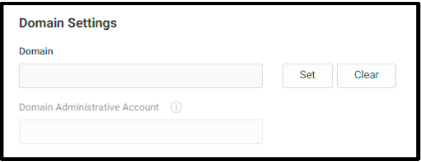

30. Search for **greensafe.lab** and add it

31. **Save**

32. In the same page, click **Zone Role Workflow**

    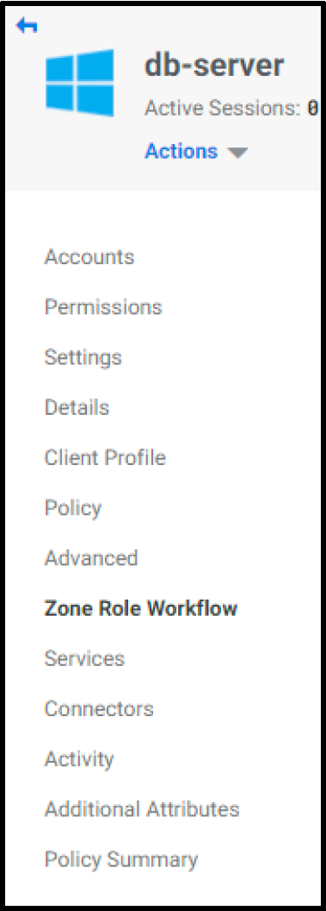

33. Check **Use Domain Administrative Account for Zone Role Workflow operations**

34. Change **Enable zone role requests from this system** to **Yes**

35. Accept All other defaults

    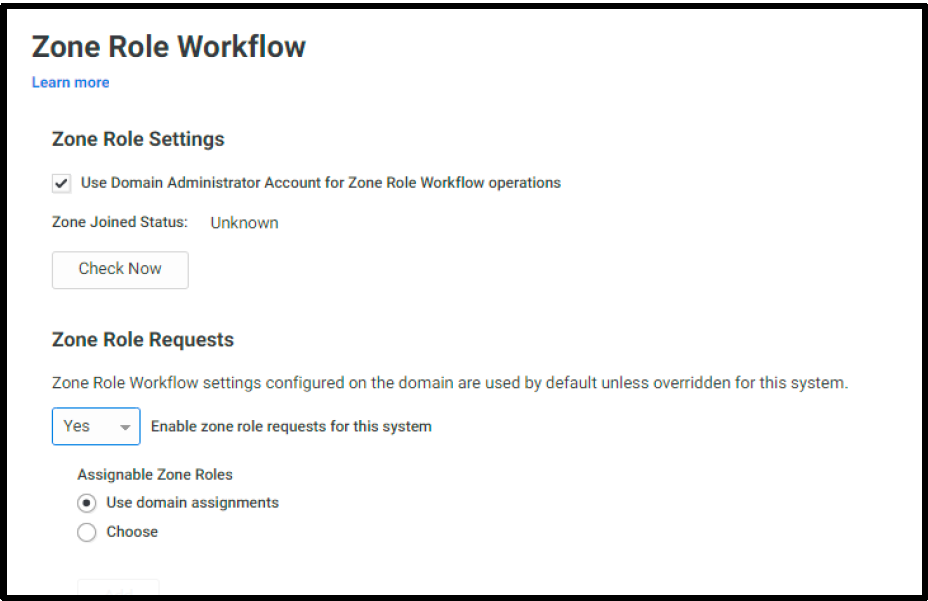

36. Click **Save**

37. In the same page, click **Permissions**

    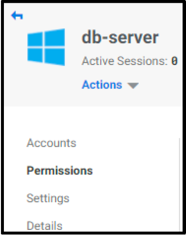

38. Click **Add**

39. Search for **badams** user, check it and click **add**

    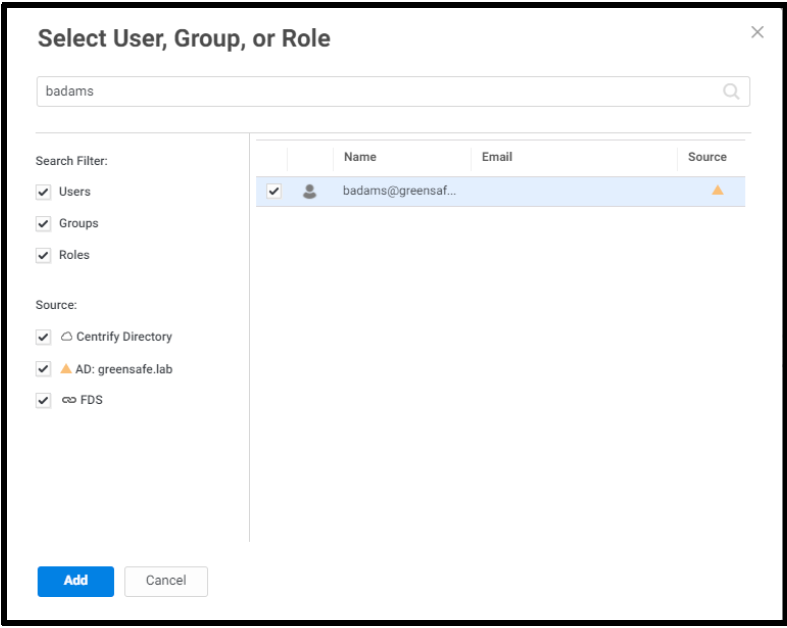

40. Scroll to the right to check **Request Zone Role** for **badams** user

    

41. Click **Save**

#### Test the Automatic Role Assignment

01. In **Access Manager**, navigate to **Global Zone > Windows Zone > Authorization > Role Assignment**

    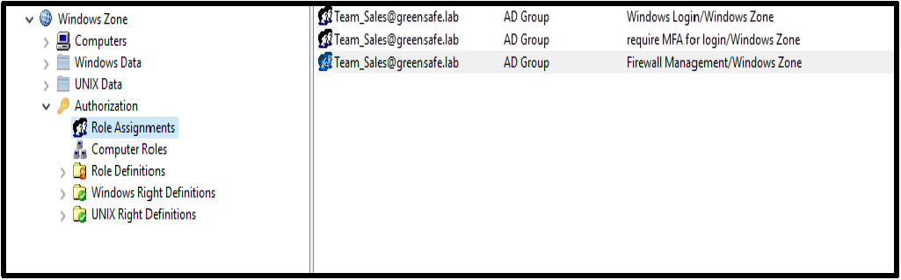

02. **Delete** the *existing Role Firewall Management* assigned for **BAdams**

03. Open **Chrome Incognito** and login to the portal as **badams**.

04. From the main menu on the left, navigate to **Resources > Systems**

05. Right click **db-server**, click on **Request Zone Role**

    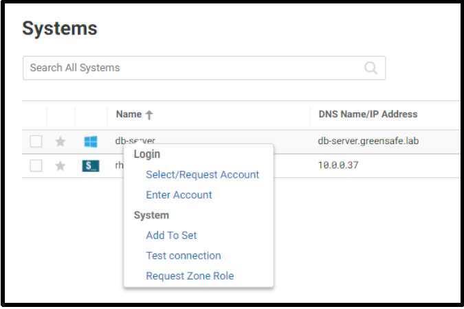

06. Click on the available Role **Firewall Management/Windows Zone > Request**

    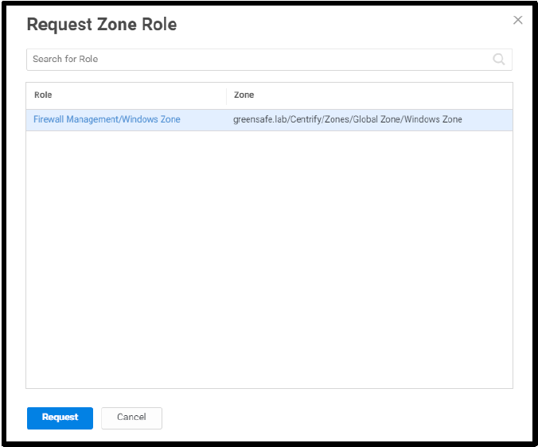

07. In the request form, change the start time to 1 minute after the approval. Type a message in the *Reason Message* if required.

08. Click **Submit**

    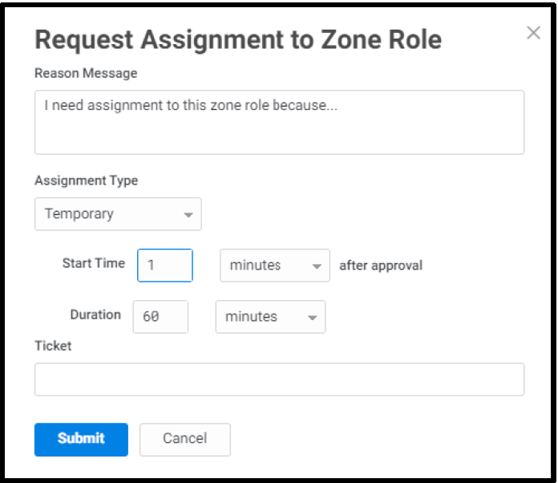

09. Switch to CIP Chrome session (logged in as your **admin** user / **Approver** user)

10. From the main menu on the left, navigate to **Access > Requests**

    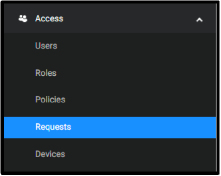

11. Click on the request to view the details.

    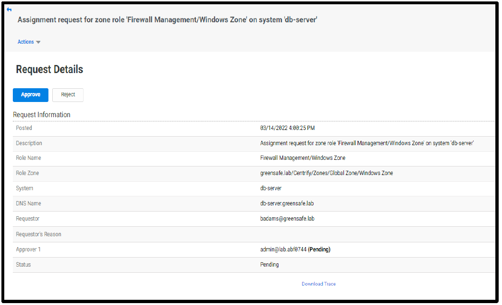

12. Click **Approve** and click **Submit**

13. In **Access Manager Console**, Navigate to **Global Zone > Windows Zone > Computers > db-server > Role Assignment**

    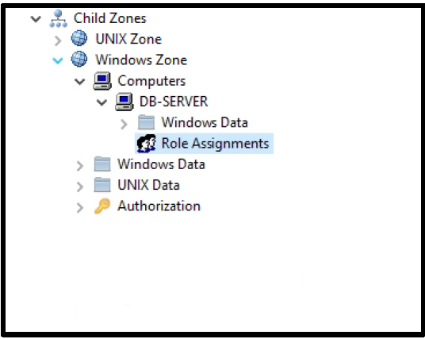

14. **Refresh the page**

15. Note the newly created role assignment with start and end date.

    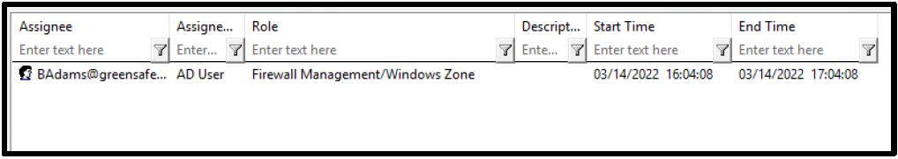