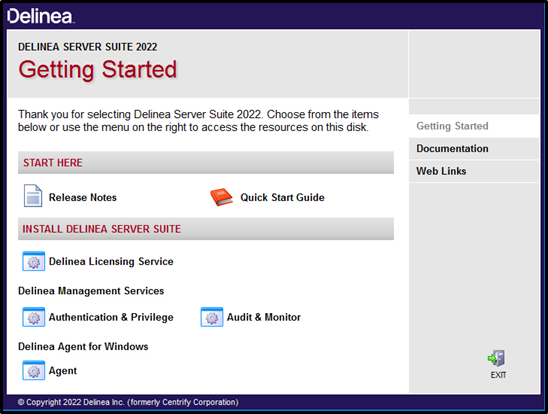
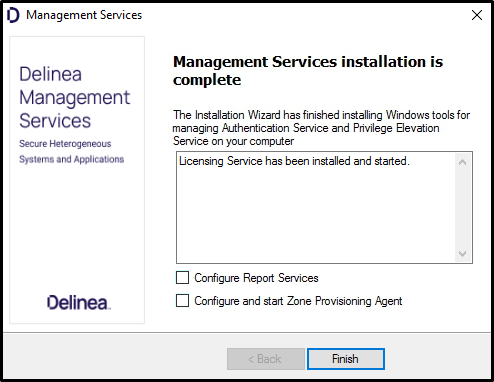
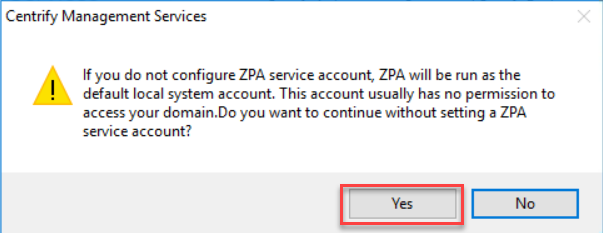
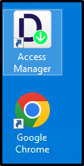
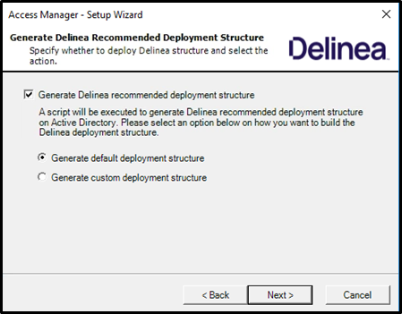
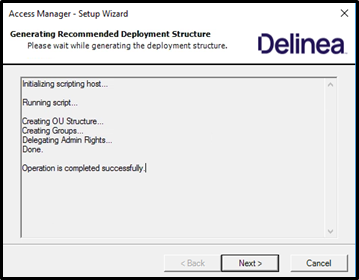
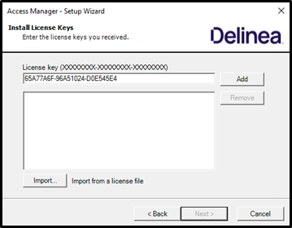
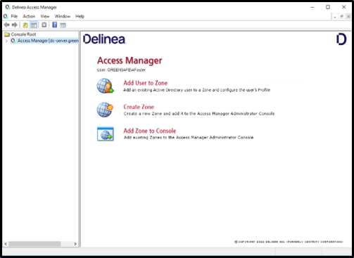

# Installation and initial configuration

## Introduction

This first lab will cover:

1. Initial installation of Server Suite, Authentication and Privilege
2. Initial configuration

Greensafe Payroll Services has recently purchased Delinea Server Suite. Alex Foster has been identified as the project engineer in charge of implementing the solution. In this exercise, Alex (you) will install Authentication and Privilege.

!!! Note
    Estimated time to complete this lab: **20 minutes**

!!! Attention
    Systems used in this lab:

    - dc-server.greensafe.lab
    - apps-server.greensafe.lab

### Installation and Configuration

#### Installation

01. Login to **apps-server.greensafe.lab** with the following credentials:

    - **Username:** afoster
    - **Password:** *Provided by Trainer*

02. Open Windows Explorer and navigate to **C:\\Share\\DS2022\\Delinea-Server-Suite-2022-mgmt-win64**

03. Launch the **Autorun** application and click **Authentication and Privilege**

    

04. When prompted to install *Microsoft SQL Compact 4.0* for support of the Sudoers Import process, click **No**

05. At the Welcome Message, click **Next**

06. Accept the EULA and click **Next**

07. Leave the **User Name** as *afoster* and enter the Company Name **Greensafe Payroll Services**, click **Next**

08. Under *Select Product Components*, expand *Utilities* and click the **checkbox** next to *Zone Provisioning Agent*

09. Click **Next**

10. Under the *Destination* folder, click **Next**

11. Under *Confirm Installation Settings*, click **Next** to start the installation

12. Once completed, **UNCHECK** the options to configure the following products:

    - Centrify Reporting Services
    - Centrify Zone Provisioning Agent

    

13. Click **Finish**

14. Click **Yes** when prompted about using a Local system account to manage the Zone Provisioning Agent (ZPA)

    

15. Close the Delinea Server Suite Installation Package by clicking **Exit**

#### Configuration

In this exercise, Alex (you) will complete the initial configuration of the solution using the management console, Delinea Access Manager. This configuration will include the creation of an active directory deployment structure and licensing.

01. While still being on the *apps-server.greensafe.lab* open Windows Explorer and navigate to **\\\\10.0.0.254\DS2022\Training_Lics.txt**. Copy the DC License. The DA License will be needed later in the training.

03. **Close** the file

04. Launch **Access Manager** from the Desktop shortcut

    

05. Click **OK** to connect to **dc-server.greensafe.lab**

06. At the *Welcome Message*, click **Next**

07. Under *User Credentials*, maintain the default setting and click **Next**

08. Under *Generate Delinea Recommended Deployment Structure*, Click the **checkbox** to generate the structure and click **Next**

    

09. Under *Choose Container*, click **Browse**

10. Select **greensafe.lab** and click **Ok**

11. Click **Next** once the deployment structure container has been populated

    

12. Under *Install License*, maintain the default container and click **Next**

13. When prompted, click **Yes** to grant all users read permissions to the license container

14. Paste the License key (copied earlier) in the space provided and click **Add**

    

15. Click **Next**

16. Under the *Default Container for Zones*, maintain the default settings and click **Next**

17. Under *Delegate Permission*, maintain the default settings and click **Next**

18. Under *Register the AD Administrative Notification Handler*, maintain the default settings and click **Next**

19. Under *Setup Properties Pages*, maintain the default settings and click **Next**

20. Under *Summary*, Click **Next**

21. Click **Finish** to complete the initial configuration wizard

22. The UI of Centrify Access Manager will open

    

