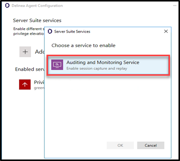

# Auditing and reporting

## Introduction

This tenth lab will cover:

1. Install Auditing and Reporting
2. Configure Auditing and Reporting
3. Review Audit sessions
4. Configure Centrify Reporting Service
5. Review Centrify Reporting

!!!Note
    Estimated time to complete this lab: **60 minutes**

!!!Attention
    Systems used in this lab:

    - dc-server.greensafe.lab
    - apps-server.greensafe.lab
    - apps-unix.greensafe.lab
    - db-server.greensafe.lab
    - db-unix.greensafe.lab


### Installing Audit Architecture

Greensafe is required to have audit records of sessions and users. In this exercise, Alex (you) will install and configure the Centrify Audit and Monitoring components for host-based auditing.

01. On the **apps-server** use Windows Explorer to navigate to **C:\\Share\\DS2022**

02. Launch the **autorun** application

03. Click **Audit and Monitor**

    

04. Click **Next** at the Welcome Message

05. *Accept the EULA* and click **Next**

06. Maintain the default features and click **Next**

07. Maintain the default installation folder and click **Next**

08. Review the installation options and click **Next**

09. When the installation is completed, Click **Finish**

10. The Audit Configuration Wizard will launch automatically. Click **Next** at the *Welcome Message*

11. Click **Next** to create a new installation

    

12. Using Windows Explorer to navigate to **\172.31.32.254\DS2022\Training_Lics.txt**

13. Copy the **Audit License Key (DirectAudit)** to the clipboard

14. Paste the key in the space provided in the Configuration Wizard and click **Add**

15. Click **Next**

16. Maintain the default publication location and click **Next**

17. Click Use an existing SQL Server instance and use the drop-down menu to Browse for the SQL Server

    

18. Click the Network tab. Be patient while the network is browsed for available SQL servers

19. Click **DB-SERVER\\CENTRIFY**

20. Click **OK**

21. Once the SQL Server is selected, click **Next**. This step will take approx. 2 minutes

22. Click **Finish**

23. Close the Installation Wizard by clicking **Exit**

### Configure Delinea Auditing

In this exercise, Alex (you) will configure Audit Roles and configure the host-based auditing.

01. Using the desktop shortcut, **launch Audit Manager**

    

02. Expand the **DefaultInstallation**

03. Expand **Audit Roles**. There is a default role (Master Role). We will now add the Security Team as Master Auditors.

04. Right-click the *Master Auditor* and click **Assign users and Groups**

    

05. Add **Team_Security** and click **OK**.

06. We will now create a secondary role for the Auditors team and grant them all permissions *except the ability to delete recorded sessions*

07. Right-click on *Audit Roles* and click **Add Audit Role**

08. Name the audit role **Greensafe Auditors**

09. Click **Next**

10. Maintain all selected machine types and criteria settings and click **Next**

11. **Uncheck** the **Delete** privilege and click **Next**

    

12. Review the summary and click **Next**

13. Once completed, click **Finish** to assign users and groups to the new role.

14. Add **Team_Auditors** and click **OK**

15. Let’s now configure systems inside the AD environment for Host Based Auditing. Use the Skytap Navigation to login to the *db-server.greensafe.lab* server with the following credentials:

    - **Username:** <mailto:afoster@greensafe.lab>
    - **Password:** *Provided by Trainer*

16. Use the *Start Menu* to *launch* the **Agent Configuration**

    

17. Click **Add Service**

18. Select **Audit and Monitoring Service** and Click **OK**

    

19. Select *DefaultInstallation* and click **Next**

20. **Close** the Delinea Agent Configuration.

21. Let’s now prepare a Unix system for Host Based Auditing. Use the Skytap Navigation to return to the *apps-server.greensafe.lab* server.

22. Launch PuTTY and login to *db-unix.greensafe.lab* with the following credentials:

    - **Username:** root
    - **Password:** *Provided by Trainer*

23. Run the following command to install the Delinea DirectAudit Agent:

    ```bash
    yum install CentrifyDA -y
    ```

    

24. Once completed, reboot the server using the `reboot` command

### Review Audit Sessions

In this exercise, Alex (you) will then review the sessions, create specific queries and document sessions.

01. Open *db-server.greensafe.lab* and login using the following credentials:

    - **Username:** <mailto:bhughes@greensafe.lab>
    - **Password:** *Provided by Trainer*

02. In the open session, use the start menu to *launch PowerShell* and run the following commands:

    - gpupdate /force
    - ipconfig

    

03. Once completed, **exit PowerShell**

04. Use *Start Menu > Windows Administrative Tools > Windows Firewall and Advanced Security* to open the Windows Firewall UI

05. Logout of the session, *Start Menu > User Icon > Sign Out*

    

06. Let’s open another session using a UNIX system. Switch to *apps-server*, launch PuTTY and login to the **db-unix.greensafe.lab** server with the following credentials:

    - **Username:** <mailto:lbennett@greensafe.lab>
    - **Password:** *Provided by Trainer*

07. In the open session, execute the following commands:

    ```bash
    cat /etc/passwd
    ifconfig
    clear
    history
    logout
    ```

08. Let’s review recorded audit sessions. Use the desktop shortcut to launch **Audit Analyzer**

09. Expand **Audit Sessions** and click **Today** to see a list of recorded sessions

10. Double click on the session for **db-server.greensafe.lab** for user *bhughes@greensafe.lab*

11. Let’s document this session so other auditors and management have the auditor’s notes. Click *Session > Update Review Status* and select **to be Reviewed**

    

12. Add notes related to the session:"witnessed.." and click **OK**. You can then *close* this session

13. Now let’s look at a UNIX session. Double click on the session for **db-unix.greensafe.lab**

14. Let’s document this session so other auditors and management have the auditor’s notes. Click *Session > Update Review Status* and select **Pending for action**

15. Add notes and instructions of the actions that need to be taken and click **OK**. For example: "Security permissions need to be reviewed for this logged in user". You can now *close* this session

16. Let’s now group sessions based on specific executed commands. Right-click on **Audit Sessions** and select **New Private Query**

    

17. Name the new query **UNIX cat Command Execution**

18. Under *Definition Type*, **uncheck Windows systems**

19. Under *Criteria*, click the **Add** button

20. Use the *Attributes drop-down menu* to select **UNIX Output and Commands**

21. Use the *Criteria drop-down menu* to select **Contains any of...**

22. In the space provided, type **cat** (lowercase)

23. Click **OK**

24. Click **OK** to save the query

25. Under *Audit Sessions*, expand **Private Queries**

    

26. Click **UNIX cat Command Execution**

27. The session where you have typed the `cat` command, <mailto:lbennett@greensafe.lab>, should be seen..

    

### Configure Centrify Reporting Service

In this exercise, Alex (you) will configure Centrify Reporting Service to report on Centrify Server Suite management tasks.

01. While still being on apps-server, navigate to *Start Menu > Delinea Server Suite 2022 > Configuration Wizard*

    

02. Click **Next**

03. Under *Database Type* click **Next**

04. Select **Use an existing SQL Server Instance**

05. Use the *drop-down menu* and select for **Browse for more...**

06. Click the **Network Servers** tab

07. Select **DB-SERVER\\CENTRIFY** and click **OK**

08. Click **Next**. *It may take a few moments before the next screen is presented!*

09. Confirm the selection Deploy Centrify Reports and URL Addresses:

    - **Web Service URL:** http://DB-SERVER/ReportServer_CENTRIFY
    - **Report Manager URL:** http://DB-SERVER/Reports_CENTRIFY

10. Click **Next**. *It may take a few moments before the next screen is presented!*

11. Under *Synchronization Mode*, select *Zone-based mode* and click **Next**

12. Under *Hierarchical Zones*, select **Monitor all hierarchical zones...** and Click **Next**

13. Under *Classic Zones*, select **Monitor all classic zones...** and click **Next**

14. Under the *Domain Controllers*, click **Add**

15. Select in the Domain: **greensafe.lab** domain. The DC **dc-server.greensafe.lab** will be populated automatically, click **OK**

    

16. click **Next**

17. Under the *Synchronization Schedule*, maintain the default settings, making no changes and click **Next**

    

18. Under *Report Services Option*, Select **Use Built-In Account (Local System)** and click **Next**

19. Permissions will be verified, identifying successes and failures. Click **Close**

    

20. Under *Summary*, click **Next**. Please be patient as the database is configured. The process takes approx. 2-4 minutes

21. Check the option to *Start synchronizing data from Active Directory* and click **Finish** to close the Report Configuration Wizard

    

22. Open Google Chrome and browse to <http://DB-SERVER/Reports_CENTRIFY>

    !!!Note
        If you are being asked for login, use **afoster** with the password: *Provided by Trainer*

23. Confirm Delinea Report Services Folder is displayed. Leave the Browser window open to complete the next lab exercise

    

### Review Centrify Reporting

In this exercise, Alex (you) will use Delinea Reporting Services to examine specific reports.

1. From the Centrify Reporting Services (SRSS) website, click **Details View**

   

2. Click **Delinea Reporting Services**

3. Click **Access Manager Reports**

4. Click **Delegation Report**. This reports on AD groups with assigned Zone Delegation tasks

5. Under **Trustee** filter, *remove the check mark under Null* and enter in the space provided **cfyS_ZPA**

   

6. Click **View Report**. We delegated specific zone tasks to this account as part of automated provisioning through the ZPA and the results will be shown in this report.

   