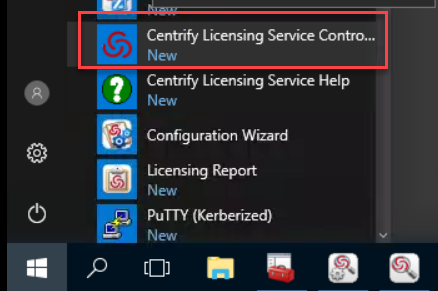
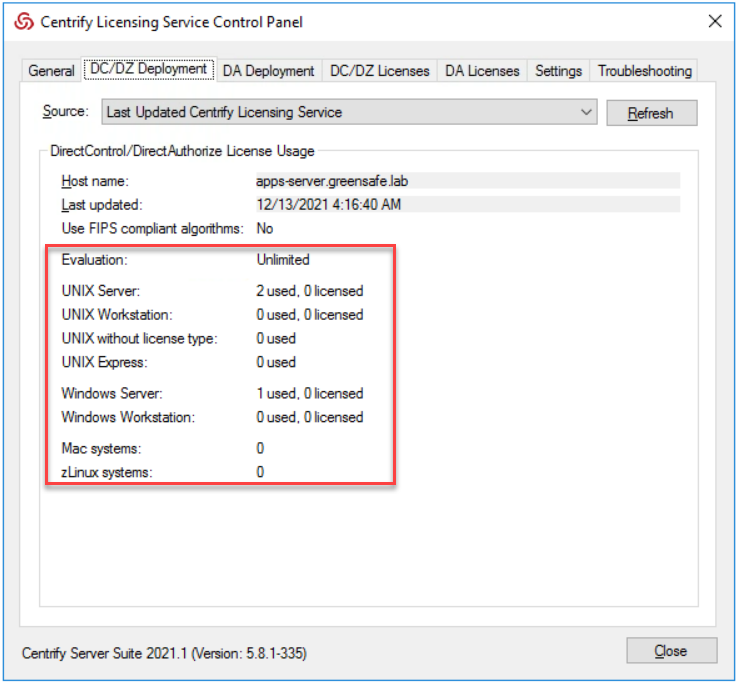
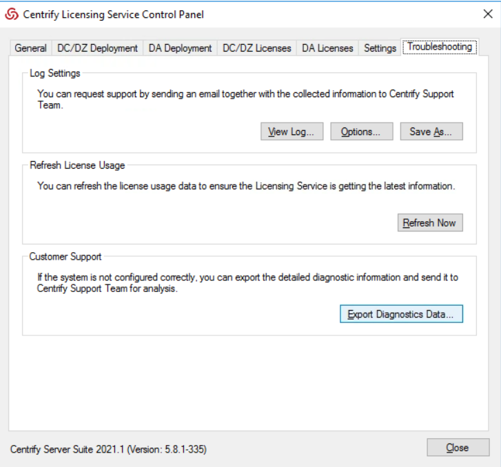
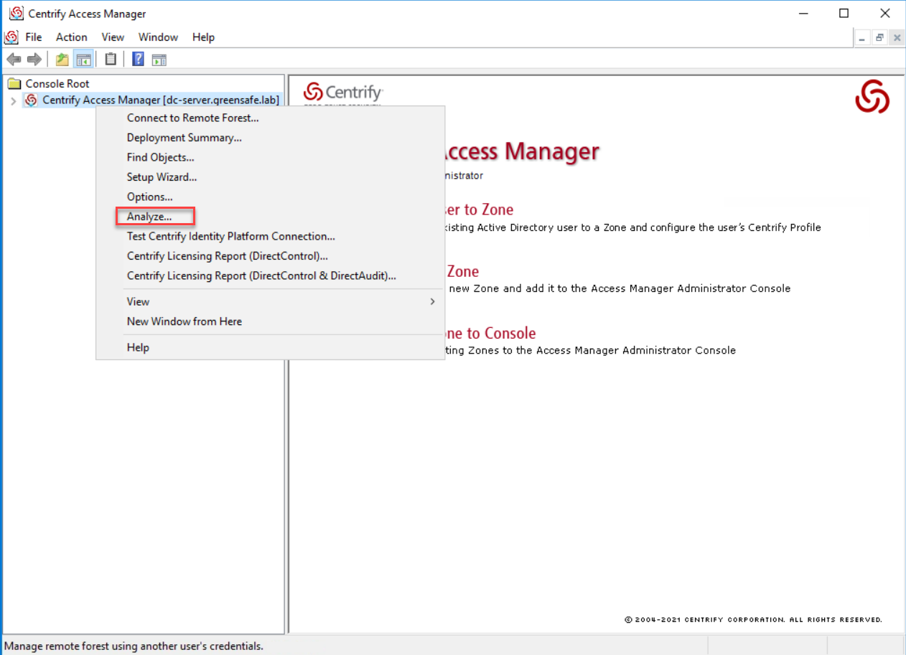
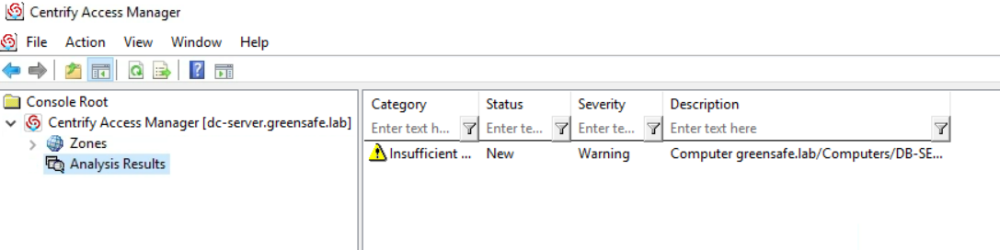
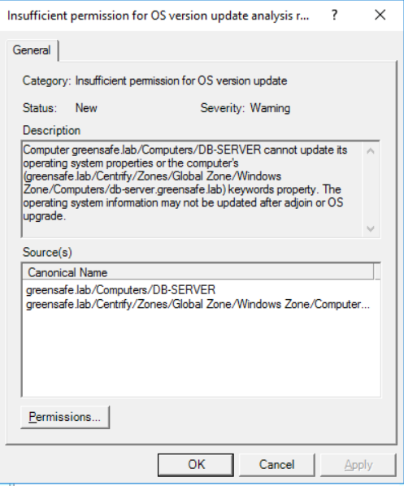

# Troubleshooting

## Introduction

This eleventh lab will cover:

1. Troubleshoot Centrify Licensing
2. Analyze the Environment

!!!Note
    Estimated time to complete this lab: **20 minutes**

!!!Attention

    Systems used in this lab:

    - dc-server.greensafe.lab
    - apps-server.greensafe.lab
    - apps-unix.greensafe.lab
    - db-server.greensafe.lab
    - db-unix.greensafe.lab

### Troubleshooting Centrify Licensing

In this exercise, Alex (you) will use the Centrify Licensing Service to examine the installed licensing applied to the environment.

01. On the **apps-server.greensafe.lab**, navigate to *Start Menu > Centrify Server Suite 2021.1 > Centrify Licensing Service Control Panel*

    

02. Confirm service is running, bottom of the screen *Service status*:

03. Click **DC/DZ Deployment** tab to determine # of devices currently licensed

    

    !!!Note
        As we are using Evaluation Licenses the number of licenses available is Unlimited.

04. Click **Troubleshooting** tab

05. Click **Export Diagnostic Data**

    

06. Navigate to **Desktop** and Click **OK**

07. Click **Ok**

08. **Close** Centrify Licensing Service Control Panel

09. Open the saved diagnostic data file.

10. Review the files included in the zip file. Close the explorer window

11. Using the *Start Menu > Centrify Server Suite 2021.1 > Licensing Report*

12. Confirm the Domain Controller *dc-server.greensafe.lab* and click **Next**

13. Select the default location to store the report and leave the *Hide host, zone and installation names from the report* and click **Next**

14. Click **Next** to run the report

15. Leave *Open the output report* **checked** and click **Exit**

16. Look at the report that has just been opened in Notepad...

17. CLose **Notepad**

18. Click **OK**

### Analyzing the Environment

In this exercise, Alex (you) will use Centrify Access Manager to examine possible issues with the health of the environment.

1. Open **Access Manager**, right-click *Centrify Access Manager* and select **Analyze**

    

2. Click **All**

3. Click **Next**

4. Click **Finish**

5. Click **Analysis Results** from the Navigational Tree on the left of the Access Manager Console

    

6. Double click the issue to review the details (with the Exclamation Mark)

7. Check whether the computer object in Active Directory has sufficient permission to update the version number property of the operating system in the computer’s serviceConnectionPoint object. If the computer object does not have permission to change this property, the operating system version number cannot be displayed.

    

8. Click **OK** to close the Issue Details