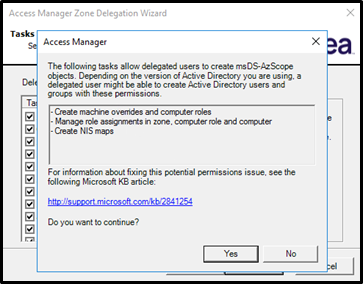

# Zones

## Introduction

This second lab will cover:

1. Creation of Zones
2. Preparing Zone Server objects

In this exercise, Alex (you) will continue the initial configuration of the Centrify solution by assigning Centrify Administrators and creating Parent and Child Zones for Centrify privilege management. There will be one Global Zone for all users, and two child zones based on server operating systems.

As part of your preparations to implement Centrify Server Suite features to the infrastructure, you can prepare the objects prior to the implementation of each server. This will avoid any interruptions in service and provide you the opportunity to confirm effective security rights are accurate. In this exercise, Alex (you) will use Centrify Access Manager to create the AD objects in the appropriate Centrify Zones so they are organized properly and effective rights are applied prior to the server being joined.

!!! Note
    Estimated time to complete this lab: **25 minutes**

!!! Attention

    Systems used in this lab:

    - dc-server.greensafe.lab
    - apps-server.greensafe.lab

### Creation of Zones

01. While stilling being logged in in the **apps-server.greensfae.lab**, open Active Directory Users and Computers (ADUC)
    
    

02. Navigate to **greensafe.lab > Centrify > Centrify Administration**
    
    

03. Open the AD group **cfyA_Global_CentrifyAdmins**

04. Click **Members**

05. Click **Add...**

06. Type **Team_Security** and click **Check Names** that will show the below screenshot

    

07. Click **Ok**

08. Close the group properties by clicking **Ok**

09. Close **ADUC**

10. Let's now create the Parent Zone, back in **Delinea Access Manager**, expand *Access Manager \[dc-server.greensafe.lab\]*

11. *Right Click on Zones* and select **Create New Zone**

    

12. Name the new zone **Global Zone**, *leave all other options default*

13. Click **Next**

14. Click **Finish**

15. Let's now delegate zone controls to the appropriate administrators, expand the *Zones*

16. Right-click the new *Global Zone* and select **Delegate Zone Control**

    

17. Click **Add**

18. Use the following steps

    - **Find:** Group

    - **Name:** cfyA

    - Click **Find Now**

    - Select the **cfyA_Global_CentrifyAdmins** group

      

    - Click **Ok**

19. Click **Next**

20. Under *Tasks to Delegate*, click **All**

21. Click **Next**

22. When prompted about the *msDS-azScope objects*, click **Yes**

    

23. Click **Next** in the *Tasks to Delegate* for the whole AD to the group

24. Click **Finish**

25. Let's now create the *Child Zones*. Right Click Global Zone and select **Create Child Zone**

    

26. *Name* the new child zone **UNIX Zone**, *leave all other options default*

27. Click **Next**

28. Click **Finish**.

29. We have to remember to delegate zone controls to each zone. In some cases, you may have different administrators responsible for each zone.

30. Expand the *Global Zone > Child Zones* and right-click the new *UNIX Zone* and select **Delegate Zone Control**

31. Click **Add**

32. Search for and add the AD group **cfyA_Global_CentrifyAdmins**

33. Click **Ok** to add the group

34. Click **Next**

35. Under *Tasks to Delegate*, click **All**

36. When prompted about the *msDS-azScope objects*, click **Yes**

37. Click **Next** in the *Tasks to Delegate* for the whole AD to the group

38. Click **Finish**

39. Let's now create the Windows Child Zones. Right-click *Global Zone* and select **Create Child Zone**

40. Name the new child zone **Windows Zone**

41. Click **Next**

42. Click **Finish**.

43. Don't forget to delegate zone controls for this zone. Right-click the new *Windows Zone* and select **Delegate Zone Control**

44. Click **Add**

45. Search for and add the AD group **cfyA_Global_CentrifyAdmins**

46. Click **Ok** to add the group

47. Click **Next**

48. Under *Tasks to Delegate*, click **All**

49. When prompted about the *msDS-azScope objects*, click **Yes**

50. Click **Next** in the *Tasks to Delegate* for the whole AD to the group

51. Click **Finish**

### Prepare Zone Server objects

#### Unix Servers

01. Using Delinea Access Manager, expand **UNIX Zone**

02. Right-click *Computers* and select **Prepare UNIX Computer**

03. Under *Prepare Computer*, maintain the default settings and click **Next**

04. Under *Specify Computer*, click **Next** to add a new computer object

05. Name the computer **db-unix**

06. Click **Change** to change the computer container

07. Navigate to *greensafe.lab > Centrify > Computers* and Click **Ok**

    

08. Click **Next**

09. Under *Read Only Domain Controller Compatibility and License Type* settings, *maintain the default settings* and license selection and click **Next**

10. Under *SPN Configuration*, maintain the default settings and click **Next**

11. Under *Delegate Join Permissions*, *maintain the default setting* to allow the computer to join itself to the zone and click **Next**

12. Under *Delegate Machine Overrides*, click **Browse** to change the AD group

13. Search for and select **cfyA_Global_CentrifyAdmins**

14. Click **Next**

15. Under *Delegate Permission*, *maintain the default settings* and click **Next**

16. Click **Next** to confirm the selection

17. Click **Finish**

18. **Repeat the above steps** *(Prepare Zone Server Objects)* **for the apps-unix server**

#### Windows Servers

1. Expand **Windows Zone**
2. Right-click Computers and select **Prepare Windows Computer**
3. Search and Add **db-server.greensafe.lab**
4. Click **OK**
5. In the *Skip delegation permission* popup box, click **Yes**

