# Managing Users (Local and Domain)

## Introduction

This third lab will cover:

1. Add domain users to a Unix Zone
2. Consolidate Unix local profiles

!!! Note
    Estimated time to complete this lab: **15 minutes**

!!! Attention

    Systems used in this lab:

    - dc-server.greensafe.lab
    - apps-server.greensafe.lab

### Add domain users

01. Using *Delinea Access Manager*, expand *Child Zones*

02. Expand **UNIX Zone**

03. Expand **Computers**

04. First, we will manually add a domain user as an authorized user of the system. Right-click the **db-unix** server and select **Add User**

    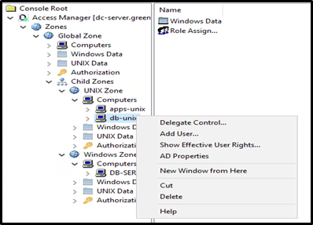

05. Select **Active Directory user** and click **Next**

06. Click **Browse**

07. Search for **Linda Scott**

    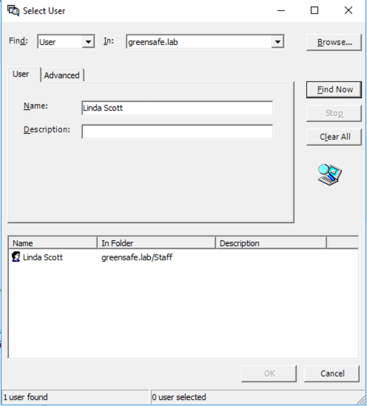

08. Click **Ok**

09. Click **Next**

10. Under *Add User to Zone*, click **Next**

11. Under *Define User UNIX Profile*, click **Next**

12. Under *Assign Roles*, click **Next**

13. Under *Confirm Your Selection*, click **Next**

14. Click **Finish**

### Consolidate Unix local profiles

01. Let's now import users that are currently installed on the local system. The /etc/passwd and /etc/group files were downloaded to this server and will be used for the next series of steps. Expand the **db-unix** server

02. Right-click **Unix Data** and select **Import from UNIX**

    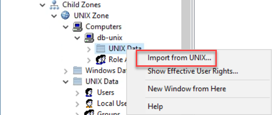

03. Select **UNIX configuration files**

04. Click the top **Browse** button to select the /etc/passwd file that is located in the C:\\Share folder (this file has already been downloaded earlier)

05. Click the bottom **Browse** button to select the /etc/group file that is located in the C:\\Share folder (this file has already been downloaded earlier)

    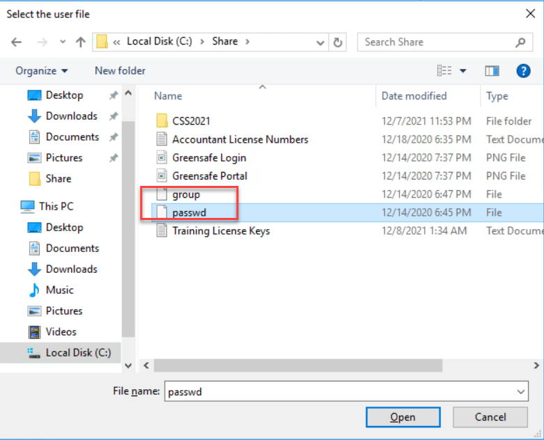

06. Click **Next**

07. Under *Select Import Objects*, click **Next**

08. Under *Select Destination*, click **Next**

09. Click **Finish**

10. Under the *db-unix server*, expand *UNIX Data*

11. Expand *Users* and click *Pending Import*. There will be a list of users that have been imported but are not yet accepted. At the bottom of the list will be the following users:

    - afoster-a
    - cfyadmin
    - helpdesk-a
    - kim
    - sam

    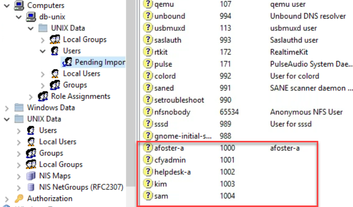

12. Select users *Kim and Sam*, right click and select **Check Status**. This process will check the identities against active directory to look for a matching user candidate

    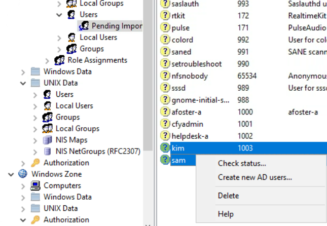

13. When prompted to select a domain, click **OK** to accept *greensafe.lab*

14. In the AD User Candidate column, you will notice an AD user has been identified as a POSSIBLE match for the local profile that was imported

    - kim -> greensafe.lab/staff/krogers (Kim Rogers)
    - sam -> greensafe.lab/staff/snguyen (Sam Nguyen)

    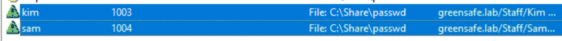

15. As the two accounts are still selected, right-click them and click **Accept**. This will consolidate the local profile with the domain account, permitting the domain account to be used to login once a role has been assigned.

    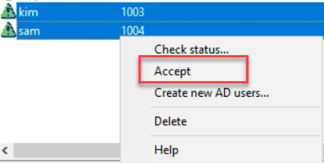

16. All remaining Pending Users can be deleted by selecting them, right-click and select **Delete** and click **Yes** in the popup screen

    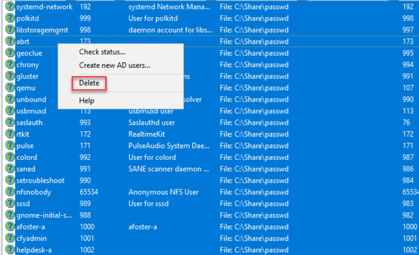

17. Let's now create a new AD group based on the UNIX local users group. Expand *Groups* under *UNIX Data* for the db-unix server

18. Click **Pending Import**

    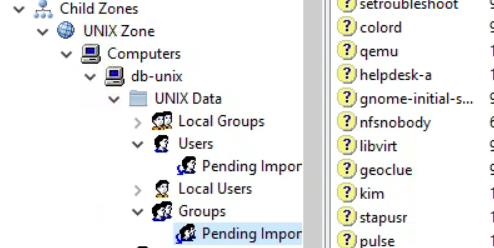

19. Right-click on the *users* group and select **Create new AD groups**

    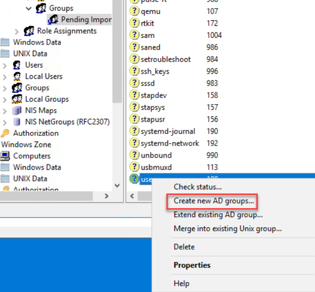

20. Under *Location of Container*, click **Browse**

21. Select **greensafe.lab > Centrify > Unix Groups** and click **Ok**

    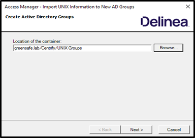

22. Click **Next**

23. Name the group name (for both group name fields) **cfyG_db-unix_users**, *leave prefix and suffix related fields unchecked*

24. Under *Group Scope*, select **Global**

    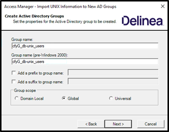

25. Click **Next**

26. Click **Next** to confirm the settings

27. Click **Finish**

    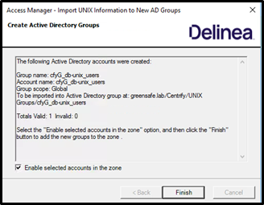

28. All remaining Pending Groups can be deleted by selecting them all, right-click and click **Delete** and click **Yes** in the popup screen

29. Let's now add the imported users and Linda Scott who was added manually to the new AD group, click **Users** under *UNIX Data of db-unix*

    !!!Note
        If only Linda Scott is shown  in the Users section, click the refresh button in the Delinea Access Manager UI. This will show the other two users.

        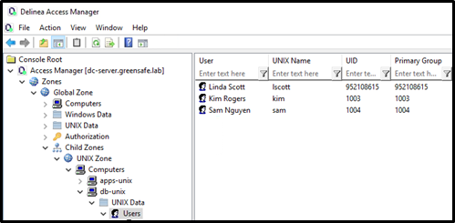):

30. Select all users, right click and select Add to a Group.

    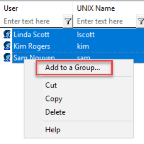

31. Search for and select **cfyG_db-unix-users**

32. Click **Ok** and **Ok** in the popup screen telling the *The Add to Group was successfully completed for 3 user(s)*

    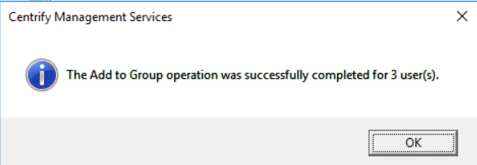

