# Configure a Centrify Zone Provisioning Agent

## Introduction

This fourth lab will cover:

1. Create AD account for the ZPA
2. Configure the ZPA Service
3. Configure the ZPA
4. Configure ZPA for automatic provisioning
5. Assign the automatic provisioning to the zone
6. Test automatic provisioning

!!! Note
    Estimated time to complete this lab: **20 minutes**

In this exercise, Alex (you) will configure the Delinea Zone Provisioning Agent (ZPA) to automatically provision and deprovision users and groups for access to privileged resources. This will include the configuration of a domain service account that will facilitate this automation as users are added to monitored groups.

!!! Attention

    Systems used in this lab:

    - dc-server.greensafe.lab
    - apps-server.greensafe.lab


### Add domain user and groups for the ZPA

1. Open **Active Directory Users and Computers (ADUC)**

2. Navigate to *greensafe.lab > Centrify > Service Accounts*

3. **Create a new AD account** with the following parameters:

   - **First Name:** Centrify
   - **Last Name:** Zone Provisioning Agent
   - **User logon name:** cfyS_zpa

   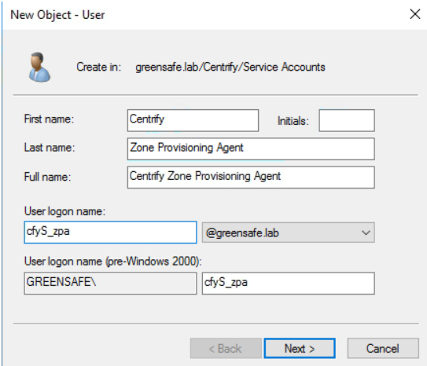

4. Click **Next**

5. Set the *Password* to *Provided by Trainer* and

   - **UNCHECK** User must change password at logon
   - **CHECK** User cannot change password
   - **CHECK** Password never expires

06. Click **Next**

07. Click **Finish**

    !!! Note
        Make sure that the account has not been disabled after the creation. In some cases this happens. You can see that the account has been disabled if there is a downwards pointing arrow next to the account. To enable the account, right-click th account and select **Enable Account**. Not having the account Enabled will lead to issues later in the lab.

        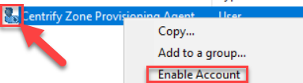

08. Navigate to *greensafe.lab > Centrify > Provisioning Groups*

09. **Create two new AD groups** that will be used for auto provisioning and deprovisioning, name them (*leave the settings default*):

    - **cfyP_Global_Users**
    - **cfyP_Global_Groups**

    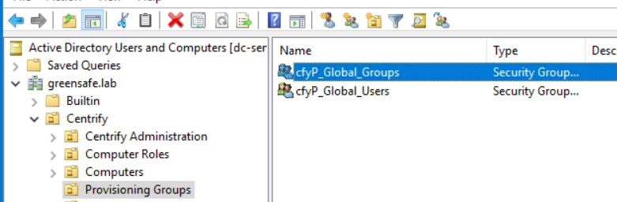

10. Close ADUC

### Configuring the Zone Provisioning Agent Service

01. Open Windows Services using *Start > typing Services.msc*

    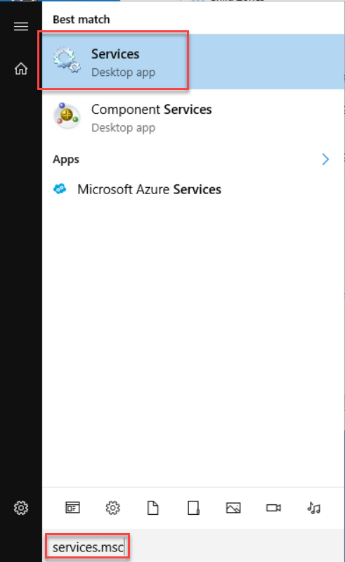

02. Open the properties of the Centrify Zone Provisioning Agent by right-clicking and selecting **Properties**

03. Click the **Log On** tab.

04. Select **This Account:**

05. Click **Browse**

06. Change *Location* to the *Entire Directory* and click **Ok**

07. Search for and select **cfyS_zpa**

08. Click **Check Names** and click **Ok**

09. Once selected, type in the *Password* fields the set password and click **Apply**.

10. Click **Ok** to confirm the account will be used to *Log On as a Service*.

11. Click **Ok**

12. Close **Services**

### Configure the Zone Provisioning Agent

1. Navigate to *Start Menu > Delinea Server Suite 2022 > Zone Provisioning Agent Configuration Panel*

2. Click the **Add** button

    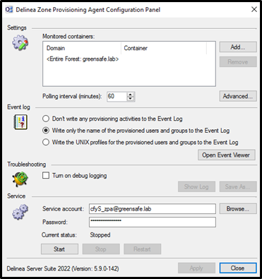

3. Navigate and select *greensafe.lab > Centrify > Zones* and click **OK**

4. Select *\<Entire Forest: greensafe.lab>* and click **Remove** from the list (Leaving the Centrify Zones Container)

    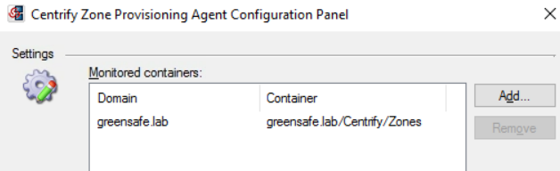

5. Under the *Event Log*, select **Write the UNIX Profiles for the provisioned users and groups to the Event Log**

6. Confirm the ZPA service Account is correct (cfyS_zpa) and click **Start** to start the service

7. The *Current Status:* must change to **Running**

    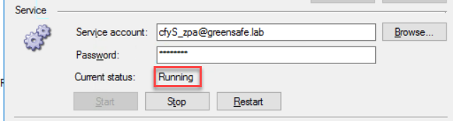

8. Click **Apply** to save the changes

9. Click **Close** to exit the Configuration Panel

### Configure the Zones to be automatically provisioned

1. Open Delinea Access Manager if you have closed it

2. Right-click the *Global Zone* and select **Delegate Zone Control**

3. Click **Add**

4. Search for and add the AD user **cfyS_zpa**

5. Click **Next**

6. Click the following administrative tasks to be applied to the ZPA service account

    - **Add Users**
    - **Add Groups**
    - **Remove Users**
    - **Remove Groups**

    !!! Note 
        The ZPA does not require all administrative tasks - only those tasks that the service account will be performing.)

    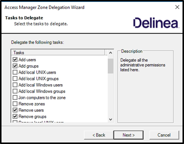

7. Click **Next**

8. When prompted about the *UID/GID auto-increment functionality*, click **NO**

9. Click **Finish**

    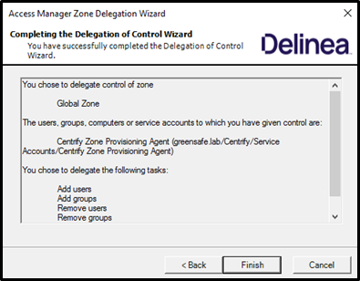

### Assigning the provisioning to the zone

01. Using *Access Manager*, right-click *Global Zone* and select **Properties**

02. Click the *Provisioning Tab* and **Enable auto-provisioning of User Profiles**

    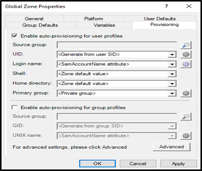

03. Click the {fa}`search` (magnifing glass) button

04. Find and select **cfyP_Global_Users** and Click **OK**

05. Under the *Provisioning* tab, *Enable auto-provisioning of Group Profiles*

06. Click the {fa}`search` (magnifing glass) button

07. Find and select **cfyP_Global_Groups**

08. Click **OK**

09. Click **OK** to save the changes

10. Click **OK** in the *This zone is now....* popup screen

### Test the auto provisioning

01. Launch Active Directory Users and Computers (ADUC) if you have closed it

02. Navigate to *greensafe.lab > Centrify > Provisioning Groups*

03. Open the *properties* of **cfyP_Global_Users**

04. Click the **Members** Tab

05. Click **Add**

06. Find and Select the following groups (type *Team\_* and click **Check Names** to speed it up):

    - Team_Contractors
    - Team_Finance
    - Team_Helpdesk
    - Team_IT
    - Team_Sales
    - Team_Security

    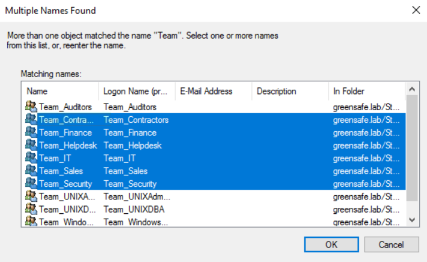

07. Click **OK**

08. Close ADUC

09. To speed up the process, we will use the zoneupdate utility. Navigate to *Start Menu > Delinea Server Suite 2022 > Zone Provisioning Agent Command Prompt*

    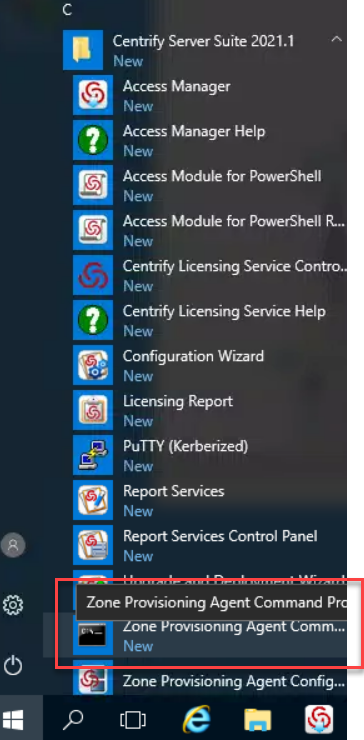

10. Type and run

    ```bash
    zoneupdate /p "Global Zone"
    ```

11. You will see a preview of a number of users that are going to be provisioned by the ZPA

    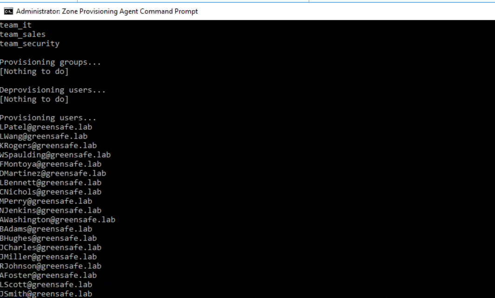

12. Type and run the below command to commit the changes immediately

    ```bash
    zoneupdate "Global Zone"
    ```

    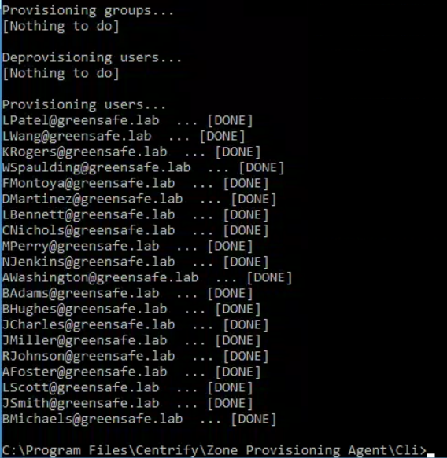

13. Close *Zone Provisioning Agent Command Prompt*

14. Using Access Manager Expand **Global zone > UNIX Data**

15. Click **Users**. Users from the groups we added will now be configured with UNIX Profiles under the *Global zone > UNIX Data > Users*.

    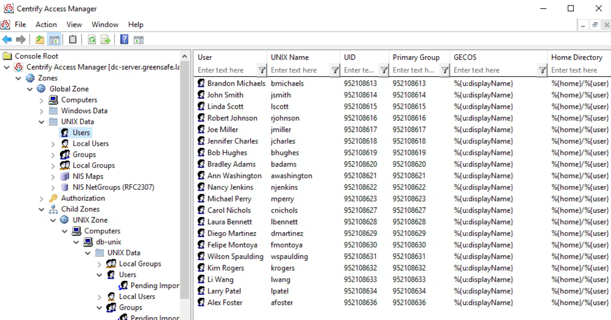