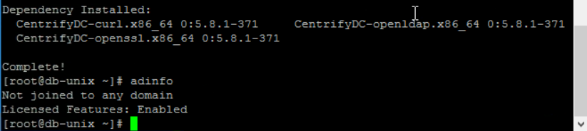
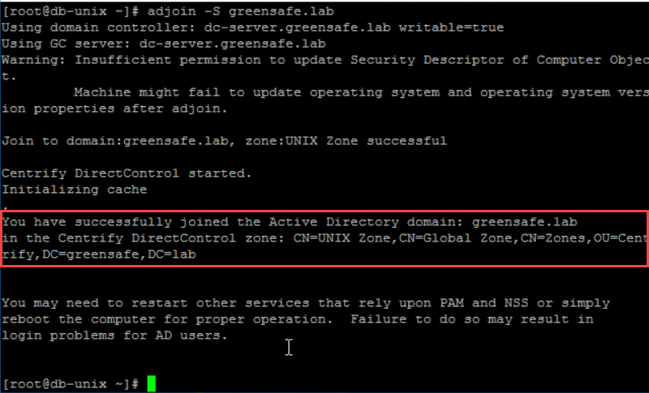
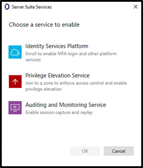
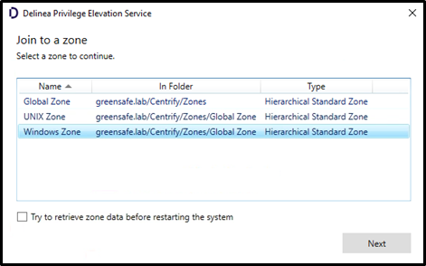

# Install and configure the Centrify Agent

## Introduction

This fifth lab will cover:

1. Install the Centrify Agent
2. Join to AD (Unix) and correct Zone
3. Configure the Centrify Agent

!!! Note
    Estimated time to complete this lab: **15 minutes**


In this exercise, Alex (you) will configure the Centrify Zone Provisioning Agent (ZPA) to automatically provision and deprovision users and groups for access to privileged resources. This will include the configuration of a domain service account that will facilitate this automation as users are added to monitored groups.

!!! Attention

    Systems used in this lab:

    - dc-server.greensafe.lab
    - apps-server.greensafe.lab
    - apps-unix.greensafe.lab
    - db-unix.greensafe.lab


### Installing the Centrify Agent on Unix

1. Open PuTTY on *apps-server.greensafe.lab* and login to **db-unix.greensafe.lab** with the following credentials:

   - **Username:** root
   - **Password:** *Provided by Trainer*

    !!! Note
        On the Security Alert, click **Yes**

2. Run the following command to install the *Delinea DirectControl Agent (the -y in the command, make sure that the yum will not prompt during installation)* **PLEASE NOTE THAT THE COMMAND IS CASE SENSITIVE!**

    ```bash
    yum install CentrifyDC -y
    ```

3. Once completed, run the following command to check the domain and zone connection status for the system:

    ```bash
    adinfo
    ```

    !!! Note
        You will notice that installing the client did not automatically join the system to the zone.

        

### Join the Unix machine to the AD and Unix Zone

1. Run the following command to join the system to the zone:

    ```bash
    adjoin -S greensafe.lab
    ```

    !!! Note
        During the process you will notice that the system was automatically joined to the correct UNIX zone because the system was pre-created and matched the DNS record.

        

2. Run the following command to reboot the server:

    ```bash
    reboot
    ```

3. **Repeat the steps taken in** *Installing the Delinea Agent on Unix* **and** *Join the Unix machine to the AD and Unix Zone* **for the apps-unix server**

### Join a Windows machine to the correct Zone

01. Open **db-server** UI

02. Login with the following credentials:

    - **Username:** afoster
    - **Password:** *Provided by Trainer*

03. Open **Windows Explorer** and navigate to the Agent folder on the desktop and launch the **Delinea Agent for Windows64** application

04. On the Welcome Message, click **Next**

05. *Accept the EULA* and click **Next**

06. Under the *Destination Folder*, click **Next**

07. Click **Install**

    !!! Note
        If prompted to close applications, please proceed. When you get an message that the system needs to be reboot after the install or services need to be restarted, click **OK**


08. When the installation is complete, click **Finish**

09. Open the **Agent Configuration** using the *Start Menu > Recently added*

10. Click **Add Service**

11. Click **Privilege Elevation Service**

    

12. Click **OK**

13. Join the system to the **Windows Zone** and click **Next**

    

14. When prompted, select **Yes** to create a Windows Login Role for the Domain Admins group so they can continue to login to the system and click **Ok**

    !!! Note
        If/ When prompted about multifactor authentication enrollment, click Yes to skip the enrollment and continue the configuration


15. When prompted to restart the system, click **Yes**

16. Login with the user afoster listed below on the machines being mentioned and confirm the ability to login according to the below table

    | Username | Password            | Server    | Able to login?                          |
    |----------|---------------------|-----------|-----------------------------------------|
    | afoster  | Provided by trainer | db-unix   | **No** (No local Profile or Role)       |
    | afoster  | Provided by trainer | db-server | **Yes** (Domain Admin Roles ia applied) |
    | badams   | Provided by trainer | db-server | **No** (badams is not assigned a Role)  |

    !!! Note
        Use PuTTY on the **apps-server** to log into the *db-unix* server. For the other two options, login using the console.