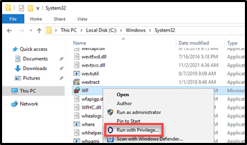

# Configuring Roles

## Introduction

This sixth lab will cover:

1. Configuring and testing Unix Login Roles
2. Configuring and testing Windows Zone Roles
3. Configuring and testing Computer Roles

!!! Note
    Estimated time to complete this lab: **60 minutes**


!!! Attention

      Systems used in this lab:

      - dc-server.greensafe.lab
      - apps-server.greensafe.lab
      - db-unix.greensafe.lab
      - apps-unix.greensafe.lab


### Configure and testing Unix Login Role

As we have examined, privileged directory service users must have roles assigned to them before they can do anything on the system. This includes the login process. Roles can be assigned at different levels of the Centrify Zone structure – at zone levels, at computer group levels and at an individual server level. In this exercise, Alex (you) will create and assign a zone roles to permit privileged users to any system in the zone.

#### Creation

01. Using Access Manager on **apps-server**, expand the *UNIX Zone*

02. Expand *Authorization*, right-click on **Role Assignments** and select **Assign Role...**

03. Locate and select the **UNIX Login** for the *greeensafe.lab/Centrify/Global Zone/UNIX Zone*. Widen the *Zone* column to select the correct Zone

    

04. Click **OK**

05. Click **Add AD Account...**

06. Add the following *AD Groups* to this role assignment (type *Team\_* and click **Find Now** to speed it up)

    - Team_Contractors
    - Team_Finance
    - Team_Helpdesk
    - Team_IT
    - Team_Sales
    - Team_UNIXAdmins

07. Click **OK**

08. Click **OK**

09. Right-click on *db-unix* and select **Show Effective User Rights**

    

10. Use the *Role Assignments* Tab to confirm the effective rights for each AD user listed below (make sure you check **Show omitted users** option)

   
    | Username      | AD Group                       | Able to login? |
    |---------------|--------------------------------|----------------|
    | afoster       | Team_IT & Team_Security        | Yes            |
    | badams        | Team_Sales                     | Yes            |
    | kim           | Team_Finance & Team_UNIXAdmins | Yes            |
    | snguyen (sam) | Domain Users                   | No             |
    | ahouston      |  Team_Auditors                 | No             |
    

    !!! Note
         The user Sam is displayed because the local profile is listed under the system’s user UNIX Data. Sam is listed as an omitted user, because a role has not been assigned. Amy Houston (ahouston) is not listed because the AD user has not been added as an authorized user of a zone or the local machine.

         

11. Click **Close** to close the *Effective UNIX User Rights*

#### Test the role

1. Open Putty and login to db-unix with the following credentials:

   - **Username:** root
   - **Password:** *Provided by Trainer*

2. Run the following command to clear the zone cache

      ```bash
      adflush
      ```

      

3. Logout of the session using *ctrl+d*. This will also close the PuTTY session

4. Use PuTTY to confirm the effective rights found in the step 8 by logging in using the username as given into **db-unix**. The password for all account is the same and is *Provided by Trainer*

      | Username      | AD Group                       | Able to login? |
      |---------------|--------------------------------|----------------|
      | afoster       | Team_IT & Team_Security        | Yes            |
      | badams        | Team_Sales                     | Yes            |
      | kim           | Team_Finance & Team_UNIXAdmins | Yes            |
      | snguyen (sam) | Domain Users                   | No             |
      | ahouston      |  Team_Auditors                 | No             |
    
### Configure and testing Windows Zone Role

Windows Roles are slightly different as privilege will come in the form of the use of specific applications. Generally, assigning privilege to a user to access an application or administer a system results in local identities on the system that have the necessary privilege or moving the AD user into a group that not only has elevated privilege to the individual system or the application, but instead to a group of systems and all applications. In this exercise, Alex (you) will create and assign roles to the Windows Zone that include the login and elevated privilege to run a specific windows application with privilege, without the need of a local identity or shared privileged account.

#### Creating a custom application right

01. On the **apps-server** open *Start Menu* and navigate and open *Windows Administrative Tools*

02. Launch *Windows Firewall and Advanced Security*

03. Minimize the Firewall Window to leave it running. We will be using this later in the exercise

04. Using *Access Manager*, expand the *Windows Zone*

05. Expand *Authorization*

06. Expand *Windows Right Definitions*

07. Right-click on *Applications* and select **New Windows Application**

    !

08. Name the *New Application* **Windows Firewall Management**

09. Click the *Match Criteria* Tab

10. Click **Add**

11. Check **Path**

12. In **Name** filed type: **mmc.exe**

13. *Check Arguments* and type ("C:\\Windows\\system32\\WF.msc")

14. **Select** *Specific Path* and type: (C:\\Windows\\system32\\)

15. Change the Description to **Windows Firewall** and Click **OK**

      

1. Click the **Run As** tab.

2. Click **Add AD Groups**

3. Search for and select **Domain Admins** and click **OK**

4. Click **OK** to Save the New Windows Application Right.

      

#### Create role and assign the Right

1. Right-click on *Role Definitions* and select **Add Role**

      

2. Name the *New Role* **Firewall Management**

3. Click **OK**

4. Right-click the **Firewall Management** Role and select **Add Right**

      

5. Locate and Select **Windows Firewall Management**

      

6. Click **OK**

#### Assign Windows Login

1. Right-click on *Role Assignment\*s and select \*\*Assign Role...\**

      

2. Select *Windows Login* for the *greeensafe.lab/Centrify/GLobal Zone/Windows* Zone. Widen the Zone column to select the correct Zone.

      

3. Click **OK**

4. Click **Add AD Account...**

5. Add the following *AD groups* to this role assignment (type *Team\_* and click **Find Now** to speed it up)

      - Team_Contractors
      - Team_Finance
      - Team_Helpdesk
      - Team_IT
      - Team_Sales

6. Click **OK** to save the role assignment

#### Assign Firewall Management Roles to privileged users

1. Right-click on *Role Assignments* and select **Assign Role..**

2. Select **Firewall Management**

3. Click **OK**

4. Click Add **AD Account...**

5. Add the following AD Groups to this role assignment (type *Team\_* and click **Find Now** to speed it up)

      - Team_Helpdesk
      - Team_IT

6. Click **OK** to save the role assignment.

#### Test the Windows roles

1. Open db-server and login as Alex Foster. Once logged in, open PowerShell and type the following command to refresh the cache

      ```PowerShell
      dzflush
      ```

      

2. We have already established that since Alex Foster is a domain admin, he has privilege to login and access the firewall

3. *Logout of db-server*

4. Log in as each of the users listed below to confirm the roles you have assigned, and open Windows Exporer and navigate to **C:\\Windows\\System32** and right-click **WF**

   | Username | AD Group         | Able to login? | Can the user see the firewall settings? | Can the user see firewall settings with Privilege? |
   |----------|------------------|----------------|-----------------------------------------|----------------------------------------------------|
   | bhughes  | Team_Helpdesk    | Yes            | No                                      | Yes                                                |
   | badams   | Team_Sales       | Yes            | No                                      | No                                                 |
   | krogers  | Team_Finance     | Yes            | No                                      | No                                                 |
   | lbennett | Team_Contractors | Yes            | No                                      | No                                                 |
   | lscott   | Team_IT          | Yes            | No                                      | Yes                                                |


!!! Note
    Running the Windows Firewall without Privilege should result in the following message:
            
       
    

    To run the application with privilege, right-click on the application and select **Run With Privilege**

    

    If the user has been granted privilege via the *assigned role*, they should see the Windows Firewall options shown below

    

### Configure Computer Roles

The current zone structure has systems grouped by operating system, but not all systems have the same role within the organization. Computer roles are configured so privilege can be granted automatically when a new server is added to the role or removed when a system is retired or removed from the role. In this exercise, Alex (you) will configure a computer role that will grant privilege to users of server members of the role.

Greensafe has made the decision to add additional database servers. The new servers will have the same configuration as db-unix.greensafe.lab but will be added over the course of several months. In order to ensure the configuration is completed ahead of time, the new computers will be pre-created and a computer role will be established.

#### Pre-create New Systems

01. Using Delinea Access Manager, expand *Child Zones*

02. Expand *Unix Zone*

03. Right-click *Computers* and select **Prepare UNIX Computer**

04. Under *Prepare Computer*, maintain the default settings and click **Next**

05. Under *Specify the Computer*, click **Next** to add a *new computer object*

06. Name the computer **db2-unix**

07. Click **Change** to change the computer container

08. Navigate to *greensafe.lab > Centrify > Computers* and Click **OK**

09. Click **Next**

10. Under *Read Only Domain Controller Compatibility and License Type*, maintain the default settings and license selection and click **Next**

11. Under *SPN Configuration*, maintain the default settings and click **Next**

12. Under *Delegate Join Permissions*, maintain the default setting to allow the computer to join itself to the zone and click **Next**

13. Under *Delegate Machine Overrides*, click **Browse**

14. Search for and select **cfyA_Global_CentrifyAdmins**

15. Click **OK**

16. Click **Next**

17. Under *Delegate Permissions*, maintain the default settings and click **Next**

18. Click **Next** to confirm the configuration

    

19. Click **Finish**

20. *Repeat Steps 1-19* to pre-create **db3-unix** and **db4-unix**

#### Create AD Groups for the Computer Role

1. Open Active Directory Users and Computers (ADUC).

2. Navigate to *Centrify > Computer Roles*

3. *Create a new AD group with a Global group scope* named **cfyC_Unix_Systems**

      

4. *Create* three additional AD groups with Global group scopes.

      - cfyU_Unix_UnixLogin
      - cfyU_Unix_ServiceMgr
      - cfyU_Unix_UnixAdmin

5. Open the *cfyU_Unix_UnixAdmin group* and **add** the following AD groups as members:

      - Team_Helpdesk
      - Team_IT
      - Team_UnixAdmins

6. Open the *cfyU_Unix_ServiceMgr* group and **add** the following AD groups as members.

      - Team_Contractors

7. Open the *cfyU_Unix_UnixLogin* group and **add** the following AD groups as members:

      - Team_Contractors
      - Team_Helpdesk
      - Team_IT
      - Team_UnixAdmins

8. Close ADUC

#### Create Command Rights

01. Using Access Manager, expand *Child Zone > Unix Zone*

02. Expand *Authorization*

03. Expand *Unix Right Definitions*

04. Right-click *Commands* and select **New Command**

    

05. *Name* the new command right **ALL** with a *description* of **Root Equivalent Command Rights**

06. Under *Command*, type an **asterisk (\*)**

07. Select *Specific Path* and type an **asterisk (\*)**

    

08. Click **OK**

09. Right-click *Commands* and select **New Command Right**

10. *Name* the new command right **Service Restart**

11. Under Command, type **systemctl restart\***

12. Select *Specific Path* and type an **asterisk (\*)**

13. Click **OK**

#### Create Privileged Role Definitions

1. Right-click on *Role Definitions* and select **Add Role**
2. Name the new role **UNIX Admin**
3. Click **OK**
4. Right-click on *Role Definitions* and select **Add Role**
5. Name the new role **Unix Service Manager**
6. Click **OK**

#### Add the Rights to the Roles

1. Right-click on the *UNIX Admin* Role in the *Role Definitions* sections and select **Add Right**
2. Select the **ALL** command right created earlier
3. Click **OK**
4. Right-click on the *UNIX Service Manager* Role and select **Add Right**
5. Select the **Service Restart** command right created earlier
6. Click **OK**

#### Create the Computer Role

1. Right-click *Computer Roles* and select **Create Computer Role**

2. Name the Computer Role **Greensafe_UNIX_Systems**

3. Use the drop-down menu under **computer groups** and select **<...>** to browse for the AD group

4. Search and select **cfyC_Unix_Systems**

5. Click **OK**

      

6. Click **OK** to save the computer role

#### Assign the Role Definitions to the Computer Role

01. Navigate to *UNIX Zone > Authorization > Computer Roles > Greensafe_UNIX_Systems*

02. Right-click on *Role Assignments* and select **Assign Role**

03. Select *UNIX Login for Unix Zone* and click **OK** (widen the Zone column to select the correct Zone)

04. Click **Add AD Account...**

05. Search for the group **cfyU_Unix_UnixLogin** and select it

06. Click **OK**

07. Click **OK** to save the Role Assignment

08. Right-click on **Role Assignments** and select **Assign Role**

09. Select *UNIX Admin* and click **OK**

10. Click **Add AD Account..**

11. Search for group **cfyU_Unix_UnixAdmin** and select it

12. Click **OK**

13. Click **OK** to save the Role Assignment

14. Right-click on *Role Assignments* and select **Assign Role**

15. Select *UNIX Service Manager* and Click **OK**

16. Click **Add AD Account...**

17. Search for group **cfyU_Unix_ServiceMgr** and select it

18. Click **OK**

19. Click **OK** to save the Role Assignment

20. Your Role Assignments should look like this

      

#### Add System to the Computer Role

1. Under the *Greensafe_Unix_Systems Computer Role*, right click on members and select Add Computer

      

2. Search for and add all of the systems below:

      - db-unix
      - db2-unix
      - db3-unix
      - db4-unix

3. Click on *Members* and it should look like the below screenshot

      

#### Check Effective Rights and Test Roles

1. Right-click on the CHild Zone *UNIX Zone* and select **Effective Unix User Rights** to check the configuration (Use the *Role Assigment* and the *Commands* tabs to see the information):

      

      

      | Username | AD Group                           | Server         | Can the user login? (Unix Login Role Assigments tab) | Can the user Restart Services? (Commands Tab) |
      |----------|------------------------------------|----------------|-----------------------------------------|------------------------------------------------------------|
      | bhughes  | Team_Helpdesk                      | db2-unix       | Yes                                     | Yes                                                        |
      | badams   | Team_Sales                         | db2-unix       | Yes                                     | No                                                         |
      | krogers  | Team_Finance & Team_UNIXAdmins     | db2-unix       | Yes                                     | Yes                                                        |
      | lbennett | Team_Contractors                   | db2-unix       | Yes                                     | Yes                                                        |
      | lscott   | Team_IT                            | db2-unix       | No                                      | No                                                         |

2. Close *Effective Unix User Rights*

#### Test the configured roles

1. Use PuTTY to login to the db-unix server to confirm the results listed below: Use the command

      ```bash
      dzdo systemctl restart sshd
      ```

      | Username | AD Group                           | Server         | Can the user login? (Unix Login Role Assigments tab) | Can the user Restart Services? (Commands Tab) |
      |----------|------------------------------------|----------------|-----------------------------------------|------------------------------------------------------------|
      | bhughes  | Team_Helpdesk                      | db2-unix       | Yes                                     | Yes                                                        |
      | badams   | Team_Sales                         | db2-unix       | Yes                                     | No                                                         |
      | krogers  | Team_Finance & Team_UNIXAdmins     | db2-unix       | Yes                                     | Yes                                                        |
      | lbennett | Team_Contractors                   | db2-unix       | Yes                                     | Yes                                                        |
      | lscott   | Team_IT                            | db2-unix       | No                                      | No                                                         |


2. !!! Note
      To check the commands that have been allowed by the configuration, as the user, run `dzinfo` to see the commands that the user has access to. The defined command(s) should be mentioned. If this is not the case log in to the *db-unix* as **root** and run `adflush`


2. Logged in as lbennett, execute the following command:

      ```bash
      dzdo cat /etc/shadow
      ```

      

3. This demonstrates how the role permits just enough privilege to restart services, but not run other elevated commands

!!! Note

    The command **dzdo** is the Delinea \`sudo\` implementation with extra options. If the user *lbennet* tries to use **sudo**, there is an error that the user is not in the sudoers files and therefore can NOT run any privileged commands. Try **sudo systemctl restart sshd** and you will see the sudoers error
    
