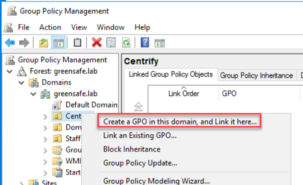
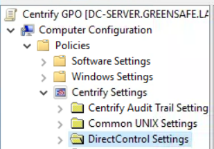
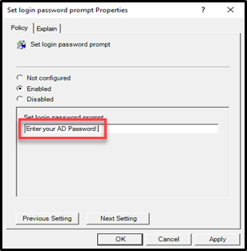
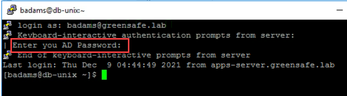
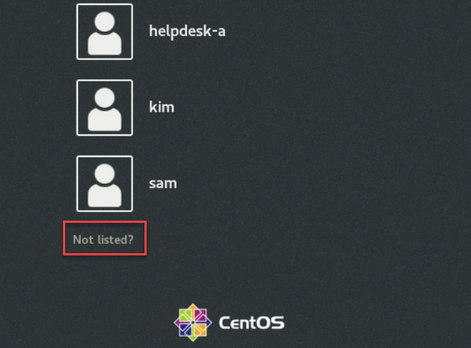
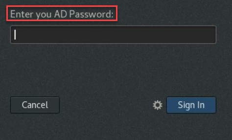

# Group Policies

## Introduction

This seventh lab will cover:

1. Configuring and testing Group Policies

!!! Note
      Estimated time to complete this lab: **15 minutes**

!!! Attention

      Systems used in this lab:

      - dc-server.greensafe.lab
      - apps-server.greensafe.lab
      - db-server.greensafe.com
      - db-unix.greensafe.lab
      - apps-unix.greensafe.lab

### Delinea Server Suite Group Policies (GPO)

#### Create a GPO

01. Use the Desktop Shortcut to launch Group Policy Management, or *Start Menu > Windows Administrative Tools > Group Policy Management*

02. Navigate to *Forest: greensafe.lab > greensafe.lab > Centrify*

03. Right-click **Centrify** and select **Create a GPO in this domain and Link it here**

    

04. *Name* the new GPO **Centrify GPO** and click **OK**

05. Right-click the *Centrify GPO* and click **Edit**

06. Expand *Computer Configuration > Policies*

07. Right-click *Delinea Settings* and click **Add/Remove Templates**

08. Click **Add**

09. Select all Centrify Templates in the window that opens and click **Open**

10. Click **OK**

11. Expand *DirectControl Settings*

    

12. Open **Password Prompts**

13. Right-click *Set login password prompt* on select **Properties**

14. Enable the option and set the login password prompt to **Enter your AD Password:**

    

15. Click **OK**

#### Test the set GPO on Unix

1. Use PuTTY to login to the *db-unix* server with the following credentials (accept the warning screen by clicking **Yes**):

      - **Username:** root
      - **Password:** *Provided by Trainer*

2. Execute **adgpupdate** to update group policies on the system

3. Logout of db-unix and **repeat these 2 steps (1 and 2)** for the *apps-unix* server

4. Log back in using the following credentials:

      - **Username:** <mailto:badams@greensafe.lab>
      - **Password:** *Provided by Trainer*

      You should notice the password prompt has been changed.

      

5. Logout of the session

6. Open the UI of the *apps-unix* server

7. From the GUI Login interface, click *Not Listed?*

      

8. Enter the username **badams** and you will notice the password prompt is the same as the terminal window login

      