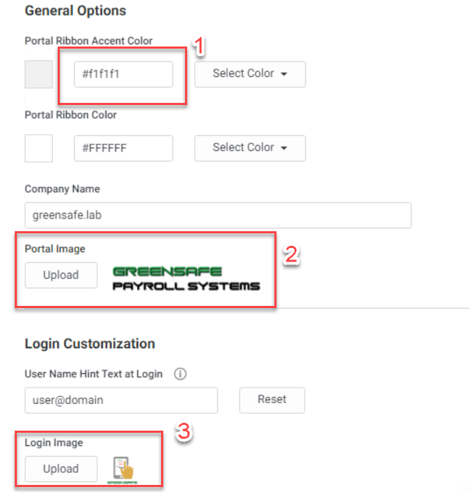
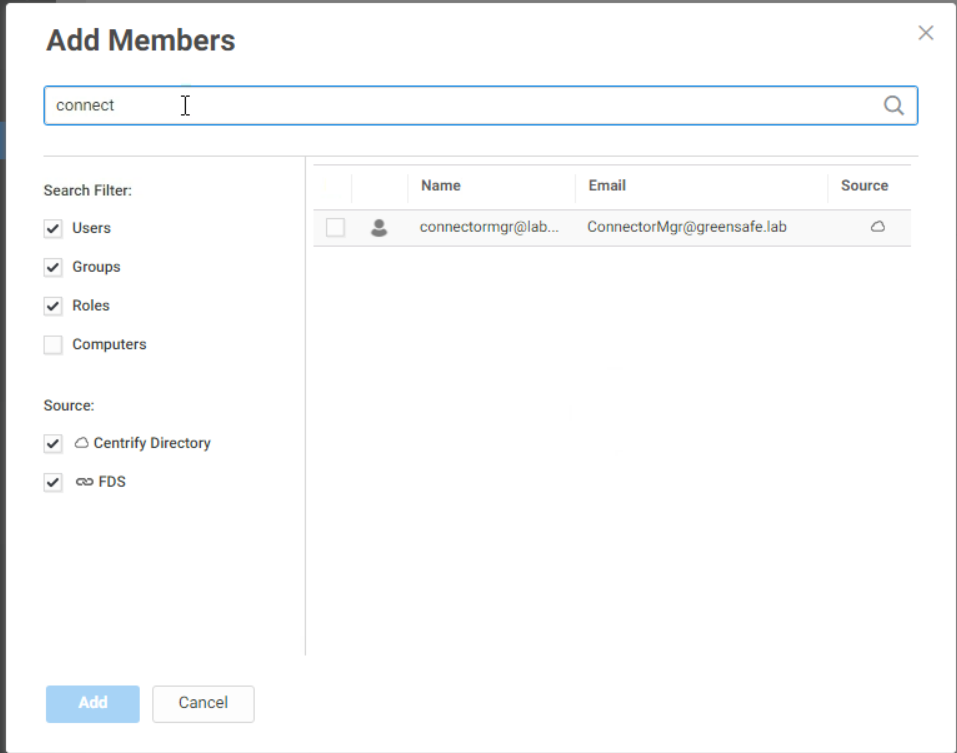
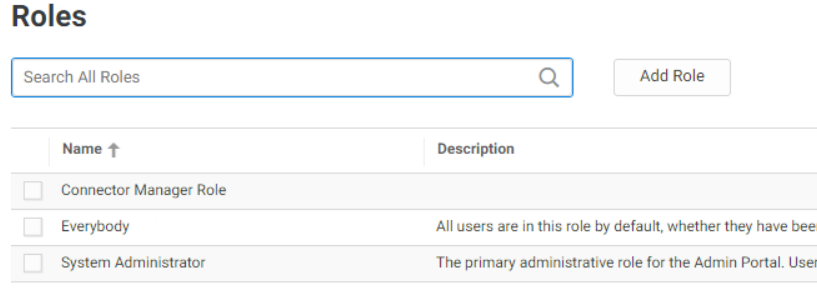
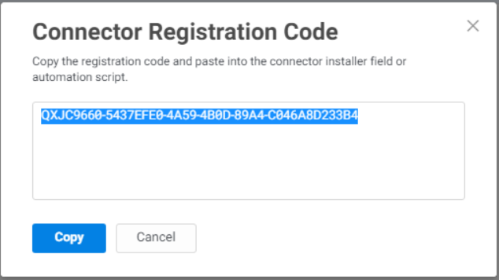
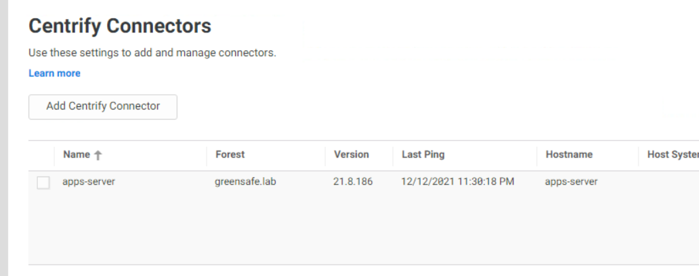

# Prepare Centrify Identity Platform

## Introduction

This eighth lab will cover:

1. Customizing the Centrify Identity Platform (CIP)
2. Create Directory Service Users in CIP
3. Create Privileged Roles
4. Install and Configure the Centrify Connector

!!! Note
    Estimated time to complete this lab: **50 minutes**

!!! Attention

     Systems used in this lab:
     
     - dc-server.greensafe.lab
     - apps-server.greensafe.lab
     - https://\<tenant>.my.centrify.net

### Customizing the CIP

In this exercise, Alex (you) will login to the Centrify Identity Platform and perform initial configuration to "brand" the platform with Greensafe Logos and colors.

01. Login to *apps-server.greensafe.lab* with the following credentials:

    - **Username:** afoster
    - **Password:** *Provided by Trainer*

02. Launch Google Chrome and browse to your unique Identity Platform URL <https:/>/\<tenant>.my.centrify.net

03. Login to your unique Identity Platform with the following credentials:

    - **Username:** admin
    - **Password:** *Provided by Trainer*

04. On the Welcome Message, click **Cancel**

05. Use the Main Menu on the left, navigate to *Settings > General*

06. Under *Account Customization*, change the *Portal Ribbon Accent Color* to **#F1F1F1**

07. Click the **Upload** button to change the *Portal Image*, select C:\\Share\\Greensafe Portal.png

08. Under *Login Customization*, click the **Upload** button to change the Login Image, select C:\\Share\\Greensafe Login.png

    

09. Under *Message Customization*, click the **Upload** button to change the E-Mail Image, select C:\\Share\\Greensafe Portal.png

10. Click **Save**

### Create Directory Service Users in CIP

Part of the initial configuration includes creating Centrify Directory Service User Accounts that will be used for specific privileged access to Greensafe servers without requiring specific domain identities. In this exercise, Alex (you) will create an account that will manage Centrify Connectors and a second account that will be used by 3rd party contractors who support specific Greensafe servers.

1. While still in the CIP, use the main menu on the left to navigate to *Access > Users*

2. Click **Add User**

    
   
    !!!note
        When you get the message that you have to add a suffix to the username@ account, user **labguide** as te prefix!!

        
   
3. Enter the required information to create a new Centrify Directory Service User for Centrify Connector Management.

    - **Username:** ConnectorMgr (leave the suffix to *labguide*)
    - **E-Mail Address:** <mailto:ConnectorMgr@greensafe.lab>
    - **Display Name:** Centrify Connector Manager
    - **Password:** *Provided by Trainer*
    - **Check** the box to *Password never expires*

4. Click **Create User**

5. Click **Add User** button to create a second user

6. Enter the required information to create a new Centrify Directory Service User for 3rd Party Contractor Support

    - **Username:** zContractor (leave the suffix to *labguide*)
    - **E-Mail Address:** <mailto:contractors@greensafe.lab>
    - **Display Name:** Contractor Support Account
    - **Password:** *Provided by Trainer*
    - **Check** the box to *Password never expires*

7. Click Create User

### Create Privileged Roles

Privileged roles are created to group privilege to the infrastructure. Roles can be assigned to users, groups, systems and other roles. In this exercise, Alex (you) will create specific Privileged Access Roles that will be used during the implementation and day to day management of the solution.

01. From the Centrify Identity Platform, use the main menu on the left to navigate to *Access > Roles*

02. Click **Add Role**

03. Use as name **Connector Manager Role**

04. Click **Administrative Rights** left to the *Name*

05. Click **Add**

06. This role requires the privilege to Register and Manage Centrify Connectors, select **Register and Administer Connectors**

    

07. Click **Add**

08. Click **Members** left to the *Administrative Rights*

09. Click **Add**

10. Search for *ConnectorMgr@labguide* and click **Add**

    

11. Click **Save**

    
    

12. Click **Add Role** to add a second role.

13. Use as name **Contractor Role**

14. Click **Administrative Rights**

15. Click **Add**

16. This role requires privilege assigned by an administrator and should be limited to servers that are specifically assigned to the role. Greensafe  has contractors that manage Greensafe database servers. Select **Privilege Access Service Users**

    

17. Click **Add**

18. Click **Members** left to the *Administrative Rights*

19. Click **Add**

20. Search for *zContractor@labguide* and click **Add**

21. Click **Save**

22. Click **Add Role** to add a third role.

23. Use as name **PAS Admin Role**

24. Click **Administrative Rights**

25. Click **Add**

26. This role provides members privilege to administer all resources within the Centrify Identity Platform. Select **Privilege Access Service Administrator**

27. Click **Add**

28. Click **Save** (members will be added later)

29. Click **Add Role** to add a fourth role.

30. Use as name **PAS Power User Role**

31. Click **Administrative Rights**

32. Click **Add**

33. This role provides members privilege to administer resources they explicitly add to the Centrify Identity Platform and have limited privilege to administer currently added resources. Select **Privilege Access Service Power User**

34. Click **Add**

35. Click **Save** (members will be added later)

36. Click **Add Role** to add a fifth role

37. Use as name **PAS User Role**

38. Click **Administrative Rights**

39. Click **Add**

40. This role provides members privilege to access resources that are explicitly added to this role with no privilege to add resources to the Centrify Identity Platform. Select **Privilege Access Service User**

41. Click **Add**

42. Click **Save** (members will be added later)

### Install and Configure Centrify Connector

Centrify Connectors are deployed in the environment to facilitate specific access between the Centrify Identity Platform and Greensafe Infrastructure Resources. In this exercise, Alex (you) will install the Centrify Connector software and configure it to communicate with the Centrify Identity Platform and Greensafe Active Directory environment.

01. From the Centrify Identity Platform, use the main menu on the left to navigate to *Settings > Network > Centrify Connector*

    

02. Click **Add Centrify Connector**

03. Click the *64-bit* link to download the Centrify Connector installation package

04. Navigate, using the *Windows Explorer*, to the location where the download has been saved (default *Downloads*)

05. Launch the application **Centrify-Connector-Installer**

06. At the *Do you want to run this file?*, message click **Run**

07. At the Welcome Message, click **Next**

08. Accept the EULA *(Check the "I have read and accept..." message)* and click **Next**

09. Keep the default features selected and click **Next**

10. Click **Install** (Some open applications will be closed automatically)

11. When completed, click **Finish** (The Connector Configuration Wizard will start automatically)

12. At the Welcome Message, click **Next**

13. Maintain strong encryption options and click **Next**

14. Greensafe is not using a proxy server and no changes are needed. Click **Next**

15. Change the Tenant URL with your unique platform URL. https://<tenant\>.my.centrify.net (You can copy and paste the URL directly from the address bar of the browser.)

    

16. Check the **Use Registration Code**

17. Open the CID UI and navigate to **Settings > Network > Registration Codes**

    

18. Check the **Account Creation** Line and under **Action**, select **Retrieve Code**

    

    

19. Click **Copy** to copy the code to the clipboard

20. Back in the **Centrify Connector Configuration**, paste the *Registration Code*

    

    !!!note
        Your codes will be different!!! Don't use the codes as mentioned in the screenshots

21. Click **Next**

1. Check the box associated to the *greensafe.lab* domain and click **Next**

2. In the *Permissions are required to domain deleted objects* click **Yes** to assign the permissions

3. The checks should be successfully run and click **Next**

    

4. After the connector has been configured successfully and registered with the Centrify Identity Platform, Click **Finish**

5. The *Centrify Connector Control Panel* will be displayed indicating the current status and connection with the Centrify Identity Platform. You can **close** the Control Panel and return to the Centrify Identity Platform

6. Close the Centrify Connector Download window and refresh the Centrify Identity Platform. The Centrify Connector (*apps-server.greensafe.lab*) should be displayed as an available connector

    

