# Configuration of the CIP

## Introduction

This ninth lab will cover:

1. Configure Role-Based Permissions
2. Configure a Domain Administrative Account
3. Configure System Discovery Profiles
4. Configure System Sets
5. Configure Multifactor Authentication for Privilege Elevation

!!! Note
    Estimated time to complete this lab: **90 minutes**

!!! Attention

        Systems used in this lab:

        - dc-server.greensafe.lab
        - apps-server.greensafe.lab
        - https://<tenant\>.my.centrify.net


### Configure Role-Based Permissions

Now that Privilege Roles have been established and the Centrify Connector has been deployed, we can now assign privilege to Active Directory Users and Groups. In this exercise, Alex (you) will assign AD groups to recently created roles and configure global security settings and permissions.

01. From the Centrify Identity Platform, use the main menu on the left to navigate to *Access > Roles*

02. Click the **System Administrators Role**

03. Click **Members**

04. Click **Add**

05. Search for **Team_Security** and click **Add**

    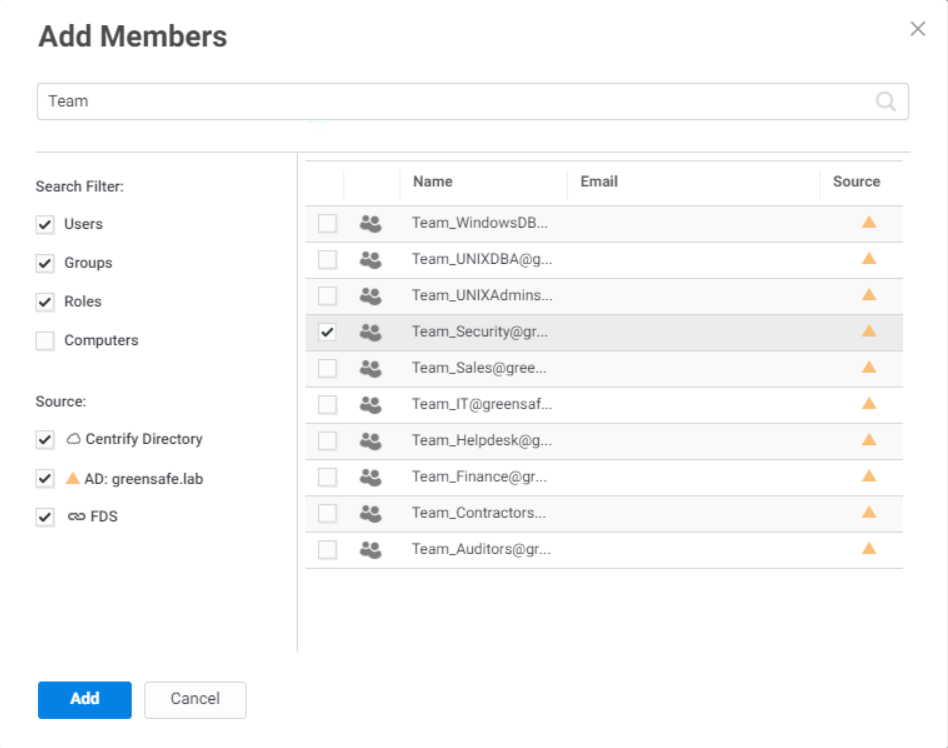

06. Click **Save**

07. From the Centrify Identity Platform, use the main menu on the left to navigate to *Access > Roles*

08. Click the **PAS Admin Role**

09. Click **Members**

10. Click **Add**

11. Search for **Domain Admins** and click **Add**

12. Click **Save**

13. From the Centrify Identity Platform, use the main menu on the left to navigate to *Access > Roles*

14. Click the **PAS Power Users**

15. Click **Members**

16. Click **Add**

17. Search for **Team_Helpdesk** and click **Add**

18. Click **Save**

19. From the Centrify Identity Platform, use the main menu on the left to navigate to *Access > Roles*

20. Click the **PAS User Role**

21. Click **Members**

22. Click **Add**

23. Search for the following groups and click **Add**:

    - Team_Sales
    - Team_Finance

24. Click **Save**

25. From the Centrify Identity Platform, use the main menu on the left to navigate to *Access > Roles*

26. Click the **Contractor Role**

27. Click **Members**

28. You will notice one member (zContractor) which was added earlier, click **Add**

29. Search for **Team_Contractors** and click **Add**

30. Click **Save**

31. Use the main menu on the left to navigate to *Settings > Resources > Security > Global Account Permissions*

    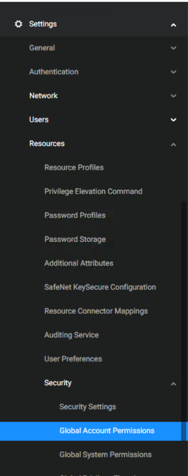

32. Global Account Permissions identifies privileged account permissions granted to users, groups and roles in the Centrify Identity Platform. Greensafe has decided to grant specific privilege to administrators and power users. Click **Add**

33. Search for **PAS Admin Role** and click **Add**

34. Check the boxes for the role to provide the following permissions:

    - Grant
    - View
    - Checkout
    - Login
    - Edit
    - Delete
    - Update Password
    - Rotate

    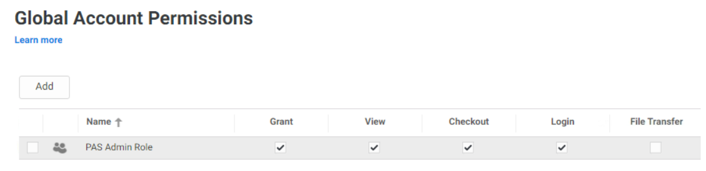

    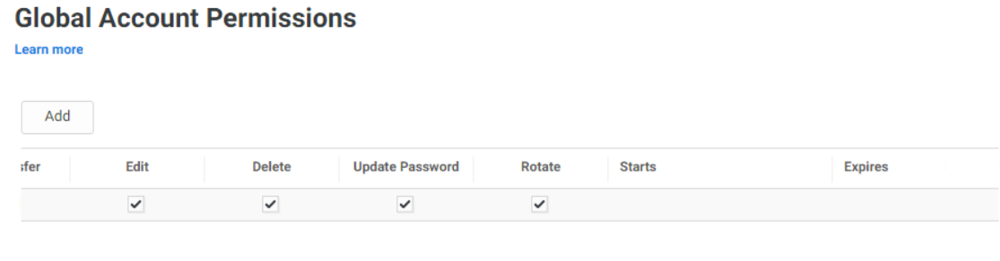

    !!! Note
        For the options *Edit, Delete, Update Password and Rotate* you may have to scroll to the right!)

35. Click **Add**

36. Search for **PAS Power User Role** and click **Add**

37. Check the boxes for the role to provide the following permissions:

    - View
    - Login

38. Click **Save**

39. Use the main menu on the left to navigate to *Settings > Resources > Security > Global System Permissions*

40. Global System Permissions identifies privileged system permissions granted to users, groups and roles in the Centrify Identity Platform. Greensafe has decided to grant specific privilege to administrators and power users. Click **Add**

41. Search for **PAS Admin Role** and click **Add**

42. Check the boxes for the role to provide the following permissions:

    - Grant
    - View
    - Manage Session
    - Edit
    - Delete
    - Add Account
    - Unlock Account

    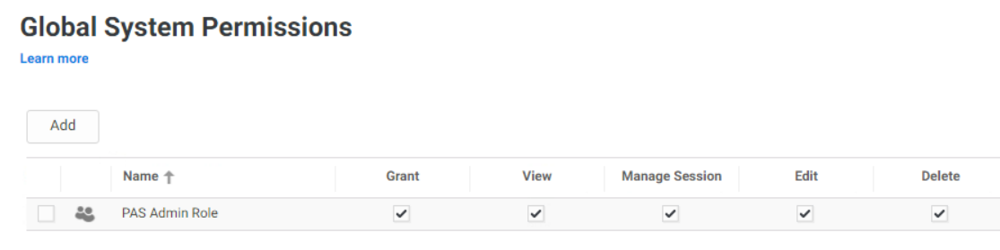

    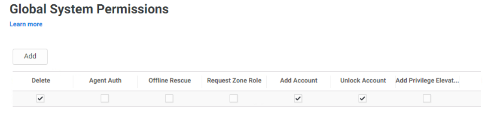
    
    !!! Note
        For the options *Add Account and Unlock Account* you may have to scroll to the right!)

43. Click **Add**

44. Search for **PAS Power User Role** and click **Add**

45. Check the boxes for the role to provide the following permissions:

    - View
    - Manage Session
    - Unlock Account

46. Click **Save**

47. Use the main menu on the left to navigate to *Settings > Resources > Security*

48. Under *Security > Security Settings*, check the box to enable periodic password rotation at specified interval (days). Use the default duration of 90 days.

    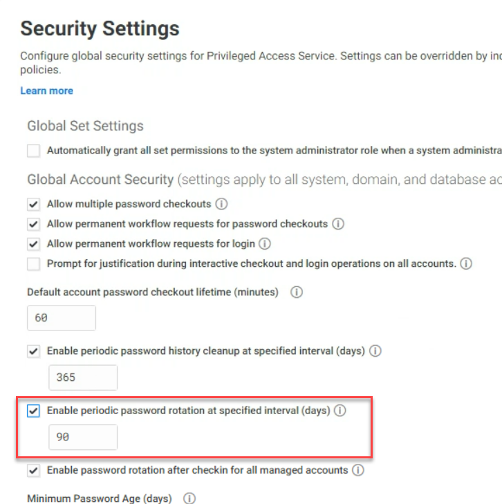

49. Under *Global System Security*, check the box to allow access from a public network (web clients only)

    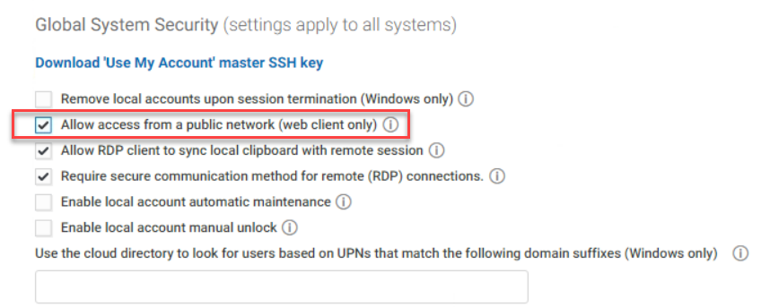

50. Click **Save**

51. Use the main menu on the left to navigate to *Resources > Domains*

52. Click the **greensafe.lab** domain

53. Under *Permissions*, click **Add**

54. Search for **PAS Admin Role** and click **Add**

55. Check the boxes for the role to provide the following permissions:

    - View
    - Edit
    - Unlock Account
    - Add Account

    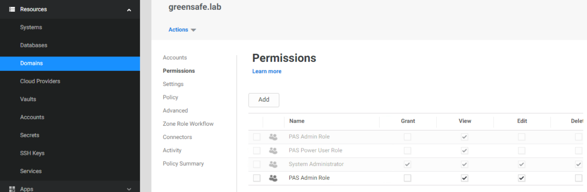

56. Click **Save**

### Configure a Domain Administrative Account

Centrify Identity Platform can be configured to facilitate domain tasks. In this exercise, Alex (you) will configure a domain administrative account to perform these tasks. This training environment has been preconfigured with a domain account (cfyadmin@greensafe.lab) to act in this capacity.

01. Logout of the Centrify Identity Platform by clicking in the top right corner the *admin account > Sign Out*

    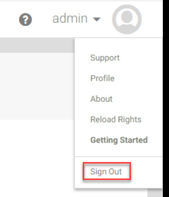

02. Login back into the Centrify Identity Platform using the following credentials:

    - **Username:** afoster@greensafe.lab
    - **Password:** *Provided by Trainer*

03. On the Welcome Message, check the box *Do not show again* and click **Cancel**

04. Use the main menu on the left to navigate to *Resources > Domains*

05. Click the **greensafe.lab** domain

06. Click **Advanced**

07. Under *Domain Accounts and Windows Local Accounts*, click the **Set** button to identify the Domain Administrative Account

08. Select the option for Active Directory and click the **Select** button to add the account

09. Search for **cfyadmin@greensafe.lab** and click **Select**

10. Enter the password (*Provided by Trainer*) and click **Select**

    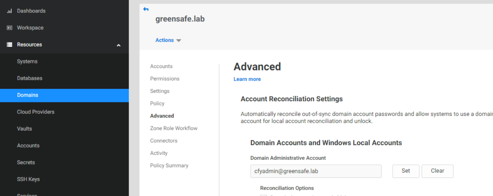

11. Under *Reconciliation Options*, check the boxes for:

    - Domain Account Manual Unlock
    - Windows Local Account Manual Unlock

    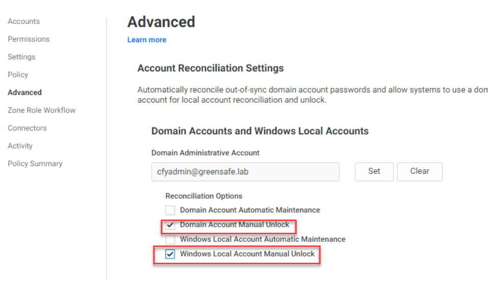

12. Click **Save**

### Configure System Discovery Profiles

Now that role-based permissions and privilege has been established, it is time to locate and add systems to the Centrify Identity Platform. In this exercise, Alex (you) will create two distinct discovery profiles so systems can be found and added to the platform, and privilege can be administered.

01. Use the main menu on the left to navigate to *Discovery > Systems and Accounts > Profiles*

02. Click **Add Discovery Profile**

03. Make sure **Active Directory** is selected in the *Discovery Method*

04. Name the profile **Domain Server Discovery**

05. Click **Next** to select a domain account that can read the domain objects

06. Click **Select**

07. Search for **cfyadmin@greensafe.lab** and click **Select**

08. Under *Scope of Search*, check the **greensafe.lab** domain

    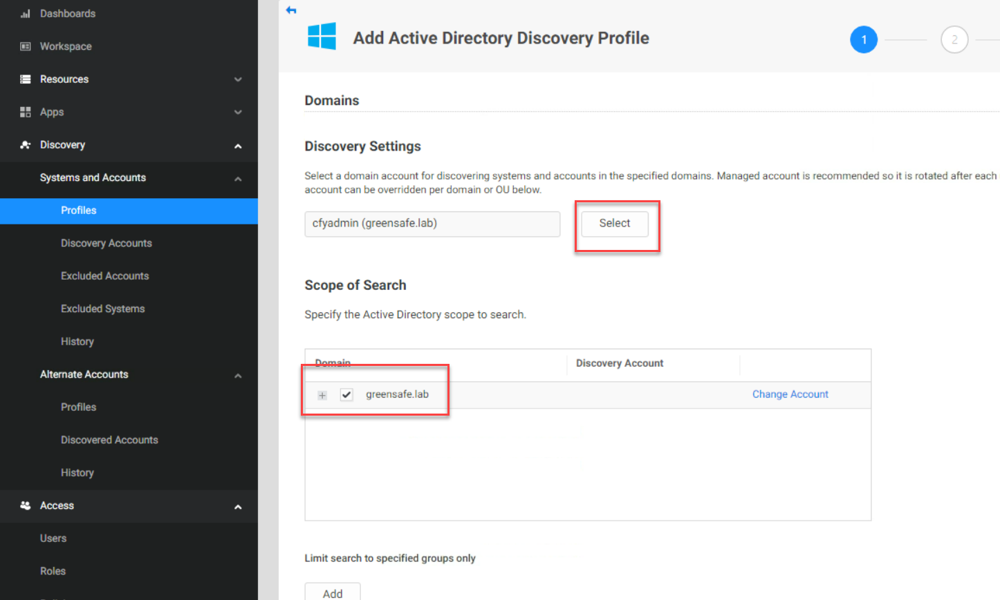

09. Click **Next**

10. Click **Next**

11. Click **Done**

12. Right click the newly created *discovery profile* and click **Run**

    

13. While the discovery is running, click Add Discovery Profile to add a second discovery profile.

14. Under Discovery Method, Select **Port Scan**

15. Name the profile **Network Port Scan Discovery**

    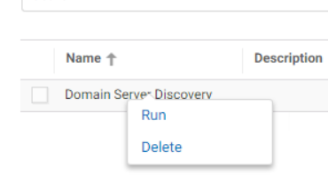

16. Click **Next**

17. Click **Add** to set the Scope

18. Select *Range* and enter **10.0.0.30** and **10.0.0.35** in the corresponding start/end fields

    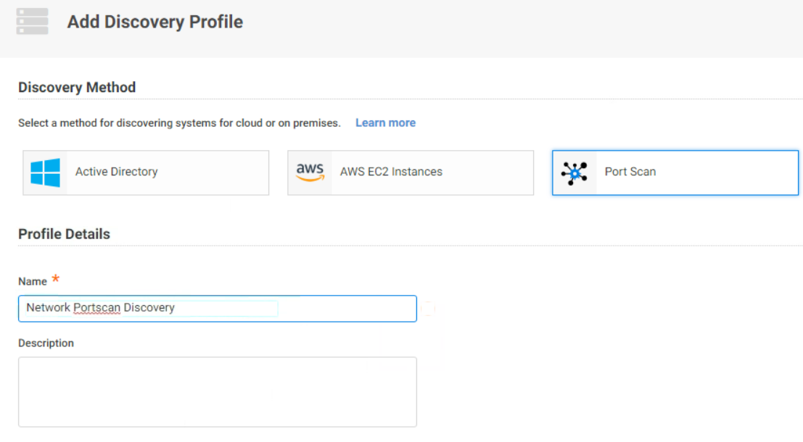

19. Under *Discovery Accounts*, Click **Add**

20. Use the drop-down menu and select **Add Discovery Account**

21. Name the account **UNIX Admin**

22. Enter the **Username:** cfyadmin

23. Enter the **password:** *Provided by Trainer*

24. Click **Done**

25. Click **Add** to add the new *UNIX Admin Discovery Account*

26. Click **Next**

27. Click **Next**

28. Click **Done**

29. Right click the newly *created discovery profile* and click **Run**

30. Use the main menu on the left to navigate to *Resources > Systems*

    !!! Note
        Once the discovery profiles are completed the following systems should be listed (it may be necessary to refresh the page or use the user profile menu at the top right and select Reload Rights)

31. You should see the following systems being mentioned:

    - apps-server.greensafe.lab
    - apps-unix.greensafe.lab
    - db-server.greensafe.lab
    - db-unix.greensafe
    - dc.greensafe.lab
    - win-id-platform.greensafe.lab (the CIP server)

### Configure System Sets

Systems have been added into the Centrify Identity Platform and while global and role-based permissions have been applied, there will be instances where systems need to be grouped based on their role within the organization. In this exercise, Alex (you) will create a number of system sets that will be configured and shared with other privileged users. Additionally, you will understand how to apply role-based permissions to the members of the set as well as the set itself.

01. Using the main menu on the left to navigate to *Resources > Systems* to display all systems

02. Using Google Chrome Menu, establish a *New Incognito Window* so you can login as different users and confirm the information in the table below:

    | Username      | AD Group      | Centrify Role     | Available Systems                 |
    |---------------|---------------|-------------------|-----------------------------------|
    | jmiller@greensafe.lab | Domain Admins | PAS Admin Role | apps-server.greensafe.lab, apps-unix.greensafe.lab, db-server.greensafe.lab, db-unix.greensafe.lab, dc.greensafe.lab |
    | bhughes@greensafe.lab | Team_Helpdesk | PAS Power User Role | apps-server.greensafe.lab, apps-unix.greensafe.lab, db-server.greensafe.lab, db-unix.greensafe.lab, dc.greensafe.lab |
    | krogers@greensafe.lab | Team_UNIXAdmins | PAS user Role | No Systems |
    | zContractor@labguide  | N/A CDS User | Contractors Role | No Systems |
    | lbennett@greensafe.lab | Team_Contractors | Contractors Role | No Systems |


    !!! Note
        You will notice that due to role based administrative rights applied earlier, the main menu at the left will look different for specific users.

        You will also notice that due to global system permissions applied earlier, systems are viewable to Joe Miller (jmiller@greensafe.lab) and Bob Hughes (bhughes@greensafe.lab).)

03. Return to the Centrify Identity Platform (*logged in as Ales Foster*) and navigate to *Resources > Systems* click the **Add** button on the **far right under Sets**

    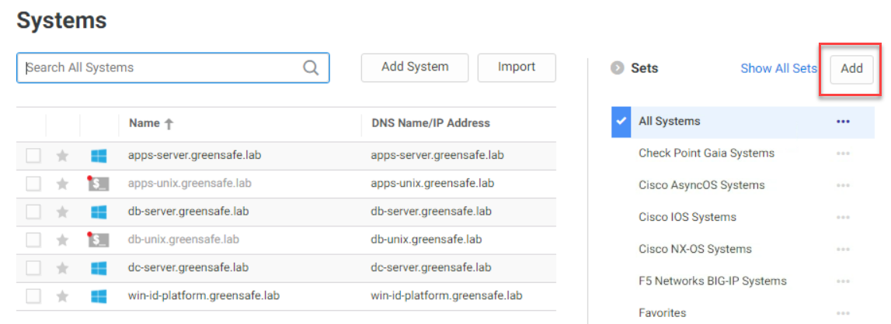

04. Name the new system set **Greensafe Domain Controllers**

05. Click **Save**

06. Under Systems, click the **Add** button on the far right under Sets, to create a second set

07. Name the new system set **Greensafe Windows Servers**

08. Click **Save**

09. Under Systems, click the **Add** button on the far right under Sets, to create a third set

10. Name the new set **Greensafe Unix Servers**

11. Click **Save**

12. Under Systems, click the **Add** button on the far right under Sets, to create a fourth set

13. Name the new set **Greensafe Contractor Supported**

14. Click **Save**

15. To add a system to a set, select the systems and use the Actions button and select **Add to Set**

    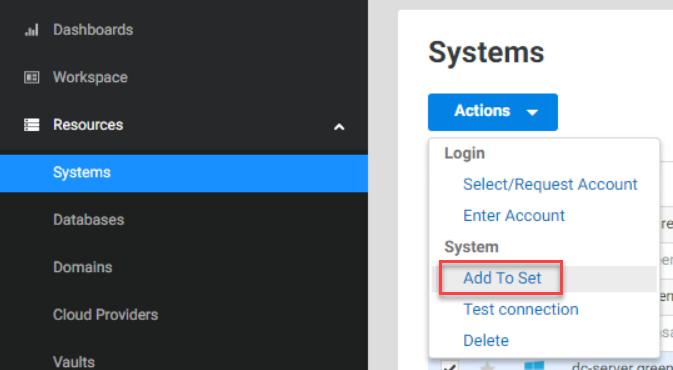

    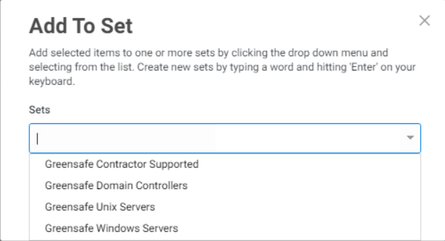

16. Select the set, as described below in the table, and click **Save** to add the selected systems to the *Set*

    | System Set | Assigned Systems |
    |------------|------------------|
    | Greensafe Domain Controllers | dc.greensafe.lab |
    | Greensafe Windows Servers | apps-server.greensafe.lab, db-server.greensafe.lab |
    | Greensafe Unix Servers | apps-unix.greensafe.lab, db-unix.greensafe.lab |
    | Greensafe Contractor Supported | db-server.greensafe.lab, db-unix.greensafe.lab |
    
    !!!Note
        Once completed, the sets are currently available to Alex Foster (you). The next steps will be to assign permissions to others to see the set and to set explicit permissions to the members of the sets without assigning the permission to each system individually.

        If you have made a mistake and want to remove a system from a set, select the set and the to be removed system, not systems!!, and under the **Action** button, select *Remove from this Set*

        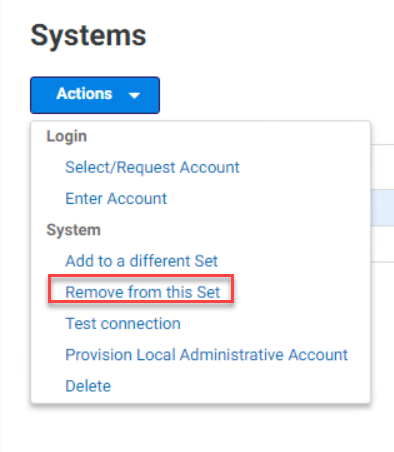):

17. Right-click on the *Greensafe Domain Controllers* set and click **Modify**

    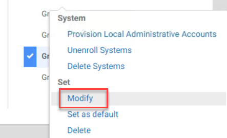

18. Under *Permissions*, click the **Add** button

19. Search for **PAS Admin Role** and click **Add**

    !!!warning
        Remember that the search is case sensitive!

20. Under PAS Admin Role permissions, assign **View** permissions

21. Click **Save**. This change will grant PAS Administrators permission to see the system set when they login

22. Use the main menu on the left to navigate to *Resources > Systems*

23. Right Click on the *Greensafe Windows Servers* set and click **Modify**

24. Under *Permissions*, click the **Add** button

25. Search for **PAS Admin Role** and **PAS Power User Role** click **Add**

26. Under each of the roles added, confirm the **View** permissions has been added

27. Click **Save**. This change will grant PAS Administrators and PAS Power Users permission to see the system set when they login

28. Use the main menu on the left to navigate to *Resources > Systems*

29. Right-click on the *Greensafe Unix Servers* set and click **Modify**

30. Under *Permissions*, click the *Add* button.

31. Search for **PAS Admin Role** and **PAS Power User Role** and click **Add**

32. Under each of the roles added, confirm the **View** permissions has been added.

33. Click **Save**. This change will grant PAS Administrators and PAS Power Users permission to see the system set when they login

34. Use the main menu on the left to navigate to *Resources > Systems*

35. Right Click on the *Greensafe Contractor Supported* set and click **Modify**

36. Under *Permissions*, click the **Add** button

37. Search for **PAS Admin Role** and **PAS Power User Role** and click **Add**

38. Under each of the roles added, confirm the **View** permissions has been added.

39. Click **Save**. This change will grant PAS Administrators and PAS Power Users permission to see the system set when they login

Now that permissions are assigned to view the set, let's assign permissions to members of specific sets.

40. Use the main menu on the left to navigate to *Resources > Systems*

41. Right-click on the *Greensafe Unix Servers* set and click **Modify**

42. Under *Member Permissions*, click the **Add** button

43. Search for **Team_UnixAdmins** and click **Add**

44. Under the *Team_UnixAdmin* Permissions, confirm the **View** permissions has been added.

45. Click **Save**

46. Use the main menu on the left to navigate to *Resources > Systems*

47. Right Click on the *Greensafe Contractor Supported* set and click **Modify**

48. Under *Member Permissions*, click the **Add** button

49. Search for **Contractor Role** and click **Add**

50. Under the *Contractor Role* Permissions, confirm the **View** permissions has been added.

51. Click Save

As permissions have been assigned to specific groups to see specific sets. We have also assigned member permissions to specific groups so individual system permissions do not need to be assigned individually. Now let's confirm the permissions, using the same accounts we worked with at the beginning of the exercise.

52. Using Google Chrome Menu, establish a New Incognito Window so you can login as each of the users (on the following page) to confirm the information in the table.

    
    | Username      | AD Group      | Centrify Role     | Available Systems | Available Sets |
    |---------------|---------------|-------------------|-------------------|----------------|
    | jmiller@greensafe.lab | Domain Admins | PAS Admin Role | apps-server.greensafe.lab, apps-unix.greensafe.lab, db-server.greensafe.lab, db-unix.greensafe.lab, dc.greensafe.lab | Greensafe Domain Controllers, Greensafe Windows Servers, Greensafe Unix Servers, Greensafe Contractor Supported |
    | bhughes@greensafe.lab | Team_Helpdesk | PAS Power User Role | apps-server.greensafe.lab, apps-unix.greensafe.lab, db-server.greensafe.lab, db-unix.greensafe.lab, dc.greensafe.lab | Greensafe Windows Servers, Greensafe Unix Servers, Greensafe Contractor Supported|
    | krogers@greensafe.lab | Team_UNIXAdmins | PAS user Role | apps-unix.greensafe.lab, db-unix.greensafe.lab | No Sets |
    | zContractor@labguide  | N/A CDS User | Contractors Role | db-server.greensafe.lab, db-unix.greensafe.lab | No Sets |
    | lbennett@greensafe.lab | Team_Contractors | Contractors Role | db-server.greensafe.lab, db-unix.greensafe.lab | No Sets |


    !!!Note
        As you can see, permissions can be granted to systems without giving access to view the set or by granting permission to each system individually.

### Configure Multifactor Authentication for Privilege Elevation

In this exercise, Alex (you) will configure systems to validate users with multifactor authentication when logging in at the console or when using a 3rd party remote access tool.

01. Let's start by downloaded the *IWA certificate* needed to configure the systems for MFA

02. Using the *Centrify Identity Platform*, login as Alex Foster (afoster), or switch back to the Chrome UI where the user is still logged in.

03. Use the main menu on the left to navigate to *Settings > Network > Centrify Connectors*

    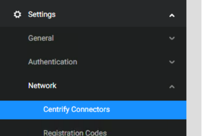

04. Click the **apps-server** Centrify Connector

05. Click **IWA Service**

06. Click the Blue link **Download your IWA root CA certificate** ans save the file
    
    !!!note
        When the Warning is mentioned, click **Keep**

07. Click **Cancel** to close the properties of the Connector

Let's now configure the Centrify Identity Platform Authentication *Profile* for client side login with MFA

09. Use main menu on the left to navigate to *Settings > Authentication > Authentication Profiles*

10. Click **Add Profile**

11. Name the Profile **CSS_MFA_Profile**

12. Set *Challenge #1* equal to **Security Question > 1**

13. Set the *Challenge Pass-Through Duration* to **No Passthrough**

    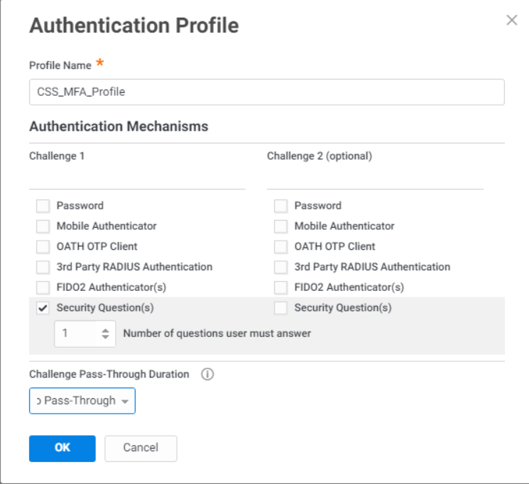

14. Click **OK** to save the new profile

Let's now configure the Centrify Identity Platform Privilege *Role* for client side login with MFA

16. Use the main menu on the left to navigate to **Access > Roles**

17. Click **Add Role**

18. Name the new role **CSS_MFA_Role**

19. Click **Members**

20. Search for and add the following **AD Groups** and **Computers** (make sure you have *Computers* checked!)

    - db-unix.greensafe.lab
    - db-server.greensafe.lab
    - Team_Contractors
    - Team_Helpdesk
    - Team_IT
    - Team_UnixAdmins

    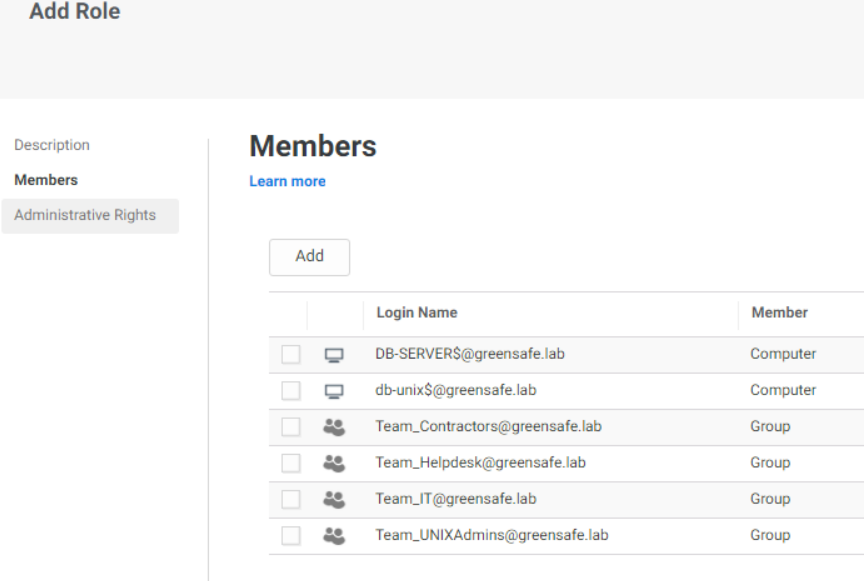

21. Click **Administrative Rights**

22. Click **Add**

23. Click and select **Computer Login and Privilege Elevation** and click **Add**

    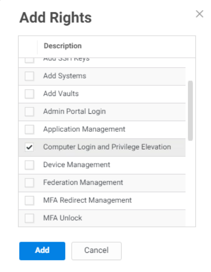

24. Click **Save**

Let's now configure the Centrify Identity Platform *Policy* for client side login with MFA

26. Use the main menu on the left to navigate to *Access > Policies*

27. Click **Add Policy Set**

28. Name the new policy **CSS_MFA_Policy**

29. Under *Policy Assignment*, click *Specified Roles* and add the **CSS_MFA_Role**

    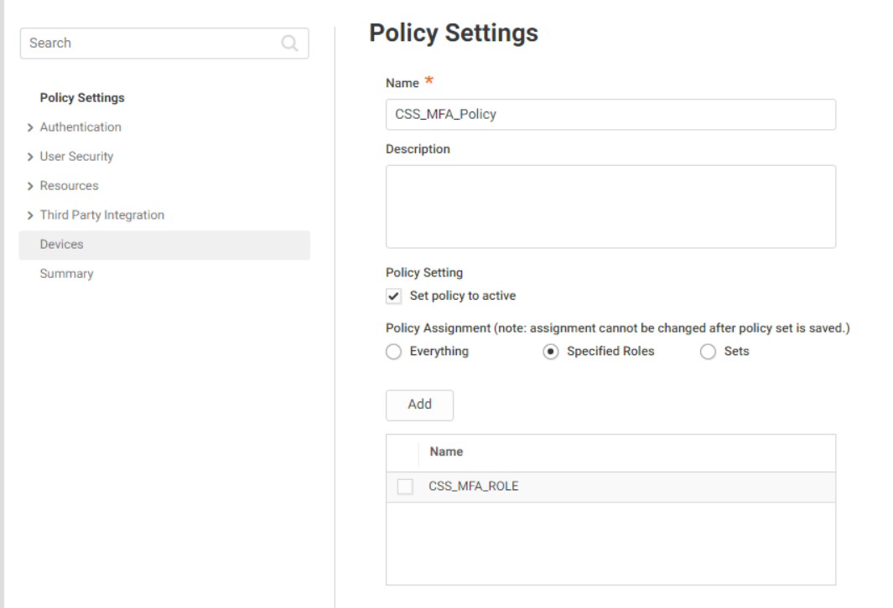

30. Expand *Authentication*

31. Expand *Centrify Server Suite Agents*

32. Click **Linux, Unix, and Windows Servers**

33. Use the drop-down menu and select **Yes** to enable the authentication policy controls

34. Use the drop-down menu to change the *Default Profile* to **CSS_MFA_Profile**

    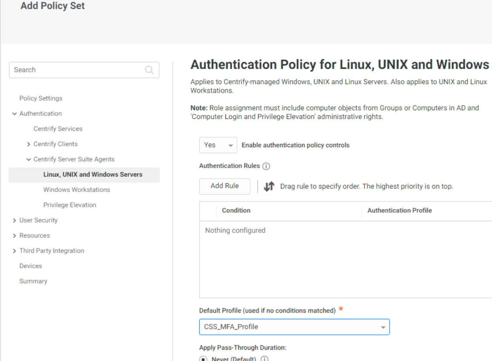

35. Click *Privilege Elevation*

36. Use the drop-down menu and select **Yes** to enable the authentication policy controls

37. Use the drop-down menu to change the Default Profile to **CSS_MFA_Profile**

    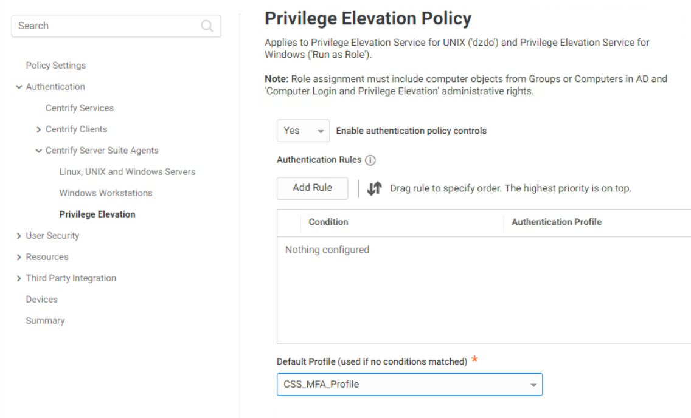

38. Click **Save** to save the policy

39. Let's now configure GPO to push the certificate to all systems

40. Open **Group Policy Management Editor**

    !!!Note
        If the Group Policy Management Editor has been closed, or not available, open a MMC and add the Group Policy Management Editor snapin.
        When asked for the *Browse for a Group Policy Object*, select *Centrify.greensafe.lab > Centrify GPO* and click **OK**, **Finish** and **OK**

        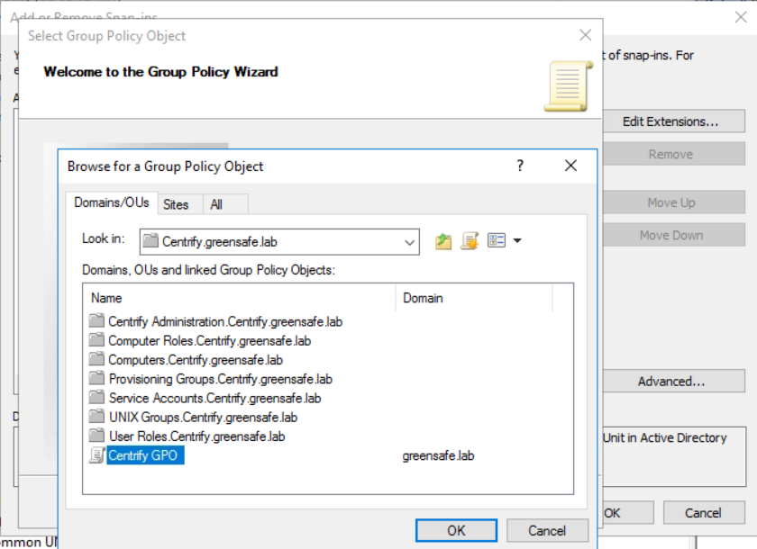

41. Navigate to *Computer Configuration > Policies > Windows Settings > Security Settings > Public Key Policies*

42. Right-click the *Trusted Root Certificate Authorities* and select **Import**

    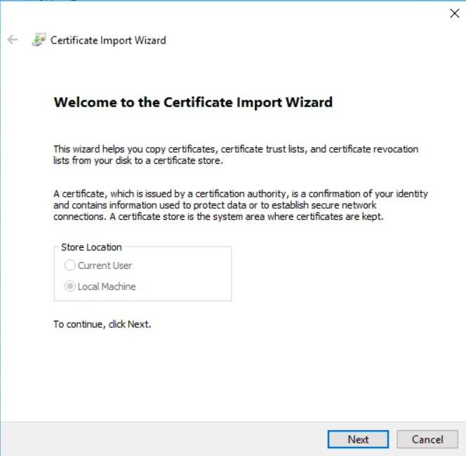

43. Click **Next**

44. Click **Browse** and select the IWA certificate downloaded earlier (common location is *Downloads*)

45. Click **Next**

46. Confirm the store location (*Trusted Root Certificate Authorities*) and click **Next**

47. Click **Finish** and **OK** on the successful import message

48. Let's now configure an existing command right to require MFA

49. In *Access Manager*, expand to **Zone > Global Zone > Child Zone > Unix Zone**

50. Expand **Authorization**

51. Expand **Unix Right Definitions**

52. Under *Commands*, double click on the **Service Restart** Command Right created earlier in the course

53. Click the **Attributes** Tab

54. Select *Re-authenticate current user* and **UNCHECK use password** and **CHECK Require multi-factor authentication**

    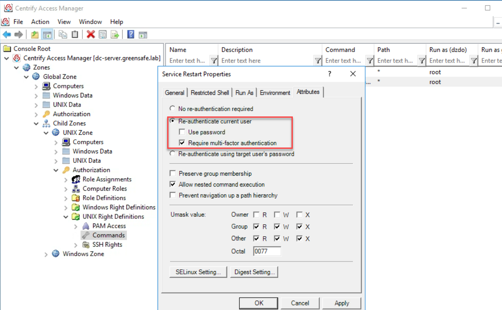

55. Click **OK** to save the changes

56. Let's now update the group policies on systems and test the MFA settings

57. Launch **PuTTY** and login to **db-unix** with the following credentials:

    - **Username:** root
    - **Password:** *Provided by Trainer*

58. Run **adflush** to clear the zone cache

59. Run **adgpupdate** to update the group policies on the system

60. Logout of the session

61. Relogin to the **db-unix** system using the credentials below:

    - **Username:** lbennett@greensafe.lab
    - **Password:** *Provided by Trainer*

62. Was Laura Bennett permitted to login?

63. Run ```dzdo systemctl restart firewalld```

    !!!warning
        If you receive errors on the command where you would see something like "Sorry cannot login..", have you logged into the cloud tenant as lbennet@greensafe.lab?
        For MFA to work, as defined in the MFA policy, the user MUST have an account in the Cloud tenant. This can be established by opening the Admin Portal and logging in with the account. Without the account available in the cloud tenant, you might get errors pointing towards the Cloud Connector not available, MFA failures etc.

64. Was Laura Bennett permitted to run this command?