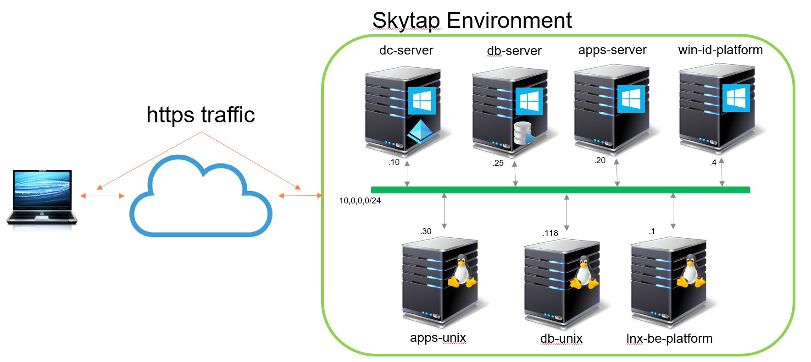
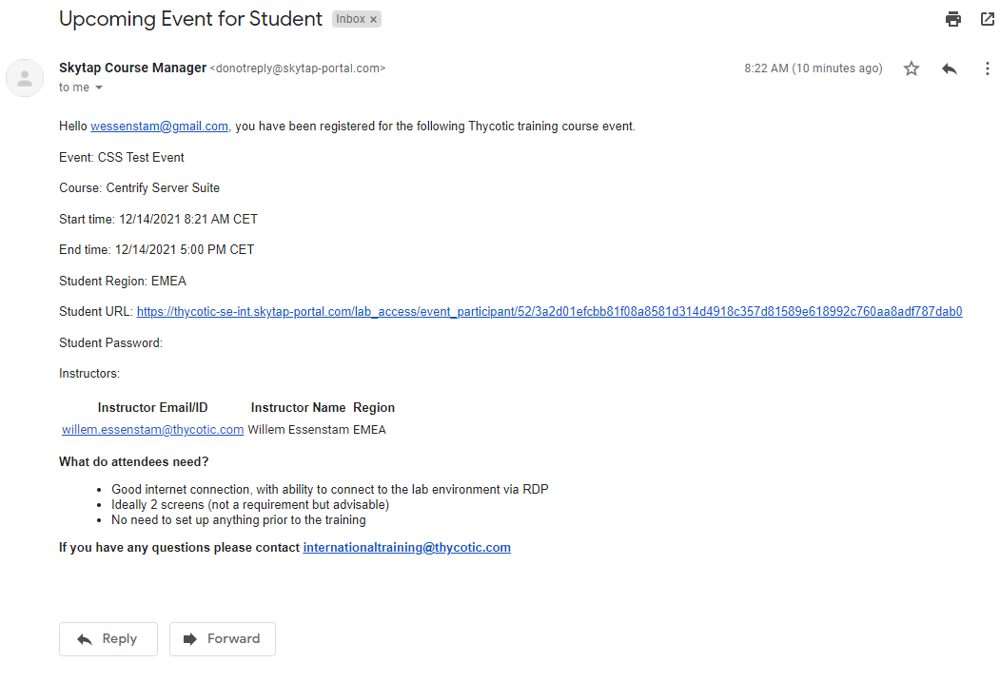
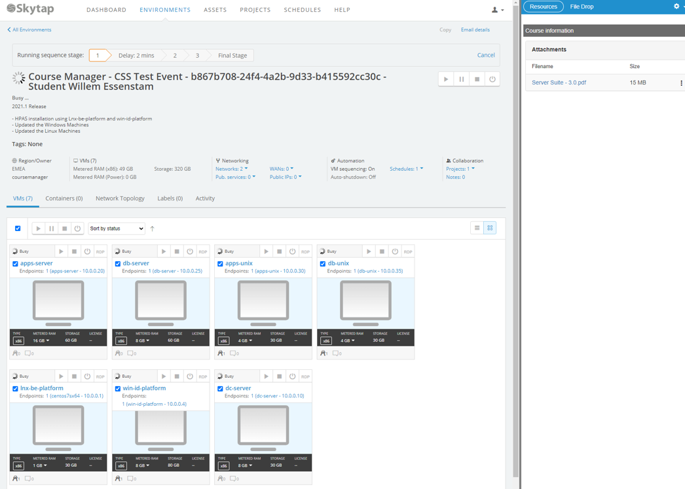

.. title:: Server and Cloud Suite Partner training

.. toctree::
  :maxdepth: 2
  :caption: Server Suite
  :name: _Server_Suite
  :hidden:

  Server_Suite/lab1
  
.. toctree::
  :maxdepth: 2
  :caption: Cloud Suite
  :name: _Cloud_Suite
  :hidden:

  Cloud_Suite/lab1
  
.. _getting_started_index:

----------
Welcome!!!
----------

Welcome to Delinea's Partner training on Server and Cloud suite!!!

This workshop runs from a Skytap environment in the EMEA region. To present you with a basic set of how to use the environment, please read this small guide..

A graphical representation of your environment is shown below:

Skytap
++++++

You should have received an email that you have been invited to an online training session.

Click the link as you see it mentioning in the email. You may be asked to provided an extra password to login to your ask your training for that password.... Welcome to the world of security :)

Once in your environment you will ss in the top right corner a "play" menu. Is your environment has not started, click the "Play" button. It will take approx 5-10 minutes for the environment is running.

After all VMs have started, the screenshot is an example, click on the VM that is mentioned in the lab. This will open the VM in a new browser tab so you can interact with the VM. Another option is to use the RDP link. This will download an RDP file that you can open in your RDP application like MS Terminal Services. This also works for Linux based machine. 

.. figure:: images/lab003.png

Once you have the VM open in a Browser window, you will get the Skytap Toolbar (click the arrow if you don’t see it or want to hide it). 

.. figure:: images/lab004.png

From left to right:
1. The two screens icon; clicking this icon provides the possibility to switch consoles between VMs
2. The “pause”/ “stop” / “power” button; Resp. suspend, stop and poweroff/on the current VM
3. Ctrl-Alt-Del button; send the Ctrl-Alt-Del command to the VM
4. Keybord (EN) icon; switch between keyboard layouts. The VMs are built on EN-UK layout!
5. Keys icon; any password that have been defined, you can use the button to insert the password
6. Clipboard icon; exchange clipboard info between the VM and the machine you are working on
7. The screen “diagonal” icon; Go full screen for the current VM
8. Different screensizes icon; resize the screen to presetted sizes
9. The “Wifi” icon; connection strength

HAVE FUN!!!!
------------